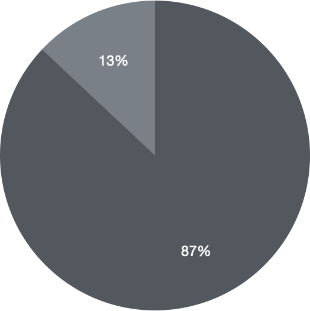
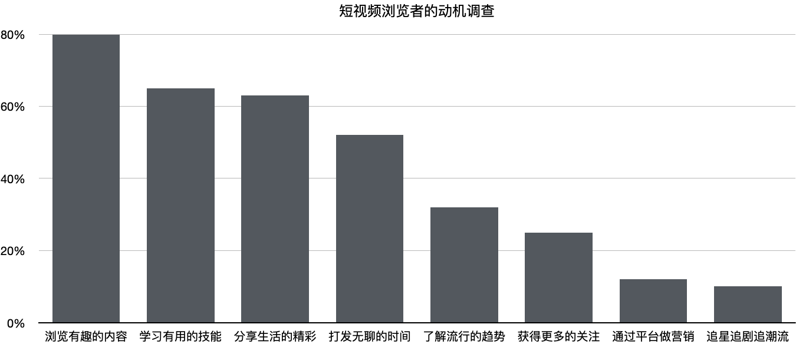
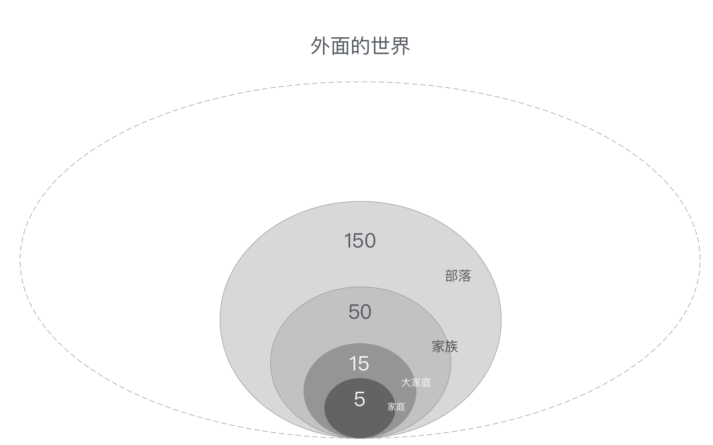
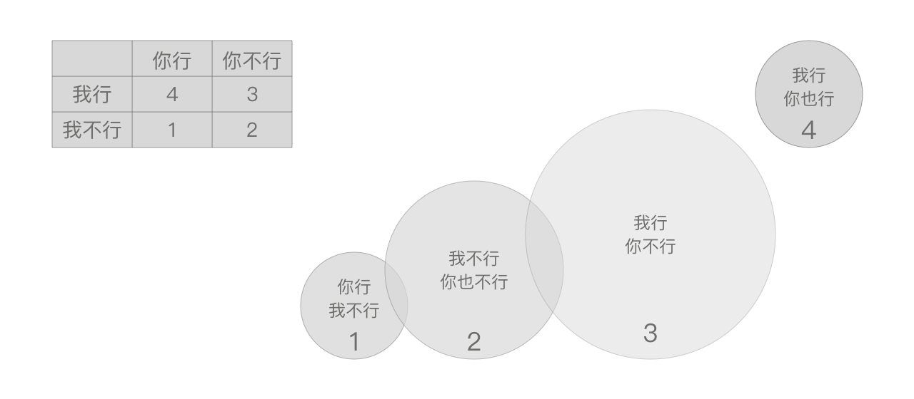
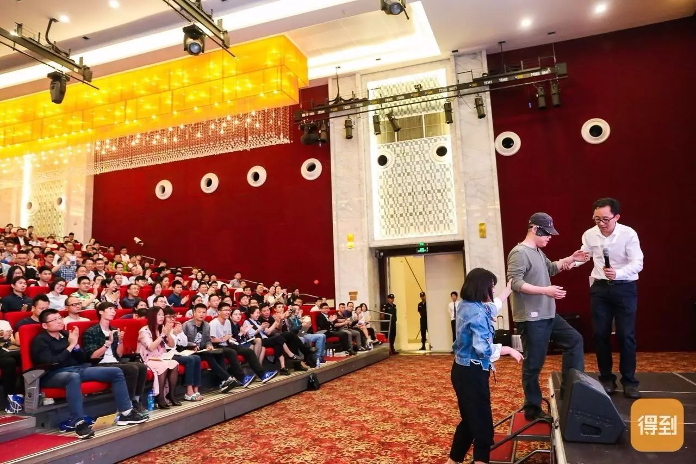
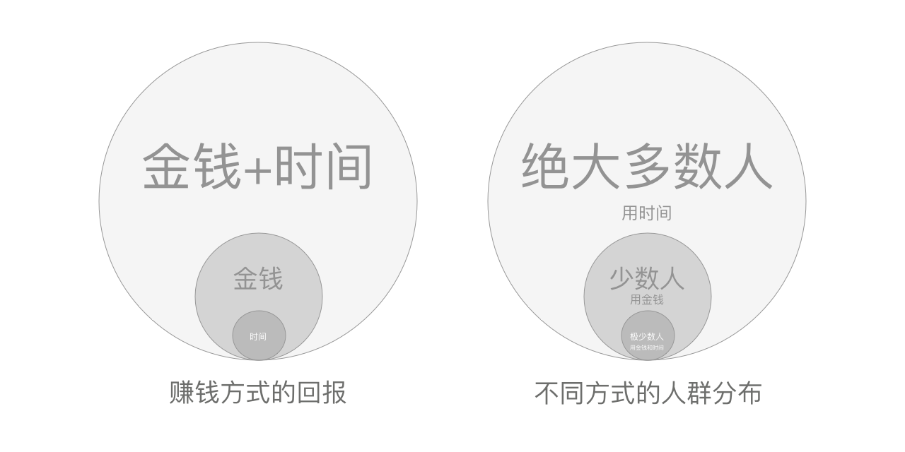

# 微信互联网平民创业（初稿）

—— 把笑来当作朋友

李笑来 © 2020

-----

## 0. 关于直播的一些说明

[点击这个链接查看「如何观看李笑来的创作直播」！](https://weibo.com/ttarticle/p/show?id=2309404528711247724703&is_all=1#_0)

我是使用 Typora 作为平日里的书写工具的 —— 它的好处是，比 Microsoft Word、Mac Pages 之类的字处理工具轻，只是用 Markdown 作为格式工具，所以，非常方便，非常容易维护。

我现在使用的直播工具是 OBS，大家可以去 https://obsproject.com/ 去下载，而后找一下教程学学。我在直播的时候，经常使用的工具箱，[看这篇文章](https://weibo.com/ttarticle/p/show?id=2309404504126162599974#_0)。

> 哈哈，我刚才是发现在不同的场景下，竟然有些没有音乐…… 所以去 OBS 客户端上添加了一些设置……

我使用的输入法，是 Mac OSX 的系统默认输入法，只不过，我把它调整成了「双拼输入」—— 使用的是「微软双拼方案」，并且打开了「南方模糊音」设置。我不是南方人，哈哈，但是为了提高输入速度，就让输入法不去区分 z-zh、s-sh、c-ch…… 这样输入的速度会提高不少 —— 副作用就是自己说话的时候渐渐开始完全区分不清楚平卷舌音了…… 唉！

现在大家听到的背景音乐，是我的 Spotify 订阅里的一个合集，Playlist 的名字叫 [Your Favorite Coffeehouse](https://open.spotify.com/playlist/37i9dQZF1DX6ziVCJnEm59?si=67XHfBvBSRCj0omir96L8Q)。只不过，我没办法用推流工具把 Spotify 播放的声音推出去，所以，我昨天找了个工具，叫做 AllToMp3，就是这个网址：https://alltomp3.org/ 挺好用的，只要把 Playlist 的 URL 从 Spotify 里拷贝出来粘贴过去，一会儿它就把所有的歌下载到本地了…… 现在大家听到的，是在 OBS 里设置 VLC 媒体源之后发出去的音乐。这个合集，是我一直听的，也懒得去找什么新歌，反正，这个合集的维护者每个月大概会放进来两三首此类风格的新歌，删除掉一些，就这样。于是，总感觉听不腻……

哦，对了，我现在是站在走步机上。这个走步机摆在一个升降桌之前，我边走边写…… 一般来说，写个半小时以上，就会大汗淋漓…… 也挺过瘾。（所使用设备，见《[一天走 300+ 分钟的装备……](https://mp.weixin.qq.com/s?__biz=MzIwNzA0NjExNw==&mid=2247487902&idx=1&sn=5502f1bff846e5e7ed85b1f42fd7c6c3&chksm=97190514a06e8c021f6ccb857e4850db5c472b1a090508a1d2f7b2cf42dfeea58e9eea23150c&token=2046283456&lang=zh_CN#rd)》

这个直播，是有回放的，只不过啊，回放功能还得等几天，估计这周末一定能完成。

这个直播，是不定时的，我有空的时候，就开始写……

差不多就这样。

## 小序

《微信互联网平民创业》应该是李笑来所写的第一本关于「如何赚钱」的书。我想教会更多的平民通过高效使用微信这个已然羽翼丰满的商业生态环境为自己赚更多的钱，长期持续地赚钱，越赚越多一点点…… 与此同时，还要打造出属于自己的品牌，更要形成、持有、并维护长期可持续增长的资产……

长期以来，李笑来写的都是「如何让自己更值钱」的内容。因为我相信只要一个人不断成长，那么，他的赚钱能力就会相应地不断加强。《把时间当作朋友》是这样，《通往财富自由之路》亦如是；甚至，《自学是门手艺》和《[定投改变命运](https://ri.firesbox.com)》也是同样的思路 —— 只不过，随着时间的推移，我的内容「离钱越来越近」。

这与李笑来的个人经历有一定的关系 —— 因为很久以前，我给自己定了一条铁律：

> **李笑来只写自己已经做到的事。**想到、学到都不算数，必须**做到**才值得分享，才有资格分享……

写了这么久，才开始写「如何赚钱」，为什么呢？很简单啊！因为，赚钱这事儿，毫无疑问，是非常困难的。

我非常喜欢李宗盛的一首歌，《你像个孩子似的》—— 其中有这样一段歌词：

> 工作是容易的，赚钱是困难的；
>
> 恋爱是容易的，成家是困难的；
>
> 相爱是容易的，相处是困难的；
>
> 决定是容易的，可是等待是困难的……

你看，一切可以瞬间就可以做的都是容易的，甚至非常容易；然而，与此同时，一切需要很久才能做好的都是困难的，异常困难。

李宗盛是在 1986 年发行的专辑《生命中的精灵》之中放了这么一首歌。而我是在 1989 年 17 岁的时候第一次听到它 —— 没曾想，这首歌竟然成了李笑来的「教材」之一。李宗盛当然不会知道，他就那么随意唱了一首歌，然后，因为这首歌，远在天边的一个 17 岁的少年，竟然恍惚之间就领悟了人间最深刻的道理。

事实上，肯定并非仅仅是你一个人觉得赚钱难，很难，很难很难，而是几乎所有人都一样，都会终究意识到赚钱的困难。因为赚钱这事儿事关的并不是你的智商和天赋，而是另外一个你可能完全没有想到的东西，一个非常抽象的概念 —— **长期**。赚一点钱事实上并不难，几乎任何人都能做到 —— 真正的困难的是：能不能**一直**赚钱？与此同时，有没有可能**越赚越多**？

终于有一天，我做到了。终于，李笑来成了一个「有资格说那话、有资格讲那事儿的人」。

于是，李笑来开始写了，讲讲「一个平民如何学会赚钱，开始赚钱，一直赚钱，越赚越多一点点……」目标也很清晰，这个内容是写给**平民**的，这个内容也只对平民有用 —— 因为李笑来就是一个平民，李笑来只会平民能做的事情…… 

如果，在未来的一小段时间里 —— 这「一小段时间」指的是大约 6～18 个月 —— 李笑来能够让相当数量的平民（比如 1,000 位，10,000 位？）变成「平民头部」（简称「平头」哈哈），那应该是多么令人高兴、多么令人激动的结果呢？

## 1. 你把微信当作什么？

对绝大多数人来说，微信一直以来仅仅是一个「熟人之间使用的即时通讯工具」—— 它最初的时候也确实看起来是这样的，所以，理解没错。

2010 年年底，张小龙组建了一个小团队，封闭开发，利用他原来的产品，Foxmail 作为底层基础设施，构建了第一个版本的**微信**，最终，这个产品于 2011 年 1 月 21 日正式发布。虽然国内市场上已经有一个同类产品 —— 雷军带队开发的**米聊** ——但，微信借助腾讯的用户基础，允许用户使用 QQ 号码和电话号码注册（并同时允许用户上传通讯录），几乎是转瞬间就获得了大量用户，随后用各式各样的手段（附近的人、漂流瓶等等）没怎么费劲就直接灭掉了国内所有其它同类产品。

从今天的视角望过去，微信的第一个版本非常非常简陋，然而，它直接对运营商的短信业务形成了巨大威胁 —— 当然，后来被证明干脆就是「团灭」。今天，电话用户用短信收到的除了验证码之外就是垃圾消息而已了。

今天回头看，第一个版本的微信颇有一些「创世」的味道。后来，就有了朋友圈；后来，就有了微信公共账号、服务号、订阅号；后来，就有了小程序，再后来，2020 年上半年，微信发布了短视频平台，驻扎在微信内的一个平台，微信视频号…… 

2020 年的苹果产品发布会上，演讲者给大家演示了一个「啊妹惊」（Amazing）的功能特性 —— 用户终于可以把一些重要消息置顶了！中国人都笑了，因为这个啊妹惊俺们早就用上很久很久了…… 又过了一小会儿，苹果又发布了另外一个啊妹惊的功能，叫做 AppClips —— 已经在微信上用了好几年的中国用户都懒得笑了，反正，Copy2USA 又不是第一次见……

2015 年的时候，微信的月活用户突破 5 亿…… 这样的时候，人们原本应该哪怕是被迫也要必须重视它了，因为，在这个用户基础上再翻上一番，就相当于是「覆盖了全国所有人」—— 然而，事实上并没有，99% 的人依然只不过是把微信当作一个短消息应用，虽然事实上每天在微信上花费的时间已然异常惊人…… 不过，99% 的人不就那样嘛 —— 反正时间对他们来说事实上也没啥大用……

2013 年的时候，微信发布了 5.0 版本，其中一个重要的新功能是「微信支付」—— 当然，大多数人再一次并没当回事儿…… 直到 2015 年春节的时候，微信联合各类商家推出了春节「摇红包」活动 —— 所有人都没想到的是，接下来的一整年时间里，所有人都在「抢红包」…… 不仅仅是接下来的「一整年」时间，而是到现在为止的每时每刻，发红包、抢红包，成了中国人在移动互联网上最常做的事情（甚至没必要在后面加上一个「之一」）。这个原本只有春节前后才做的事情，现在变成了一个「压根就停不下来」的活动。

仅仅是 2015 年春节前后一个月的时间里，微信就绑定了全国上下总计两亿张银行卡 —— 要知道，这可是支付宝干了 8 年才做到的事情…… 到了 2020 年，你很难想象，你作为一个成年人竟然没有在你的微信里绑定银行卡，是不是这样？

红包的出现和流行，彻底颠覆了支付场景的同时，微信支付也几乎是「瞬间」成了绝大多数人的支付方式。你用滴滴打车，会用微信支付，你用大众点评选好餐馆去吃饭，结账的时候用微信支付，你在京东上购物，结算的时候用微信支付，甚至，你在你家楼下买水果的时候，也是用微信扫描二维码而后支付……

我自己现在的情况是，支付宝芝麻信用分是 762 分，与此同时，我的微信支付分是 817 分 —— 你说我用哪一个支付手段更多？

一转眼，到了 2020 年，微信的 10 周年都过去了…… 十年之间，**微信吞噬了整个世界**。到了 2020 年，微信的月活用户已经超过 12 亿 —— 这非常惊人。这相当于说，「微信是一个在中国安装率甚至超过了 100% 的应用」。有手机的人都注册了微信，并且，你想想，是不是很多人有不止一个微信号？请问，你有两个微博账号吗？你有两个支付宝账号吗？你有两个京东账号吗？你有两个抖音账号或者两个快手账号吗？

如今，在微信上，你所能做的，不再仅仅是把它当作一个替代运营商所提供的短信功能的免费替代品而已了。你当然能用它向熟人发消息，不仅可以用文字，还可以包括图片、音频或视频，甚至发送很长的文章，你也可以把文章发表在微信公共账号或者互联网上的任何地方之后给对方发送一个链接；你能用它群发消息 —— 发到某个或者多个群里，或者只是静静地发布在朋友圈，人家爱看不看；你还能用它给很多陌生人发消息，比如用之前就有的微信公共账号或者现在刚有的微信视频号……

更为重要的是，在微信上，与交易有关的每一个环节都可以完成，并且「无缝衔接」。广告发布、产品宣发、售前咨询、支付、售后服务…… 闭环。

微信不再只是一个熟人间免费发消息的应用了。甚至，连互联网圈、投资圈里的人经常用来描述微信的那个词 —— 操作系统 —— 也彻底不够用了…… **微信干脆是个完整的互联网** —— 所有人都在上面的移动互联网 —— 也就是说，先是互联网吞噬了整个世界，而后，微信吞噬了互联网…… 整个互联网几乎全都要搬到微信上了。

这肯定不是什么「危言耸听」，也不是什么「哗众取宠」的说法 —— 这只是在描述一个原本应该是「显而易见」的现象而已。在这样的时候，你依然不重视微信，你依然只不过把微信当作一个社交工具去理解，请问，是不是不太合适了呢？—— 反正，在我看来，真不太合适。

## 2. 你应该把微信当作什么？

微信已然吞噬了整个世界。

那么，你有没有认真想过，我们所生存的世界，它的构成究竟是怎样的呢？若是你想要有一个概览式的了解，那么，倒是有一个很简单的办法：去看看一份主要的报纸是由哪些版面构成的？然后你就明白了，我们所在的世界，其实就那么几个方面而已：

> * 政治
> * 经济
> * 娱乐
> * 教育
> * 情感
> * 其它……

李笑来现在所写的文字是面向平民的，也只能是面向平民的，因为我自己就是个平民，不是平民的事儿我也的确不懂。对一个平民来说，买来一份报纸，通常情况下，前两版都是直接跳过的 —— 第一版，政治，真的跟自己没有任何关系；第二版，经济，唉，想来想去也没有半毛钱关系…… 就算有关系也真的不大。然后呢？然后才是平民世界的重点，娱乐，然后再跳过一版，把教育跳过去，看看情感…… 剩下杂七杂八，就看心情喽。

然而，从另外一个角度望过去，**一切都是经济**。政治与经济紧密相关，娱乐同样与经济紧密相关，或者说，从平民的感受来看，相关更大。教育呢？教育依然与经济相关，不是吗？至于情感板块，某种意义上都在躲避一个现实：在整个社会总体经济情况良好的时候，人们的情感和情绪都没有那么激烈……

话说回来，我真正想说的是：

> * 微信吞噬了整个世界；
> * 整个世界都是由经济构成的；
> * 微信是一个经济世界……

不管是否有人相信，不管是否有人喜欢，不管是否有人重视，都不重要；它就是它，一个本质上由经济提供支撑的世界。

在过往的三五年时间里，由于微信支付的异军突起，导致了微信商业生态的完善，直接催生了大量的「微商」。而在这个过程中，这个称呼即便是在现在依然在很多人嘴里多多少少带着一丝丝贬义，甚至，很多人干脆认为这个身份完全处于整个社会的鄙视链最底端……

可事实上呢？事实上，微商，只不过是「在微信这个经济世界里从事商业的人群」而已 —— 这样的描述就是完全中性的，不必包含任何情绪和价值观上的判断。在任何一个现代经济世界里从事商业都是不丢人的，重农轻商，在 2020 年来看，显然不合时宜，难道不是吗？

当然，这些年来，微商之所以口碑不佳，是有原因的。这是事实，任何一个经济环境都一样，它刚刚开始崛起的时候，能够吸引来的总是整个社会里最底层的人们。这没办法，因为只有底层的人们才渴望机会，渴望改变…… 既得利益者不需要机会 —— 他们已经过得很好了，不需要改变，最好也别有什么变化…… 话说，谁希望自己的好生活被改变呢？

颇有些遗憾的另外一个事实是，底层的人们虽然的确积极向上，但终归能力有限、资源有限，所以，在遇到机会的时候，「能力有限、资源有限」的这个事实会被放大，遇到的机会越大，这个缺陷被放大得越厉害…… 于是，一不小心就「露馅」了，一不小心就犯错了，一不小心就「被甩了出去」。最为常见的是，他们因此会倾向于急于求成，或者他们会因此一不小心就在自己并没有获得太多收益的情况下损害了别人的利益……

其实，哪儿哪儿都是一样的。上个世纪八十年代，中国刚刚改革开放的时候，所有闻风而动的商人在今天看起来都是非常非常 LOW 的。都是小商小贩，再说难听一点，就都是「二道贩子」。

别说微信了，整个互联网都是一样的。上个世纪末这个世纪初，互联网上的商业刚刚开始抬头的时候，是什么最先起步的呢？色情行业和赌博行业 —— 你大概能理解为什么会这样了吧？这是大实话：在「微信互联网」上，色情和赌博一直以来被最大限度地压制着，这已经是相当不错的成绩和现状了，难道不是吗？

在人们尚未反应过来，还用怪异的眼光看着那些在微信这个经济世界里经商的人们的时候，很多真正的创业者和企业家是不一样的，思路不同，行动也不同…… 你看，是不是绝大多数企业都开通了服务号，很多服务提供者都研发了小程序？只要是你生活中必须的服务，就有企业在微信生活提供给你，美团、滴滴、京东、火车票机票、酒店…… 从定义上来看，这些都是微商啊！你有想过最牛微商是谁吗？刚刚上市没多久的拼多多啊！你有什么不服气的？

你可以瞧不起或者瞧不上某个商人，但，你没有任何理由鄙视商业，鄙视所有商人 —— 这才是关键。

这是个经济世界，这是个商业社会…… 请问，平民在商业社会里最现实最靠谱最常见的出路是什么？

> 做个商人，做好一个商人，做一个好商人。

不对吗？

我们的教育多少有点畸形，我们的文化多少有点扭曲 —— 人们好像总觉得钱是臭的，赚钱是低人一等的，甚至连平日里提起钱都是俗气的…… 

若干年前，我有一个朋友提起我的前老板，新东方教育的创始人俞敏洪，撇了撇嘴，评价说，「他就是个商人而已！」我当场差点晕过去…… 首先，商人怎么啦？然后，啥叫「一个商人而已」？！做好一个商人多难啊！做一个好商人更是难上加难啊！人家拼了那么多年才最终竟然成为了一个**好商人**，你撇撇嘴，加上一个「而已」到底什么意思？

总是有 80% 以上的人认为自己的驾驶水平在平均水准之上（心理学上把这个叫做「乌比岗湖效应」），这不明显是因为有很多人高估了自己造成的吗？人们为什么会莫名其妙地高估自己呢？另外一个心理学效应叫做「杜宁·克鲁格效应」，说的就是，能力不强的人倾向于高估自己的能力水平…… 李笑来的总结就是，「越差越牛逼，越强越谦虚」。

上学的时候，我们都见过那些学渣的典型论调，他们不服气，背后咬牙切齿地评价那些自己怎么也打不过的学霸，说，「有什么了不起？除了会学习还会啥！」说得好像学习不是最重要的事儿似的。他们同样也会找来几个根本就没有统计代表性的反例来给自己打气，你看那谁谁谁不就是高中都没毕业也一样成了亿万富翁？

同样是这些学渣，就是同一群人，后来发现自己没赚到钱，或者说，大致能够体会赚钱的困难，然后，再次拿出同样的「武器」——「有钱了不起啊？」或者「有钱人不一定幸福……」等等等等不一而足。说得好像「没钱很了不起」或者「没钱一定能幸福」一样。

我是想说，脑子要清楚一点，心态要健康一点：

> * 我们就应该把微信理解为一个商业世界；
> * 我们应该在这个商业世界里做个好商人……

换个更为简单直接的说法吧：

> 我们是平民，微信是我们的赚钱工具。

就这样。

## 3. 微信给我们提供了什么？

地球上估值最高的公司之一，是 Google。它的核心商业价值是什么？或者说，Google 利润的主要来源是什么？Google 这家以搜索引擎为核心的公司，他的商业模式最震撼的地方在于：

> 通过关键词搜索技术，它把互联网上的每一篇文章中的几乎每个关键词都变成了它的广告牌……

于是，Google 是地球上最大的广告公司。

中国有一家公司，也是广告公司，肯定不如 Google 那么大，但也绝对不小 —— 分众。经过十多年的发展，截止 2018 年，分众在全国大约 500 万部电梯里占据了一个其实并不算太大的份额，不到 10% —— 也就是说，占据了差不多 50 万部电梯…… 它在这 50 万部电梯里都装上了一个屏幕，用来播放广告。截至 2018 年年底，分众账上的现金超过 60 亿 ，一年的净利润也超过 60 亿，市值大约 1500 亿，市净率高达 18 左右。

当然，这些都跟平民没关系 —— 因为平民基本上是做不出上市公司的…… 若是真的做出了一个上市公司，那么也就不再是平民了罢。然而，这两家公司背后的思路，其实对平民来说是有借鉴意义的，尤其是有微信号的平民。在这一点上，中国的平民要比非中国的平民实在是幸运太多了……

为什么这么说呢？

> 因为微信给你 —— 不仅给你，事实上是给每一个用户 —— 提供了一个竟然是免费的却又可以长期打造、长期积累的「屏幕」（或者准确地讲，「广告屏幕」）……

—— 那就是你每天可能看，也每天可能发的「**朋友圈**」。

微信为你提供的**朋友圈**这块「屏幕」，可比你平日里在写字楼的电梯间里甚至洗手间里见到的那些屏幕或者海报框架强太多了！这块「屏幕」上可以显示的东西，不仅可以有视频，也可以有图片或文字或者它们的组合，甚至还可以有超链接 —— 电梯里、洗手间里那些傻乎乎的屏幕如何与之相比？广告主们傻乎乎地在视频或者海报上添加上了二维码 —— 可问题在于，电梯里永远信号不好，所以，人们即便是真想去扫那二维码也经常是最终不得不放弃……

更为关键的是，在微信朋友圈这块「屏幕」上，人们还可以互动！可以点赞、可以留言。点赞甚至还有**传播效果** —— 要是从互动与传播的效果来看，别说分众放在电梯里的屏幕了，就算是 Google 也望尘莫及了。

2020 年上半年，微信又推出了一个新功能：**微信视频号** —— 瞬间，你又多了一块儿「屏幕」，并且是更大的屏幕，比朋友圈大不知道多少倍的屏幕。在此之前，你发个朋友圈，那消息只能被你的微信通讯录中的好友看到，现在，微信视频号这块新的「屏幕」就不一样了，它的展露，不再局限于你的微信通讯录好友 —— 算法会根据你的短视频内容质量、观众的反馈，将其不断地对外扩展传播，从你的一度人脉推荐到二度人脉、三度人脉…… 甚至六度人脉。若是真的被推荐到六度人脉，理论上来看，你的内容已经「触达了整个世界」！

如果你意识到了微信已然吞噬了整个世界，微信就是互联网本网；与此同时，你也意识到了微信就是个经济世界，是个商业平台…… 那么，我猜：

> 你应该已经意识到了微信为你提供的这些「屏幕」的**长期**商业价值。

在接下来的一小段时间里（写这段文字的时候是 2020 年 7 月份），如果微信再发布一个**直播功能**的话，我们完全不会有任何意外的感觉，因为这再自然不过了。并且，你也不会像别人那样去理解直播功能，你会完全是出自本能地想到另外一个与他人不太一样的理解：

> 这又是微信向我提供的另外一个更大更有用的「屏幕」……

你看，如果我能改变你的认知，我就能改变你的行为；如果我竟然可以改变你的行为，那么很可能最终我就事实上改变了你的命运…… 如果李笑来竟然真的可以改变很多人的命运，那么，某种意义上李笑来就真的改变了这个世界。

偶尔，我会因为手中有太多的事情而不能参加朋友聚会。这样的时候，我老婆会替我出席。这样的时候，朋友们会问，「哎，你家老李呢？」她就会笑嘻嘻地回应说，「哈哈，我家老李改变世界呢！」也不知道为什么这句话有那么强的「喜剧效果」，每次大家都被它逗得人仰马翻…… 到最后，这个「段子」甚至进化成了反问句，「你家老李又改变世界去了？」不过，随着时间的推移，许多年犹如白驹过隙，转瞬即逝，现在我身边的朋友都真的知道了，李笑来说自己正在改变世界，其实是相当认真的，后来也的确是真的。

来，让我们回头整理一下：

> * 朋友圈 > 平面媒体
> * 视频号 > 微型电视台
> * 直播号 > 电视购物栏目

你看，有些人的脑回路是不一样的，即便是同样的东西，在他们眼里、在他们脑子里，都有可能是完全不一样的另外一个东西 —— 在普通人眼里没有任何商业价值，在他们眼里，不仅有价值，甚至还有长期价值…… 这还用问嘛！这样的「屏幕」怎么可能没有长期价值呢？怎么可能不值得长期投入呢？

你再想想，如若没有人如此认真提醒，是不是有很多人就完全没有想到过原来微信竟然为平民提供了这么多屏幕，这么好、这么丰富的商业资源？甚至，这事儿显得有点诡异，因为微信自己一直就没有刻意说明，也不太像是「有意而为之」，于是从来都是「你自己琢磨去罢爱懂不懂」的态度。于是，真的有很多人明明身处金山却并不自知，所以非要外出花钱学个什么新技术然后再找个工作去挖铁矿……

接下来，你只能开动脑筋了。你要去琢磨究竟应该如何利用好这么多这么好的「屏幕」，去琢磨如何才能「身在福中善用福」，不是吗？不知者不怪，可若是明明知道了还能做到「岿然不动」，那可还真的需要很强的定力呢！基本上，我不相信你能做到。

很多的时候，真的不是我们不努力，不是我们不勤奋，也不是我们不聪明，甚至不是我们不动脑，更不是我们没有脑子…… 只不过是我们「没看到」而已。一旦看到了，脑子就会懂；脑子开始动并且不停地动，人就会变聪明；人变聪明了，就会开始琢磨；开始琢磨了，就不可能不行动；开始行动了，就不可能不改变…… 就这么简单 —— 所有的一切，「开眼」都是起点。所以古人总是说，「读万卷书不如行万里路」—— 行万里路为什么竟然更有效啊？因为行万里路的过程中必然反复经历「开眼」，即，所谓的「长见识」。

## 4. 我们自己最缺的是什么？

微信是整个互联网，微信互联网是个商业环境，在微信里做什么最划算？—— 经商呗。我想，这个结论除了可以接受之外并没有任何其他选项，因为不接受并没有任何意义。

问起「经商最需要什么？」很多人的答案无外乎这么两个：

> * 机会
> * 本钱

可实际上，与绝大多数人以为得恰恰相反，比如，首先：

> **机会并不见得是必要的。**

若干年前，李笑来投资了比特币，现在也依然在持有一些比特币的同时，还会时不时加仓。于是，在这个过程中，我不断遇到各式各样的人在那里哀叹自己错过了机会。这还不算，有更多的人被这样的句式所迷惑：「你已经错过了比特币，现在还要错过 \_\_\_\_\_ 吗？」然后，误以为找到了一个天大的机会 —— 所谓「下一个比特币」—— 而后发生的是：最终人和财都下落不明……

当然，在这个过程中，我见到的更多的，是这样的人：

> 他们不仅很早就遇到了机会，甚至还**曾经**把握过机会 —— 注意「曾经」两个字。他们一块钱买入的比特币，然后在两块钱的时候全部卖掉了 —— 再然后呢？一路从落袋为安（当时看起来是非常明智的选择），到花光拉倒（那么容易赚到的钱当然会非常容易就花出去），到懊恼不已（发现自己错过的不是一块两块，不是一倍两倍，而是一百倍、一千倍，甚至更多），到绝口不提（是啊，那么伤心的事儿就不应该让别人知道，甚至自己都不敢或者不愿再重新想一遍罢）……

你看到了没有？很多人就算不小心遇到了机会，哪怕很早遇到机会，甚至曾经把握了机会，到最后也只不过是「然并卵」。

首先呢，机会这东西要放到有本事的人手里才真正有用…… 可更为重要的是：

> **真正有本事的人不愁没机会。**

—— 这才是真相。

所以，任何时候都不要害怕错过机会 —— 如果你竟然错过了，那只能说明事实上你并在没有驾驭那个机会的能力而已。不要被各式各样的「红利说」所打动，甚至因为它们所焦虑。没用！是你的就是你的，不是你的就不是你的，你真正需要的根本就不是机会，虽然你也想要那所谓的「红利」，虽然那红利可能真的存在，可它们的确并不属于你，只因为你不配，事实上应该是「**暂时**不配」—— 这事儿越早想明白越好。

又，没有本钱就不能经商了吗？

虽然平日里总是看起来如此，可事实上，这世界上绝大多数真正好的生意，有很多都是无本的，或者说接近于无本的。我在《通往财富自由之路》里提到过一个「个人商业模式升级」的方法论：

> 你要想尽一切办法从「一份时间只能出售一次」升级到「同一份时间可以重复出售很多次」……

于是，当年我想到这个方法论的时候，就相当于是发现了一个「无本生意」—— 写书，虽然也是有时间精力成本的，但起码它不需要「本钱」，或者准确地讲，他需要的肯定不是钱。你以为写书不是生意吗？你以为作者不是商人吗？反正，比起作者这个身份来说，李笑来更喜欢商人这个身份。

你看，假设你想经商 —— 在一个商业社会里生存，经商好像是最佳选择之一，那就做个商人呗 —— 那么，你缺的根本不是机会，缺的也根本就不一定是本钱…… 可你最终并没有成为一个商人，更没有成为一个好商人，到底是因为缺了什么？

**两个字：能力；四个字：商业能力。**

说自己没机会、说自己没本钱、说这个世道太艰难…… 这样的人总是十有八九，可实际上都是他们在给自己找借口而已。完全不懂商业，缺乏基本的商业能力才是真正的解释 —— 可是，**大多数人不都一样么！死活都不肯承认真正的问题其实出在自己身上。**

商业能力这个东西，是非常泛、非常含混的概念，甚至到最后可以无所不包。智商可以是商业能力的一部分，情商可以是商业能力的一部分，写作能力可以是商业能力的一部分，演讲能力可以是商业能力的一部分，组织能力可以是商业能力的一部分，领导能力也可以是商业能力的一部分，甚至，趋势研究思考能力也同样可以是商业能力的一部分……

但，有一个重要的点，是最为基础的，了解了它，就算是「一下子入门了」：

> **识别长期价值的能力**

大多数人干脆不经商，所以谈不上懂经商。而少数经商者之中，绝大多数并不是好商人，为什么呢？因为他们总是被昙花一现的所谓机会所吸引，于是只能随波逐流，到最后无疾而终，甚至不得善终。

可是，入门真的就这么简单。以后只要养成这个习惯，你就已经走在「成长为一个好商人」的路上了：

> 无论做什么事情，都要事先认真问自己，并且还要真诚回答自己，哪怕就这么一句：
>
> > **这事儿值得做很久吗？**

这个问题很简单，不过，想要认真回答它可并没有看起来的那么容易。

首先，我们要认真回答一个潜在的问题，「这事儿能做很久吗？」随着时间的推移，随着经验的增加，你会越来越明白的：能做很久的事儿事实上并不多 —— 尤其是「赶时髦」的东西。回答完这个问题之后，才能得到真正的答案：嗯，能做很久，那么，「做很久真的值吗？」不过，这还没有完事儿，还有个很重要的后继问题：既然它能做很久，也值得做很久，那么，「我应该付出的是什么？」

入门这么简单，更上一层楼呢？其实也出乎意料地简单，只要深入了解一个概念就够了：

> **公平交易**

若是你真的能够通透地理解什么是公平交易，那么，不管你敢不敢相信，其实，你已经具备大师级别的思考能力了。正如刚才所说，经商虽然最终是少数人的选择，但，说实话，做一个商人本身并不难，真正难的是做好一个商人，最终最难的是能够做一个好商人。

只要你认真观察一下就明白了，就「发现」了，所有真正的好商人都是遵循这个原则的：

> **他们只做公平交易**

做不好商人，不是好商人的，虽然看起来千变万化，可实际上的确万变不离其宗：

> 他们每时每刻都想要占便宜……

这些人的核心问题在于，他们没有能力获得公平交易，没有能力创造公平交易，也因此只能通过不公平交易获利 —— 于是，他们不由自主地成了占便宜、或者占小便宜的人；甚至，一不小心就把自己变成了骗子，因为他们必须想尽一切办法掩盖交易不公平的事实…… 更为隐蔽且又可怕的是，他们因为一时间尝到了甜头，会把「作弊」当作「聪明」，会把「老实人」当作「傻瓜」—— 所谓「越差越牛逼，越强越谦虚」就发生在他们身上，然后自己活在自己创造出来的扭曲的世界里再也无法逃脱。

对交易公平性的深入理解，不仅仅是一个商人的自我修养必需，事实上，它对整个生活的方方面面都有着深刻的影响 —— 只是，大多数情况下人们没在意或者没发现而已。我们经常会看到一些所谓的「情感咨询大师」向女人们兜售各种奇怪的论调诡异的方法…… 他们也不缺拥趸，因为买账的这些人想要「牢牢绑住对方的心」…… 真的很无语！你希望获得一个男人的终生忠诚，这很好啊！可是…… 请问，你想拿什么交换呢？就凭你那说说而已的爱情和从神棍那里弄来的一套奇谈怪论？这交易不公平啊！（以上的例子里，即便是把「女人」和「男人」调换之后，效果也还是一模一样。）**不懂公平交易的人，不配有哪怕一丝一毫的幸福。**

想想看，为什么好商人都一样，都异常地**珍惜信誉**？道理很简单啊，只要是好商人，就能识别任何东西里的长期价值，你想想看，你说说看，**信誉**这东西是不是蕴含着极大的长期价值？那再进一步，为什么那些好商人为了信誉连命都可以舍掉？这个问题比刚才的问题可严肃多了，因为「舍命」可不是轻易能够做出来的选择。因为好商人们不约而同地发现了信誉这个东西里所蕴含的**甚至可以被称为无价的**长期价值，那价值真的比自己的性命更大，并且还要大很多，为其舍命，才是公平的啊！

穷并不丢人，这是事实，因为只要不傻，只要肯做事，总能赚到必要的钱，任何人都是这样的，这一点毫无疑问。什么样的人不入流？有一个这样的衡量标准：看他的脑子里是不是认为「没有什么比命更重要」？对很多人来说，没有什么比命更重要 —— 这样的人，其实并不入流。有的人之所以高贵，跟别的因素没多大关系，但有一个因素在起着决定性的作用：这样的人脑子里「总是有一些比自己的命还重要的事情」—— 说来真是有点诡异，生命之所以高贵，是因为竟然有比它更贵的东西。最不入流的人是什么样子呢？在他们脑子里，「钱竟然比命还重要！」

不要误以为「长期价值、公平交易」这八个字很「虚」…… 这八个字是非常实在的，因为对它的理解会影响一个人对任何事情的理解和判断，进而影响任何人的生活轨迹，甚至是所谓的「命运」。把它们组合起来，就是这一章的主旨：

> **识别公平交易的长期价值**

因为这是最重要的能力，这是最底层的能力，没有它，你就干脆不要经商了…… 反正也不会有什么好结果。在没有这个基础能力的情况下，给你机会又如何？给你本钱又如何？再进一步，就算微信给了你一个难能可贵的商业环境又如何？你看不到那些「屏幕」，你识别不出那些「屏幕」的长期价值，你做的所有的事情都是「占便宜」甚至是「占小便宜」的…… 反正，你不行。反过来，若是有了它，你就可以开始起步了，你不仅要做一个商人，也能做好一个商人，最后，你也终将成为一个好商人。

## 5. 为什么要格外重视视频号？

之前我们说过，绝大多数人缺的并不是机会和本钱，真正缺的是能力。但是，反过来，在能力具备的情况下，错过机会就是极为可惜的事儿了，是吧？更何况，经过一小段时间的学习与思考，你的认知，以及你的商业能力都有了很大的提升，所以，若是进步过后的你竟然还是错过了机会，那么，肯定更为可惜……

> 真正的教育都是（或者应该是）很简单很实用的。传统教育之所以又臭又长，是因为它们有史以来都是「灌水」的 —— 甚者都不叫「掺水」—— 这话题太长，都够另外写一本书的，在这里就点到即止罢。

微信视频号在 2020 年上半年开始内测的时候，很多所谓的「业内人士」所谓的「专家」都不看好。他们的理由非常丰富，且貌似逻辑严谨，甚者相当系统，比如：

> * 短视频平台早已经是快手、抖音这种「后起之秀」的天下了……
> * 微信从来都做不起来「需要堆上大量人力才能做好运营的事情」，虽然做技术绝对没问题……
> * 年轻人不玩微信的…… 我也不是没打开看，一看都是中老年人在那里讲道理…… 那谁看啊？！

在过去的三个多月里（我是 2020 年 4 月 30 日发布第一条视频号内容的），我也辅导了很多人开通视频号，帮他们做内容定位，甚至请人帮他们设计视觉效果、后期剪辑制作等等…… 当然，李笑来的风格是，无论干什么，都要自己「先成为有资格说那话的人」。所以，所谓的咨询辅导与帮助，都是在李笑来很快就把关注做到 2 万以上之后。在写这个文字的时候，我的视频号账号，「笑来」的关注量刚刚超过了 6 万（2020 年 7 月 24 日上午）。不仅如此，我也很快做到了大多数视频的内容播放量超过 10 万，大多数内容的点赞量超过 2000，甚至有单条播放量超过 500 万的内容……

有趣的是，在这个过程中，我「发现」有个格外有趣的现象：

> 越是微博大号、抖音快手大号，越是不重视微信视频号……

他们即便是「勉为其难」地做了，最终也是「浅尝即止」，看着自己发过的那几条数据表现并不好的内容，就失去了继续下去的兴趣和动力 —— 进一步验证了他们自己原本「对微信视频号并不看好」的判断。真的是很典型的「被自证预言进一步禁锢」的案例。

反倒是一些〇起点的素人们，行动迅速、思维敏捷、调整及时、进步神速…… 我猜，主要是因为他们天然有「空杯心态」罢 —— 当然，肯定还有更多的原因，随后的内容中我们会不断剖析。

微博上的几个超级大号，都是明星号，姚晨，八千多万粉丝，陈坤，九千多万粉丝…… 姚晨和陈坤都是极好的演员，这毫无疑问。但，有另外一个问题要问：

> 为什么这么多年过去了，很难再有什么别的明星的粉丝量（或者，严肃点，叫作「影响力」）能够超越他们呢？

虽然可能原因众多，但有个比较核心的理由:

> 他们俩（的账号）都是「跟着微博一起成长的」……

请你仔细想想这一条理由是不是很重要？他们也不是故意的，但，偏偏在时间上「恰巧」赶上了，于是，相当于是完整地参与了微博的起步与发展甚至崛起的整个过程。我们把这种「运气」叫作「共同成长红利」。

2020 年 6 月 21 日，张小龙发朋友圈，「泄露」了一个数据，**2 亿**。究竟是内容数量 2 亿？还是日活用户 2 亿？或者，是月活用户 2 亿？再或者，其实是「已经有  2 亿用户打开过视频号？」不得而知。然而，有一件事是我们很容易得知并确定的：

> 微信肯定是所有提供短视频服务的平台之中「**唯一绝对不缺用户的**」。

因为，只有微信才能做到，「只要我准备好了，转瞬间就能激活 12 亿用户」—— 这个数字，准确地讲，指的基本上是全国所有持有智能手机的人…… 到了 2020 年 7 月初，已经有视频号的创作者发现自己的单条视频播放量超过 5000 万，点赞量超过 600 万 —— 如果不是我恰好认识该创作者，我是绝对想象不到增长竟然是如此迅猛的。

这一次，微信不用像微博或者淘宝当年那样，「只能通过堆上大量人员跑出去推销跑回来维护」，因为用户就在这里，并且，重点在于，**全部用户都在这里**…… 所以压根就不需要堆上大量的人跑到外面「吸引用户」。

而那最初的时候被很多人所不齿的「全都是中年大叔在那里吭哧吭哧讲道理」么…… 其实是另有原因的 —— 那是因为说这话的人，有这感受的人，自己已经人到中年，所以，自己的通讯录里的好友全都是中年人，所以，算法给他们推荐的全都是那样的内容…… 这事儿不说怪谁吧，怪平台有点不靠谱吧？至于微信视频号的内容传播机制，后面会有深入的分析。

至于「年轻人不玩微信」，从来都是个伪命题。更为重要的是，在微信已经吞噬了整个互联网之后，还在鼓吹「哪个哪个平台上年轻人多」的，基本上都是缺乏全面思考能力的 ——「年轻人多」或者「年轻人占比多」，实际上说明的恰恰是那个平台的整体用户基数比微信少啊！这不是很明显的事实嘛！因为微信上有的可是**所有用户**。更为重要的是，微信是个商业生态圈，电商是商人们最应该关注的领域…… 请问，年轻人消费能力强吗？虽然我自己不能代表所有人，但，我很清楚的是，我自己年轻的时候消费能力几近于零 —— 真正有消费能力的，是中年人，更强的是老年人，难道不是如此吗？

…… 你现在已经是个商人了，请问，你的看法如何呢？

还有更为关键的点没说呢！

在我们眼里，微信视频号的意义之所以巨大是因为两个方面。首先，这是微信第一次开始涉足「熟人」之外的世界。在此之前，微信被牢牢定位在「熟人社交」领域。微信的第一版简介非常简单：

> 熟人间的通信工具，可以免费发短信和照片。

十多年后的今天，熟人社交被微信全部占领且牢牢掌控之后，它开始发力一度人脉之外的天地。事实上，「微信群」就已经开始涉及二度人脉了，「在看」，就是三度人脉理论（与之相对的，更早被人们所熟悉的是「六度人脉理论」） 应用了…… 现在的视频号，终于和微博一样，是「面对整个世界的广场」了。

然而，与微博完全不一样的地方在于，微信有另外一个「杀手锏」，或者也可以称为是「护城河」的东西：**微信支付**。除了微信之外，你再也找不到任何一个其他应用可以做到全方位的**全覆盖**了：

> * 用户全覆盖
> * 社交全覆盖
> * 内容品类全覆盖
> * 交易环节全覆盖

从交易的角度望过去，只有在微信上能够丝滑顺畅地完成并衔接交易的每一个环节：宣发、导购、收钱、支付、售后…… 抖音和快手这两个后起之秀，在这个层面上，也许还要挣扎很久很久呢。

更为重要的是，在「微博上有一百万粉丝」和「在微信视频号上有一百万粉丝」最终相差可能至少十万八千里，或者十万八千倍…… 因为微博顶多是个「完整的广告生态环境」，而微信却干脆是个「完整的商业生态环境」—— 你说差别大不大？

等等，还没完！

最令人兴奋的是：

> **这是一次素人的绝佳机会！**

换句话讲，**这是平民的机会**。从 2012 年 8 月底，微信推出微信公共平台开始算起，到现在差不多整整八年了，创作者网络版登录页面上，有一句话从一开始就写在那里，从来都没有变过：

> **再小的个体，也有自己的品牌。**

我猜，在此之前，很多人（包括我）从未认真体会过这个简短句子的深意 —— 可现在，我猜，起码，已经读到这里的你，一定和我一样可谓感受颇深，感慨万千。

这也是我写《微信互联网平民创业》的初衷 —— 我甚至能感觉到自己想要尽快完成的冲动…… 我写字那么多年了，这还是第一次有「冲动」的感觉！我想要尽快完成，我想要让更多人看到，因为我知道它会帮助很多人，甚至有可能改变很多很多人的命运。

理由也非常简单直接粗暴：

> **这很可能是未来五到十年里所能遇到的最后一次互联网流量瓜分机会……**

仔细琢磨这句话罢 —— 用越长的时间琢磨越好，越使劲越好。因为，未来的 6～18 个月，不管你自己有没有发生变化，你必然能够看到的是，很多人会因此发生巨大的变化……

## 6. 为什么总是要更重视选择？

你一定听说过，**选择比努力更重要**。为什么呢？因为努力谁都会，选择却不一定 —— 何止是不一定会啊！干脆是十有八九都不会……

我们已经看到，微信视频号值得重视，这毫无疑问；但，那些选择不重视的人难道就不努力吗？他们也在努力，甚至可能更努力呢！反过来，那些已经开始做视频号的人们，也同样都很努力…… 但，请问，他们选对了吗？—— 很遗憾，十有八九并没有。

很多人干脆从来都没有真正「选」过。他们的特点是，在有视频号之前他们在干什么，那么，在有视频号之后他们依然在干什么。在有视频号之前，他们是唱歌的，那么，他们现在就在视频号里发唱歌的视频；之前是跳舞的，他们就在视频号里发跳舞的视频；之前是当老师的，那么，他们就在视频号里发与自己的教学相关的视频；之前是做投资的，那么，他们就在视频号里发表自己对投资的见解…… 不排除他们之中也有很多做的相当不错的，但，他们的共同特征是一样的：

> 面对一个新机会（甚至是很大的机会）的时候，他们并没有做任何选择，他们只是「凭着惯性」继续自己原来的生活与工作……

—— 这是最常见的且实际上影响最大的错误，并且这个错误非常隐蔽，导致绝大多数人对自己正在犯的错误毫无察觉。

在大趋势面前，人们最常犯的，也是最大的错误，就是：

> 总是一厢情愿地希望趋势可以为自己服务……

比如，当年微信公共平台出现的时候，如果李笑来当时还在新东方教书，教托福作文…… 那么，在正常情况下，李笑来也会像绝大多数人一样思考的话，那么，我每天脑子里琢磨的大抵上全都是这样的：

> 我应该写什么样的内容才能让我招到更多的托福作文学生呢？

这就是特别典型的「一厢情愿地希望趋势为自己服务」的例子。说实话，这已经很厉害了，因为，即便是犯了一些错误，甚至是个非常大的错误，但，李笑来毕竟还是看出来微信公共账号是个机会、是个趋势，看出来它是有很大的长期商业价值的了啊！

可实际上，更为凶悍的李笑来应该这么想才对：

> 嗯，这是个趋势，这有很大的商业价值，并且，它还有长期积累的可能性……
>
> 那么，在这个趋势之中，李笑来做什么是效率最高收益最大的呢？

想啊想，后来发现，在这个趋势之中做微商是最赚钱最有效率的…… 那么，李笑来的决策应该是怎样的呢？—— 李笑来应该直接辞掉新东方托福老师的工作，冲进去当个微商啊！立志做个最好的微商！几年下来，这两个选择之间的差别，仅凭想象大家也应该能多少猜个八九不离十吧？（当然，那个时候的李笑来已经身在投资领域，并且做的相当不错，风生水起，所以，对我来说并不存在这种决策上的纠结…… 所以，这一段就是一个假想出来的「例子」。）

这背后的思考是：

> 趋势这个东西，从来都不是用来驾驭的，从来都应该是顺应的……

—— 多简单且明了的道理啊！又，**既然已经顺应了趋势，为什么不去选最大最好的方向呢？**

再看看另外一些人罢 —— 他们并不是因为自己真的想选，而是「不得不选」。因为在此之前他们并没有做成或做好一个可以在此之后可以继续干的事情…… 于是，这些人总结了在此之前的其它短视频平台上的思路，看看有什么类别、有什么形式的内容在抖音或者快手上很红很火，然后，就在微信视频号上开干……

然而，这里有个关键需要搞清楚：

> **模仿并不是真正的选择。**

模仿的危险来自于**模仿者只能模仿到表面** —— 要是那些模仿者竟然有「穿透表象看透实质」的能力，压根就不需要模仿了，是不是？

抖音、快手、B 站等短视频平台的推荐算法和微信视频号的推荐算法能是一样的吗？若是不一样的话，最可能哪儿最不一样呢？我先说说我的一个猜想罢。然后，也请你判断一下李笑来的这个猜想质量如何：

> 微信与其他视频平台最大的不同在于，它不缺用户 —— 甚至，毫不夸张地讲，「所有的用户都在微信上」—— 这一点我们反复提起过好多次。对其它平台来说，推荐算法可能必需同时完成两个任务：
>
> > * 筛选好的内容
> > * 吸引更多用户
>
> 然而，对微信这个平台来说，它的推荐算法**可以**更为单纯，只要一个任务就够了：
>
> > * 筛选好的内容
>
> 因为…… 我们早就说过了么，它不缺用户！

这样的结果是什么呢？

> 在抖音和快手上，有大量「**自己都不知道自己为什么就火了**」的创作者 —— 这样的时候，是推荐算法的第二个任务「吸引更多用户」在暗中起作用。它知道这样的内容是更「吸睛」的，更能「吸引更多新用户」的 —— 哪怕只是昙花一现…… 所以，这样的算法甚至会鼓励模仿、鼓励搬运、鼓励带节奏 —— 只要能吸引更多的用户进来就行。
>
> 那些「自己都不知道自己为什么就火了」的创作者或者内容，在一段时间之后，就会「发现」，突然之间，「自己也不知道自己为什么就不火了，就海量掉粉了」…… 为什么？因为推荐算法发现了「新的」可以吸睛、可以吸引新用户的内容或者内容形式了 —— 于是，另外一些人开始「自己都不知道自己为什么就火了」…… 如此循环往复。

所以，想想看吧，如果你用一个「在渴求新用户的平台上总结出来的所谓经验」在一个「完全不缺用户的平台」上实践，你觉得能奏效吗？肯定无效啊！—— 事实上，早就有很多抖音快手的大号冲进微信视频号之后发现自己的内容表现非常差、数据非常难看……

以上举的两个例子分别是「不选」和「假选」，接下来，让我们再看个虽然「真选」了然而却「选错」了的例子罢。

健身是个相当不错的领域，尤其是针对女性的瑜伽运动。这个领域将来的变现途径也很清楚，可以卖课也可以卖货 —— 还真的有不少相关品类的产品销量相当不错呢！

我猜，你也肯定看过的 —— 在视频号里有大量的女性做的瑜伽视频，故意突出自己的臀部，故意突出自己的胸部…… 可是，这样真的好吗？

> 注意！李笑来没有任何兴趣从道德层面分析这个问题。

曾经，有一位女生，非常红，红得发紫，甚至令人感觉红得离谱。她会挺着 G 杯的巨乳，把脸装扮成萝莉，穿着紧身上衣，拿着两根情趣玩具举在头上扮「性感恶魔」…… 她不仅很红，还拿到了不少风险机构的投资，并且，还经常被邀请到各种交流会上分享她那「迅速崛起的秘密」—— 当然，她也很擅长演讲，很擅长制造话题或者新概念，经常把听众搞的一愣一愣的…… 这才多久啊？只不过两三年而已，这位曾经的「网红」现在早已消失在茫茫的人海之中，人们再也听不到她的任何消息。

问题出在哪里？

你仔细想想就明白了。她用她那性感大胆甚至出格的形象，吸引来的究竟是谁？吸引来的好像并不是她以为的、她希望的那种「消费能力很强的精神独立女性」—— 而是基本上没有任何消费能力的、就算有消费能力也只不过就是买一包纸巾放在桌子上而后坐在那里看她的图片或者视频的那种年轻男生…… 更为可怕的是，她原本想要吸引的那些「消费能力很强的精神独立女性」，正因为精神独立，所以事实上对她的这种形象不仅抵触，甚至还有可能发自内心地无比憎恨……

所以，她的终局非常尴尬，核心问题在于：

> * 她实际上是用她的内容把所有目标群体都赶走了；
> * 与此同时，吸引来的是更多甚至无数非目标群体；
> * 从她的自我感知（甚至是旁观者的感知）来看，她会误以为自己正在成功的路上，因为流量就是很大；
> * 可实际上呢？最终，她被错误的群体误导了且毫不自知，把自己变成了一个完全没有任何商业价值的资源……

以后你会观察到更多与你最初的直觉彻底违悖的现象。比如，美女好像很有优势，可实际上，美貌很可能是她们最大的负担 —— 如何避免吸引垃圾渣男粉？如何才能同时不引发女粉的憎恨？这些都是她们要长期费尽心机面对的问题。这样的例子特别多。再比如，那些整过容隆过胸的女生，有一天误以为自己已经当上了妈妈就可以做母婴类内容，最终的结果都不太乐观。

> 这就是为什么之前我会反复提及一点：这是素人的机会。有的时候，看起来的优势可能是最大的劣势。所以，千万不要误以为短视频时代是「靠脸」的时代 —— 长期来看，真正至关重要的显然不是容貌。

话说回来，通过以上的几个例子，你应该明白了：

> **选择最重要**

—— 选择比什么都更重要。然而，尽管选择如此重要，可人们总是忽视它的作用，要么不选，要么假选…… 当然，最可惜的是，你也看到了，虽然真的选了却竟然选错了！

## 7. 最基本的决策方法是什么？

最重要的商业能力是什么呢？—— 刚刚我们已经说清楚了是**决策能力**啊！

到此为止，我们已经罗列了三个商业能力的根基：

> * 长期价值
> * 公平交易
> * 决策能力

—— 对平民来说，懂了这些，并且最终能够熟练地用上这些，就等于获得了顶级的商业教育。平民通常是没有机会去读几十万美金学费的世界顶级商学院的，不是吗？然而，听起来可能有点夸张，你也可能难以相信：只要你能深入了解这三个方面，那么，你很有可能要比那些花了几十上百万美金读过顶级商学院的人更强…… 因为他们中的绝大多数，在这三个基础上都有缺陷，且毫不自知；而商学院里事实上也不会教这些过于基础的内容。在这种基础存在缺陷的情况下，在那上面再学什么、再练什么，基本上都是白费 —— 这是事实。我这么说也是有原因的 —— 因为我可能是你知道的人里，认识商学院毕业生最多的人…… 别忘了李笑来原来是做什么的 —— 教出国留学考试的。

我们已经看到了，「不选」、「假选」和「选错」等三种情况及其各自相关的例子，那么，接下来我们当然应该讨论的是：

> 如何做出正确的选择？或者，换言之，如何做出更好的决策？

在这里，我们需要聚焦的问题是，「微信视频号是个超级大机会！」那么，我们就要讨论，「我在微信视频号里应该选择哪个方向呢？」—— 做好这个决策，才有后面的各种可能性，甚至各种好运、意外的好运。这个决策不做或者做错的话，后面什么都没有。

让我们再学一个思考方式，我把它叫做：

> **以终为始**

「以终为始」的意思是说，你要仔细琢磨这个事儿、这个方向做很久之后的最终结果是什么？那个结果是你想要的吗？那个结果值得你长期付出吗？如果答案是肯定的，那么，就要从那个「**终局**」倒过来往回想：为了这样的结果，我应该怎么做？一步一步「**倒推**」到现在…… 然后，你就知道你应该如何选择、如何决策了。

不过，「以终为始」的思考模式背后，是你已经熟悉的东西 —— 上面提到的三种基础商业能力的第一个，**长期价值**。因为你是关注长期价值的，所以，你会去思考很久之后的结果，而不是眼前的蝇头小利……

若是你竟然拥有并且能够熟练使用「以终为始」的思考模式，你会发现自己瞬间开始跟从前不一样了，也跟绝大多数人不一样了，因为你的选择不再是从前的选择了，你的选择也不会与那些毫不关注长期价值的人相同。

你是商人，你要做的终归是交易…… 所以，你要想，你所选择的那个方向，最终会产生什么样的交易呢？这个品类的商品交易额大嘛？有多大？相比来看是最大的吗？这种交易会持续吗？交易量会随着时间的推移不断增长吗？……

而所谓的交易指的是什么呢？反正，在微信互联网上，在可预见的未来，你要么**卖货**要么**卖课** —— 这是目前以及未来三五年里能够看到的最基本变现思路。

在这里，我不能乱举例子，因为即便我举出来的例子非常正确，也有可能一不小心打击了很多无辜的人 —— 之所以说他们无辜，是因为他们也很努力，他们也很勤奋，他们只不过是不小心选错了而已…… 所以，在这个特殊的地方，我就不举例了，不过，你可以通过「做作业」自己找例子，不断刺激你自己的深入思考：

> 你去找找看那些点赞量高、转发量大、可能关注数非常多的内容或者视频号，做一个表格，开始注意记录并持续分析……
>
> 1. 用你的能力去思考，在半年后、一年后、甚至两年后，这些账号分别有怎样的变现可能？能卖货？不能卖货？能卖课？不能卖课？
> 2. 能卖的话（可行），能卖得很多吗？能长期卖吗（可持续）？能越卖越多吗（可增长）？
>
> 反复观察、反复思考、反复记录，而后进行总结之后再次重复……

如此这般，你就会得出跟我一样的结论，你会发现绝大多数「很火的内容」，或者「很红的账号」，事实上不见得是有商业价值的！记住我的话：

> 流量是流量，变现是变现，它们俩常常并不是一回事儿……

「流量变现」并不是一个好词，它太过含混，乃至于经常误导很多人…… 事实上，「能变现的流量」才是个有效词汇。绝大多数的流量并不具备变现能力，无论多「火」无论多「红」，也有可能干脆不能卖货或者干脆不能卖课…… 所以，结论很清楚：

> 你的确需要流量，但，更准确地讲，你真正需要的是**能卖货能卖课的流量**！

这里略微说明一下，我为什么把「广告收入模式」有意暂时忽略掉了 —— 其实有很多原因，后面会深入解释，但，在这里只说一个特简单的理由罢：

> 在哪儿都一样，**不要跟平台抢食**。

广告收入是平台要赚的…… 所以，暂时就算了罢，平民就应该赚平民能赚的钱。

其实，卖课这事儿，跟绝大多数平民也没啥关系 —— 因为若是想要在这个领域里成为大户，需要很多年的积累 —— 这没办法，不仅是流量的积累，更重要的是自我认知提升就是需要大量的时间与精力的投入…… 除非，你一上来就铁定了心做江湖骗子。

所以，让我们认真关注一下卖货这个方向罢。

只要你肯做一点点调查，哪怕你只是随便百度一下，也都能了解个大概 —— 只不过，未经训练的你总是不习惯于自己动手做调研而已。在微信这个商业生态里，商品品类若是按成交额排名的话，目前大概是这样的（未来当然会有所变化）：

> 1. 母婴
> 2. 食品
> 3. 美妆
> 4. 服装
> 5. 珠宝
> 6. 医美
>
> ……

与很多人的想象并不相同，决策能力靠的并不是面对若干选项之时「挑出最好的那一个」；而是一个人底层的认知，包括知识、经验，以及他通过长期总结出来的行事原则。没有足够的知识和经验，没有任何行事原则的人，常常会「哪怕是看到了最好的选项也会视而不见」。

…… 反正，若是让我选择，我当然会优先选择市场最大的品类，母婴么！当然，我经常会遇到这样的反驳：

> 那要是大家都按照你的思路决策，岂不是所有人全都去做母婴品类了？

首先呢，每个人的特性不一样，所以，不是所有人都真的适合最大的品类，能力也不一样，所以，即便选了最大的品类也不见得能够真的做好。另外，以上各大品类之中也有无数的小分类可供选择…… 然而，更为重要的是，「大家全都选择做同一件事」的可能性压根就不存在 —— 因为绝大多数人就算是有人真的手把手去教，也学不会那些最基础但又最实用的的能力。这个世界的多样性，归结起来只不过源于一个事实，那就是大家各自的能力不同。结果就是，这世上什么样的生意都有人做（不管好坏），所以，完全没必要担心多样性会被抹煞 —— 不可能的！因为历史反复证明，教育总是大面积失败的 —— 绝对不会因为有人写了一本书，大家就都突然之间只用那本书的原则做事……

只要你「以终为始」地思考，只要你肯做一点点调查研究，你马上就有了非常明确的方向，并且还是「**有根据的方向**」—— 不是吗？请问，你应该做什么样的内容？针对什么样的群体？为他们提供什么样的价值？

如果不出什么意外的话，微信也会很快推出**直播**功能。事实上，另外一个功能也已经开始内测了：**微信小商店**。

> 写这段文字的时候是，2020 年 7 月 28 日

微信小商店可以像聊天一样发给朋友，可以分享到群里，将来也会像现在正在内测的微信视频号功能一样，直接分享到朋友圈…… 于是，朋友圈会成为主战场，有图文消息、有超链接、有短视频、有直播、有商店……

这意味着什么？这意味着说：

> 几乎微信上的一切都可以也应该为你卖货而服务！

—— 谁让你是个商人来着？谁让你想要做好一个商人，甚至想着早晚要成为一个好商人来着？

从现在开始，你要拼命琢磨的是，根据你所选择的品类：

> * 我要学习怎样的专业知识？
> * 我要搭建怎样的专业人脉？
> * 我要如何才能更多地覆盖目标群体？
> * 我要提供怎样的内容才是对客户有益的、有价值的？
> * 我要重点从哪方面建立我的名誉和客户对我的信任？
> * 大方向选定了之后如何在其细分领域中有效地选择商品？
> * 什么样的商品和服务是我的主攻？又，都有什么可以当作助攻？
>
> ……

这个单子可以很长很长…… 每一个问题都值得认真思考。不停地罗列，不停地琢磨，不停认真记录答案，不停地改进答案…… 如此这般，若是你竟然没有任何进步，那还真的是见鬼了吧？

—— 不过，别急，我们后面还有很多的选择要做呢！

## 8. 问问自己真的适合卖课吗？

在微信互联网这个生态之中，现在能卖的东西可以分为两种：

> * 实物商品
> * 虚拟商品

那么，虚拟商品除了服务之外，最常见的就是各种「课程」。我猜，在微信视频号上最先变现的，肯定是**卖课** —— 貌似目前也的确事实如此。最先「变现」的人群，的确就是「教人家怎么做视频号」的……

然而，李笑来并不推荐你去干这种「知识变现」或者「内容变现」—— 为什么呢？只需要再应用一次「以终为始」的思维模式就可以了啊！质问自己「这么做的长期价值」就可以了啊！

首先说个事儿，不知道你能不能理解：

> 更看重长期价值的好商人，不喜欢赚「靠信息不对称才能赚到的钱」。

因为「信息不对称」这个东西永远只是短暂的现象，随着时间的推移，当前的信息不对称一定会消亡，通常还是很快消亡 —— 虽然肯定会有新的信息不对称出现…… 所以，即便是赚到了钱，也是在赚「疲于奔命」的钱。当然，我们也能理解，在很多人眼里，「能赚到」就已经不错了！

更为重要的是，这种生意明显不属于「公平交易」。除了上面提到的，它只是通过短暂的「信息不对称」赚钱的本质之外，还有更深层次的理由：

> 你总结的那点所谓的「经验」，真的靠谱吗？

绝大多数情况下，真正靠谱的方法论，都只能靠时间证真或者证伪。没有做过 AB 测试，没有检验过安慰剂效应，没有做过双盲测试，更为重要的是，根本没有经过时间的考核，最关键的是连自己也只不过是「刚刚上路而已」—— 那么，一切只不过是「猜想」而已。

我们并不是说所有的猜想都没有价值。但，若是你非要把猜想当作定论去出售，在你自己因为自己其实很傻所以不知道的情况下，那叫「不经意的骗子」；在你自己明明知道却依然如此坚持做的情况下，那你就是「别有用心的罪犯」…… 这真的是你的「选择」吗？

你开车上路，有时候会看到一些车的车牌被泥水挡住了 —— 这种司机可能只不过是「不经意的坏人」。因为按照法律法规，他们应该经常检查自己的车牌，随时将其清洗干净；但他们并没有。有可能是没意识到，有可能是故意的，我们不得而知。但是，偶尔你能看到一些故意遮挡车牌的司机，这样的人本质上来看是「别有用心的罪犯」，因为在坏事发生之前，或者在他们主动干坏事之前，他们已经做好了准备 —— 换言之，他们随时可能故意干坏事儿……

许多年前，我给自己定下一条铁律 —— 之前就提到过：

> **李笑来只能分享自己已经做到的道理。**

本质上来看，就是基于以上的分析 —— 我认真思考了很久，发现的是，「即便是我想要真诚分享，也要先自己花时间花精力去验证之后才算数……」——很简单却非常不容易的决策。

另外，还有一个更为隐蔽的陷阱，少有人考虑到。

很多人以为「能忽悠住一些人」是自己的本事…… 真的吗？许多年前，我还在做出国留学培训老师的时候，就发现一个格外有趣的现象：

> 虽然很多人以为是「老师在塑造学生」，可实际上，更可能是「学生在塑造老师」！

我曾遇到过一个知名外语学院毕业的高材生；来应聘，一开口，发音很漂亮…… 然而，因为生活不顺利，他在毕业后的相当长一段时间里，一直在各种培训机构里做中考英语辅导老师。你想想就明白了，以他的教育背景，给初中生讲那样的课，完全不需要备课 —— 用他的话来说就是，「到现场拿起书随便讲讲就可以了！」下面的学生听到他一口漂亮的英国腔，当场就觉得「这肯定是遇到了一个比学校里见到的老师们不知道强多少倍的老师！」

…… 就这样，这个曾经的高材生，一步一步被那些连中考都要补习才行的差生们塑造成了一个「长期不用提前准备就可以混饭吃的人」。有一天，他到我这里来应聘，因为教 SAT 考试赚的钱明显更多。然而，第一节课还没结束呢，他就被学生投诉了！在这里，他遇到的学生不再是过去他每天见到的那种差生，而是完全另外一个物种 —— 这些学生是学校里的学霸，现在用课余时间去准备考一个美国中学生要考的考试，后来他们中的绝大多数也都的确去了哈佛、耶鲁、MIT、普林斯顿这种顶级大学…… 在这样的学生面前，不备课肯定是不行的，甚至，就算他真的准备了，也可能已然不太够 —— 不仅要英语足够好，逻辑也要异常系统、清晰。然而，在此之前的许多年里，他已经被过往的学生「反向塑造」成了当下这个样子，现在，再想把自己改造成适合教育精英学生的样子，实在是太难了 —— 就算没多难，也必然需要大量的时间罢…… 后来呢？后来他还是回去教原来的课去了；一转眼十多年过去，他还在过着那种不用提前准备到地方随便讲讲就可以赚到钱补贴家用的日子，没有任何进步。

后来我经常跟身边的老师说，「一定要教最优秀的学生，否则，自己肯定会变傻……」这个经历对我来说实在是太震撼了，因为我太明白一个事实：我自己的起点远不如那个曾经的高材生；可我的运气比他好，因为我一上来教的就是最优秀的学生，于是，我后来所有的进步本质上来看都是被「反向塑造」出来的 —— 其实就是被那些优秀学生逼出来的。

「反向塑造」是个好词。

同样的道理，你以为自己有本事，所以能「忽悠」很多人…… 殊不知，那是你傻，并且你自己还不知道自己傻！再说，你能忽悠到的都是比你更傻的人，这些比你更傻的人会不断地「反向塑造」你这个原本就已经够傻的人…… 于是，日子一天又一天地过去，你只能越来越傻…… 可悲的是，你越傻，你越觉得自己聪明！

**难道说我们就不能卖课了嘛**?答案是，能！当然能！—— 只不过，要卖真正有价值的课。

首先，真正有价值的课，都是很朴素的 —— 因为真正有用的道理全都是简单实用易行的，无一例外。市场上几乎一切教育领域里的「独门绝技」或者「秘密」都是忽悠人的，都是骗子 —— 成长、进步这种东西，没有啥秘密。只要是正确的方法论，基本上都是公开的。越是经验丰富的老师越是明白一个道理：「教得越久越觉得没啥可教……」让李笑来教英语，已经不大可能了；因为，走到最后，李笑来发现，一个字就够用了：「**用**」！别学英语了，直接用罢！用着用着就真的会了 —— 学啊学，就是不用，所以才小学六年中学六年本科四年加起来十六年，依然很废。光学不用，太扯淡了……

其次，真正有价值的课，应该是不掺水的。古今中外都一样，在教育上掺水甚至灌水太严重了！哪儿有那么多废话可讲啊！？理论上，一个小册子，或者 60 节 2 分钟的课，就可以把一切学英语的重点讲完讲清楚。学会音标、学会基础语法、学会查词典，完事儿！然后就开始用呗！遇到问题解决问题…… 我们自己学中文不就是这样做的吗？小时候天天带着新华字典上学，什么时候可以不用字典了，什么时候就不再是文盲了，难道你忘了吗？（因为我的经历，我习惯于用英语做为例子。可实际上，任何领域的知识都一样的……）

更为重要的是，请务必不要混淆「教育」和「教练」这两个概念。真正应该花很长时间做的，根本不是**教育**，应该是**教练**才对。两个小时把要点说清楚，这是所谓的「教育」。然后呢？然后就是学生自己的事儿了…… 他们要有信心，知道自己肯定能够学会 —— 这时候需要教练不断做心理辅导；他们要有耐心，完成一个又一个的任务，遇到问题能够解决问题 —— 这时候需要教练在关键点上说那么一句两句，在关键步骤上有那么一下两下的物理指导…… 

你可能已经想到了，学生真正需要的，更需要的，根本就不是什么所谓的「课程」，而是一个「社区」—— 就好像是他们早已习惯的校园一样。在校园里，有很多远比「课程」更为重要，影响更为深远的东西。比如，除了自己之外，还有很多非常努力非常勤奋但一点都不觉得苦的同时反倒乐在其中的人，也有一些无论如何都不会放弃自己的老师…… 

所以，如果你就想卖课，那么，来自于李笑来的建议很简单 —— 当然，虽然简单，但做好肯定并不容易，研究明白也同样没那么容易：

> **微课 + 大社群**

这不是那种李笑来一拍脑门就告诉你而后拍拍屁股就走的建议。这是李笑来在过去的几年中反复实践之后的结论。2019 年差不多这个时候，我写了一本《[定投改变命运](https://ri.firesbox.com)》，免费开源，而后开始持续维护「[BOX 定投践行群](https://ri.firesbox.com)」—— 就是这种模式。有空就仔细研究一下呗？

## 9. 不能卖货也不能卖课咋办？

《微信互联网平民创业》的定位异常清楚 —— 它就是写给**平民**的。平民所面临的问题是，「我既卖不了课，也卖不了货」…… 那我应该怎么办？

让我向你介绍一个任何时候对平民都有意义、都非常实用的策略吧，这个策略一共四个字（哈哈！）：

> **退而求其次**

听说过「叶公好龙」这个故事吧？这里面的「叶」其实读作 shè…… 这个明显是编出来的故事显然抓住了绝大多数人的本质 —— 人们总是以为自己向往成功，可若是有一天，成功真的来了，或者哪怕真的成功机会出现了，他们会吓得慌不择路、屁滚尿流……

有很多次，我跟人分享，说，你应该去琢磨「最大的市场是什么？」的时候，在对方眼里，我明显看到的，明显能感觉到的，不是兴奋而是恐惧，极度的恐惧 —— 人们貌似从一开始就不相信自己会有那么好的运气，从一开始就不相信自己能做那么大的事情…… 随后，为了掩盖自己「叶公」的本性，他们会说，「我们普通人就老老实实做点实在的事儿就好啦」…… 与此同时，当他们遇到意外、遇到灾难，乃至于自身的实力无法应付之时，他们又会说，「唉！最苦的就是我们这种老实人了……」—— 这是我能见到的最经典的「自算其命终必成」的例子了罢。

不过，说实话，绝大多数人的确不适合做太大的事 —— 这也千真万确。在描述一个做不成事的人的时候，我们经常用的是这样的排比：

> * 输不起
> * 等不起
> * 赢不起

输不起、等不起，都很好理解。可为什么竟然有那么多的人最终事实上「赢不起」呢？

大家都知道我是做投资的。做投资，短期来看，有输有赢；长期来看，只有那些长期主义者才有胜出的机会。所以，在投资这事儿上，绝大多数人都是「输不起」或者「等不起」的…… 所以只有少数人最终有机会「赢」—— 可问题在于，你可能想象不到，那少数「赢家」之中还是会出现大量的输家，为什么呢？因为他们「赢不起」。赚了点钱，就狂妄起来了；赚了点钱，就觉得自己高人一等了；赚了点钱，就觉得天下所有人都是跑来图他钱的；赚了点钱，就觉得应该离婚了；赚了点钱，就幻觉天下都是自己的了…… 这些都是「赢不起」的表现。

所以，做大事的坏处就是，首先它的确难以做成，这过程中有无穷无尽的变数、困难与障碍；更为可怕的是，即便努力夹杂着运气终于把它做成了，还要面对自己可能「赢不起」的情况 —— 若是竟然真的「赢不起」，那么下场就会很惨；做成的事情越大下场越凄惨……

于是，客观地讲，有时候能够「**退而求其次**」，不仅不是「更次」的选择；恰恰相反，很多的时候，「退而求其次」很可能是最优选择呢！—— 尤其对平民来说，更是如此。**此话有深意**，你可能需要很久很久才能真正深入领会……

基于这样的认知，在过去的一小段时间里（大概已经有两个月），李笑来为很多人（都是平民）提供了一个有效策略，也已经证明相当有效 —— 并且，我认为这个策略会对所有平民**长期有效**：

> 做**本地**内容

展开讲也只不过是一句话而已：

> 你把自己想象成本地的一个电台、电视台或者其它的什么媒体，而后专注于为本地居民提供你能提供的足够优质的服务……

这又不是什么李笑来独创的、原创的策略 —— 你想想就知道了。最初的时候全国就一个中央电视台，后来就出现了各种省电视台，再后来就出现了各种地方电视台…… 无论中央电视台多厉害，地方电视台也总有自己的生存空间，难道不是这样的吗？这背后是一种所谓「去中心化」的趋势在起作用。「去中心化」的意思不是说最大的中心被消灭了 —— 这不可能 —— 而是除了过去最大的那个中心之外，还会出现很多很多个小中心，直至最终网络变成「分布式结构」。

当然，这样的**选择**背后，实际上还有更为深刻的决策支撑：

> 对平民来说，微信互联网商业生态，并不是成为领袖的机会，而是成为**服务者**的机会！

—— 这才是更有价值的选择！

在李笑来眼里，所有成功的好商人都是真正的公仆 —— 这与大众的普遍理解刚好相反。成功的好商人也许的确看起来像是领导者，但，其实他们更为重要、更为核心、更为本质的角色，是「**优质服务提供者**」。他们不仅为消费者提供质优价廉的好商品或者服务，他们也为追随他们的人们提供超乎寻常的好服务：提供机会、提供培训、提供更多更靠谱的上升通道……

在《[定投改变命运](https://ri.firesbox.com)》里，我还讲过另外一个观点：

> 那些伟大的上市公司的创始人、CEO、老板们，本质上都是真正的慈善家 —— 因为他们提供了一个可以让平民们手中的那一点点钱竟然也能跟着世界上最伟大的公司共同成长的机会…… **难道他们不是天下最好的公仆嘛？！**

再一次，让你体会一下选择的力量。你想想看，人们是不是普遍更喜欢做**领导**，而不是做**公仆**？选择做个领导，其实并不是绝大多数人担当得起的 —— 至少不是现阶段尚无足够积累的时候就可以担当的。并且，在江湖上选择做个领导，事实上并不像人们想象得那么风光。因为你是前浪，只要你被别人看到是领导，那么就会有无数的后浪跟你当初想得一样，他们想要通过打倒你进而取代你最终也成为一个领导…… 甚至，他们还要「不择手段」、「不惜一切代价」地打倒你。所以，你以为你终于可以风光了，可实际上你「早已成为猎人的目标」—— 这真的是你想要的吗？

**做服务提供者就不一样了 —— 没有人可以打倒你。**除非你自己打倒你自己，除非是你自己放弃了提供优质服务。与此同时，后浪们压根就不会想着要打倒你，首先是打倒你本身毫无意义，其次是需要被打倒的目标其实太多…… 更为重要的是，就算他们想要打倒谁，也不是打倒你这个人，他们应该打倒的，是用他们自己更优质的服务打倒你的已经很优质的服务…… 从另外一个角度，你自己做好一个服务者之后就明白了，自己很忙的！根本没空搭理所谓的「江湖恩怨」……

你看，一切都是选择，一切优势实际上都来自于选择……

一旦我们把自己定位成「真正的服务者」，我们就会发现自己压根不畏惧任何竞争…… 更为重要的是，这个策略使得每个平民都有很多的可以掌握的空间。你可以想象一下，在你所居住的本地，哪怕有一百个像你一样愿意努力的服务提供者，也可能完全不够用啊！另外，它只是一个区域上「退而求其次」的原则应用而已啊！在「**本地**」这个范围之下，你依然有很多很多的选择，不是吗？

一旦你把自己的内容方向定位到「本地」，你就会发现，你的选择事实上更多，事实上更实诚，你的未来显得更为确定 —— 你知道哪个最关键的点你其实知道但这会儿没想到吗？

> 在此之前，我曾经提到过一句话，解释了为什么我会「暂时忽略广告这个商业模式」：
>
> > **不要跟平台抢食！**

…… 这下子你想起来了！做本地内容的好处在于，平台做广告业务肯定是「全平台」的类别，它不会去做「本地类别的广告」，这事儿对平台来说，实在是费力不讨好…… 然而，对你这个平民来说，那就完全不一样了，「苍蝇再小也是肉」啊！关键在于，作为平民，你找到了一个「任何时候都不用与平台对抗」的领域，任你游玩……

你可以做本地最好的餐饮大号；你可以做本地最好的导购大号；你可以做本地最好的游玩账号；你可以做本地最好的母婴账号；你可以做本地最好的家居大号、地产大号…… 甚至，如果你做得不错的话，你就能很容易地联合若干个本地大号共同合作！—— 这些都不是凭空想象，都是已经发生、正在发生的事情。

在微博时代、微信公共平台时代，很多本地号就做得非常出色。在很多人红而不赚的时候，他们悄无声息地获得了很多很实在的收入！当微信商业生态闭环彻底形成的时候，本地流量的价值一定会逐年水涨船高 —— 不仅价格如此，价值亦如是。

最重要的是，你仔细想想就明白了，这是所有平民都能做，且都能做好的事情。甚至，可以反过来说，不是平民，还真干脆就没办法做好这件事情呢！想想看吧，你用了用脑子，就避开了所有最强悍的竞争对手，是不是超级解脱？脑子是个好东西。

别急，还有下一步呢！

优秀的本地内容创作者、本地服务提供者可以在本地联盟，随后可以给各自创造更大的机会，更多的价值…… 那么，若是把很多很多本地内容创作者、本地服务提供者集结到一个社区呢？写到这里，李笑来不仅一脸坏笑，还洋洋自得…… 这也是为什么李笑来会在《微信互联网平民创业》这个标题下加上了一个副标题 —— **把笑来当作朋友** —— 的原因。显然，这个副标题并不仅仅是为了与当年李笑来发布的著作《把时间当作朋友》对应而已。

《微信互联网平民创业》的核心目标，只有一个，那就是：

> 在未来的 6～18 月里，我们要培养至少两万个本地内容创作者、本地服务提供者…… 并将这些优秀的本地内容创作者和本地服务提供者连接起来构成一个平民创业社区…… 

这些优秀的平民创业者，有个响当当的名字，「平头」——「平民头部」的意思……

而，如何做好这样的社区，试问，你能找到比李笑来更有经验的人吗？李笑来不仅有方法论，还有已然被验证为有效的实战经验。就这样。

## 10. 连本地内容都做不好咋办？

做本地号很不错！然而，我知道，更多的平民面临的其实是看起来更为尴尬的问题：

> 不仅
>
> * 没什么货可卖
>
> 也
>
> * 没什么课可讲
>
> 甚至
>
> * 连本地内容也做不好……

—— 难道就没有出路了吗？怎么可能就没有出路了嘛！了不起，我们再用一次「退而求其次」的策略呗！弄不好，依然处处有惊喜呢！

在继续之前，先说说另外一件事儿：

> 商业能力是完全独立于传统教育体系之外的 —— 弄不好，读书读多了反倒有可能被剥夺了商业能力的成长呢！

在我读初中的时候，在我家楼下的胡同口，有一对夫妇每到傍晚就开始蹲在街边卖烤羊肉串…… 只有一支烤炉架的那种。据说，这两口子连初中都没有读完。到了我考上大学离开老家的那一年，1991 年，他们两口子终于攒足了钱，有了自己的门店，30 平米左右，立了个牌子，叫「丰茂烤串」…… 许多年过去了，现在的我还是会时不时带着朋友去吃他们家的烤串，总是要到店排队很久才能吃上。丰茂在全国有多少家连锁店我不知道，反正我老家延吉市里有很多家，北京至少七八家，上海也有 —— 甚至，2014 年我去美国的时候，在旧金山和洛杉矶都找到了它的分店！

2013 年已经通过投资获得财富自由的我，曾经多次向家人慨叹：若是我现在依然教书为生，一年赚个五六十万元的税后收入，那么，虽然内心可能依然是个自傲的人，可实际上，从商业能力这个层面上去比较的话，我还真不如人家初中没毕业就去卖烤串的人呢！

所以吧，任何时候，平民都是有机会的，不是吗？你想想看，若是你让王兴、张一鸣、马云、马化腾这种精英去开个烧烤店什么的，可行吗？估计也开不明白…… 别说开了，他们压根就不会做这样的事情！这也常常引发我另外一个慨叹：

> * 向上总是竞争越来越惨烈的；
> * 向下总有越来越开阔的空间……

话说回来，如果我们再一次应用「退而求其次」的策略，会得出怎样的结论呢？

> 如果我竟然连本地内容（地区号）都做不好的话…… 那么，我就做个「**小区号**」算了！

什么叫「小区号」呢？你的微信通讯录里有 5000 个位置。平均来看，普通人（即，平民）的微信通讯录里有大约三五百个联系人 —— 当然是未经过任何商业思维筛选过的…… 因为绝大多数人只不过是把微信当作一个「熟人通讯工具」使用而已。

那么，你现在可以做一件事：

> 花上一段时间，在你的微信通讯录里不断添加以你的住所为中心的附近的居民 —— 至少 1,000 位…… 5,000 位更好；能再多的话，了不起就再买一个手机，再买一个手机号码，再注册一个新的微信号嘛！

如此这般，你的微信号就变成了「小区号」！如此这般之后，相当于是：

> 在一分钱没花的情况下，你给自己建设了一个容纳了 1,000 人、5,000 人，甚至更多人存在且不断来来往往的「**广场**」……

更有意义的是，你哪儿是免费建设了一个「广场」而已啊！在这个「广场」里，你还有微信为你提供的各种「屏幕」—— 朋友圈、视频号、以及微信小商店，还有未来必然出现的直播间…… 你说这个「小区号」是否有很大的**长期商业价值**？如果有，那再倒过头来认真问自己一次：「这事儿是否值得我努力去做？」

很多人对 1,000 人究竟是多少人，完全没有任何概念和感知，也不知道 1,000 人意味着什么。

在北京，有一个居住区，叫「天通苑」，里面有 16 个分区，654 栋楼，常住人口将近 50 万…… 你看，一栋那么高的居民楼里，也不过平均来看住着 800 人不到。天通苑的地铁站，据说是全世界最拥挤的、人流最大的地铁站，到了高峰时刻，差不多长这样：

在这张照片里，正在排队的人，差不多就是 1,000 人…… 通过这样的视觉震撼，你现在能反应过来了：若是你竟然需要在物理世界里建设一个能容纳 1,000 人的大广场，你究竟需要投入多少钱、多长时间才能建造那么大的一个建筑？反正，若是 1,000 人肩并肩胸靠背地像沙丁鱼一样挤在一起的话，占地面积也会超过 450 平方米；若是能够正常走动，相互之间有一点空隙，像上图那样，那就得要 1,000 平方米左右；若是像商场那样，有各种各样的功能空间的话，那么，想要同时容纳 1,000 人，那就得有 5,000 多平方米才凑合着够用 —— 中小城市里的百货中心差不多也就是这个规模……

我的意思是说，你只不过是用了你的时间和精力而已，在完全不需要资金投入的情况下，你居然可以建造一个跟你们老家本地百货商场差不多的商业空间！—— 你说，你说！你快说！这事儿是不是太划算了呢？

所以说，「**永远不要抱怨这个世界不给你机会！**」机会这东西，随时随地都存在；只不过，大多数人看不到而已，或者刻薄一点讲，那就是「大多数人根本不配看得到」……

你可能会不由自主地想：

> 「嗯，是，听起来不错…… 可，就算是我按照你说的做了，且做到了，又怎样呢？我咋赚钱呢？」

让我们花两分钟时间学习一个新的商业思维模式，很简单、很容易理解，因为它只不过是一个概念而已…… 然后，你就应该知道自己该干什么了！这个概念叫 —— 等等！开始计时！120 秒！倒计时！——「**客户终生价值**」（Customer Lifetime Value，简称 **CLV**）：

> 所谓「客户终生价值」就是指你在一个购买你的商品或者服务的客户身上一辈子能赚到的利润。

一分钟过去了，再用一分钟把这句话反复朗读若干遍罢！

完事儿！你！毕！业！了！因为这个概念在你脑子里是否存在，对你接下来的所有思考、所有决策、所有行动都有巨大的影响。仅仅「有」和「没有」这个概念之间的差异已经是天壤之别了！

再看看下面这张图：

在这个示意图中，你最终的利润，无非是两个指标的乘积（或者，在图中扩出来的面积）。你所提供的商品或者服务的 CLV 越高，乘积越大；你的客户数量越多，乘积越大 —— 就这么简单。

当你想要预估一个生意能不能做的时候，你只要想想你的最终利润（就是图中你能画出来的方块面积）能够大幅度超过你的投入（成本）就可以了 —— 或者，反过来讲，「那个方块的面积大小决定了你是否值得投入？」

很简单是吧？不过，如此简单的概念及其应用，在绝大多数平民的脑壳里是压根不存在的 —— 所以才出现「天下无论多烂的生意竟然都有人在认真地做」的情况。他们不做最重要的思考，所以，每次都只能像赌博一样，投入自己的身家去赌，赌赢了也不知道是咋赢的（即便赢了也无法扩大再成长），赌输了也不知道是咋输的（赌输了当然要怪自己命不好）…… 这就是真相，很多很多人终其一生只不过是认真地做了一个积极向上非常努力的**赌徒**而已。

对「客户终生价值」（CLV）这个概念的深入思考是至关重要的，你要问：

> * 客户数量是不是有天花板存在？
> * 这个商品或者服务的客户终生价值究竟有多大？
> * 客户终生价值和客户数量的乘积是多少？
> * 我要投入多少换取这个乘积呢？
> * 我有什么办法可以尽可能提高客户数量呢？
> * 我有什么办法可以加大客户终生价值呢？
> * ……

进而，这些问题会引发你对很多事物的理解发生变化甚至逆转。你会发现的，有些单价比较高的商品，实际上「客户终生价值」并不高，比如，那些看起来很贵的线下各类补习班课程 —— 因为人们只会购买它一次，并且，这种课程的客户人数还明显受到地理位置的限制。反倒是「丰茂烤串」这种生意更吓人…… 首先是因为它的客户有可能越来越多；更为重要的是，它的客户好像每次花的钱都并不太多，可这些客户时不时就要来吃一顿…… 所以，「丰茂烤串」的生意里，「客户终身价值」实际上要比那些「高考英语补习班」强太多了！

每个人根据自己的情况进行同样的思考也会得出不一样的结论。所以，在这里，我不会、也无法给出一个「标准答案」或者「最佳选择」—— 不过， 我倒是可以分享一个当初我的思考结果。

在我们国家刚刚改革开放，推行市场经济的时候，全国上下所有地方都出现了所谓的「夜市」…… 然后，家家户户都为了多赚一点钱（当时被戏谑为「捞点外快」）去夜市里练摊。平民么！总是「不选」或者「乱选」所以十有八九都会「选错」…… 所以，夜市里卖什么的都有。过了一小段时间，夜市就不那么热闹了 —— 因为绝大多数人并没有赚到什么钱！当然，这也并不奇怪，选错了还能赚到钱，那才叫真的奇怪呢……

然而，商业并没有因为大多数平民凑了凑热闹没赚到啥钱就散了而停止发展。很快，百货大楼火了起来，随后各地都出现了除了「大百货」之外的「二百货」、「三百货」，甚至「五百货」…… 后来，就开始出现各种专门品类的大市场，比如，菜市场、宠物市场、鲜花市场等等……再后来，就出现了各种专卖店，先是各种杂牌服装店出现，然后全部倒掉，被替换成了「品牌服装专卖店」，并且连锁…… 而街边常年屹立不倒，几十年如一日地经营着的，还真的没有多少品类，就那么几个：餐馆、便利店、眼镜铺、金店、药店、典当行、烟酒专卖店、咖啡店…… 如果你略加分析就会发现，这不是偶然，因为这些品类的「客户终生价值」都非常高，与客户数量的乘积也非常大！

那接下来我的结论就简单了：这些「长生」或者「常胜」的品类中，有哪一个是我能做且能做好的呢？后来，我的结论是，药店不错啊！并且，都不用做什么调研，仅凭简单计算就可以得出结论，在店里卖避孕套（保健品）肯定比卖感冒药（医药）更赚钱啊…… 别笑，我还真的有所行动呢！

好了，这个章节，就到此为止。然而，通过这个章节，你能理解为什么李笑来会坚持认为「**教育是最伟大的布施**」了吧？而你，我猜，也一定感受到了认知提升的惊人效果……

## 11. 平民如何做好视频号内容？

微信视频号的最重要特征之一就是它的「去中心化」属性。我们之前就提到过：

> 「去中心化」的意思不是说最大的中心被消灭了，而是除了过去最大的中心之外，会出现很多很多的小中心，直至网络变成 「分布式结构」。

这个属性决定了说，「成为一个微信视频号的超级大号」难度非常高，虽然不是不可能；但是，会有很多很多之前并不存在可后来在这里崛起的「大号」—— 虽然没有「超级大号」那么大，但也足够大。「中心化网络」由一个超级大号及其粉丝构成；「分布式网络」由很多很多个大号以及它们各自的粉丝构成……

当我看到微信视频号团队把「关注」按钮隐藏到更深一层的时候，我就更喜欢微信视频号的机制了！因为，若非如此，那么， 很快很快就会形成所谓「粉丝量的巨大贫富差距」，那么，这个网络结构的属性就更像「中心化网络」而非「去中心化网络」或者「分布式网络」了。平民么，只有在「分布式网络」里才有真正属于自己的机会。

所以，平民在一个更适合自己的环境下，想要做好视频号的话，那么最重要的原则中，应该排名第一的就是：

> **平民本色**

你的**本色**就是你的**特色**，你的本色和特色就是你的优势 —— 不要去模仿他人，不要去跟风，**保持本色**才是最大的**长期核心竞争力**。

跟风永远不靠谱 —— 只因为一个最重要的理由：

> 跟风没有任何长期价值。

并且，你也不再是彻头彻尾的愣头青了 —— 毕竟你已经读到这里，思考了这么久，并且，你已经做出了很多高质量决策：

> * 你选择去经商，并选择了要成为一个好商人；
> * 你选择了经商环境，即，微信的商业平台；
> * 你开始选择能变现的流量，而不仅仅是任意流量；
> * 你选择了方向，往大了你选择了自己的品类，往小了你选择了自己的客户群体；
> * 你选择了不断进步不断积累，起码，你已经是懂得什么是 CLV 的平民了；
> * …… 你还会不断地继续进步、不断地继续升级！

于是，你事实上已经没办法随波逐流了！

保持本色的另外一个重要选择就是：

> **不要太过在意拍摄技术**

拍摄技术真的相对来看并不重要，尤其是在分布式的平民网络中更是如此。吸引人的，永远不是拍摄技术本身，永远是内容，准确地讲，是优质内容；更准确地讲，是**优质内容所传递的真正价值**。

李笑来在很小的时候做过一个选择，就是选择文风。我到底是要罗大佑那种辞藻华丽的文风呢？还是要李宗盛那种大白话白开水的文风呢？后来，我选择了李宗盛的文风，只有大白话，就像白开水…… 为什么？很简单啊：这样的文风制作成本低啊！许多年过去了，这个选择给我带来了当初绝对想象不到的好处：

> 因为李笑来从来没有在文风文采上浪费过时间，也就是「从来不在创作技术上浪费时间」，所以，创作内容的能力、让作品更具穿透力的能力反倒是飞速成长 —— 道理也很简单，人的时间精力就是非常有限的，就是干了这个就没空干那个的，所以，必须合理分配……

做一个视频号内容，原本应该有很多个环节 —— 随便一数就至少 8 个：

> 编导演拍剪配发宣
>
> * 编剧
> * 导演
> * 演出
> * 拍摄
> * 剪辑
> * 配音/配乐
> * 发行
> * 宣传

在《通往财富自由之路》里，李笑来向大家分享了一个「放之四海皆可用的思考方法」，那就是：

> 无论遇到什么事，无论遇到什么情况，都要反复问自己一个最首要的问题：
>
> > 什么更重要？
>
> 反复问下去，就能回答更进一步的问题：
>
> > 什么最重要？

显然，在这 8 个环节之中，「编剧」是最重要的么！没有它，剩下的都得干等着；内容不好，无论怎么宣传都没用，难道不是吗？于是，我们就应该把所有的注意力都放到「编剧」这个环节上…… 剩下的么，以后再说！拍摄技术和剪辑技术差一点就差一点吧，不怕；演技差一点就差一点吧，其实没啥…… 虽然我们并不是说以后就不用去学去练技术了。不过，更重要的是，甚至最重要的是，「**保持平民本色**」是我们早已经制定的首要原则 —— 你想想就明白了，平民本色之一就是「技术一般」么！

当李笑来建议大家不要过份在意技术的时候，同样不是凭空想象，而是有实际调查数据支持的。有[调查表明](images/https://www.36kr.com/p/1723825668097)，87% 的视频观众在意的是「视频内容的真实感」，而不是那种一眼望过去就能看出来是「可以表演」的内容。

在此基础上，是另外一个原则：

> **价值导向**

遵循所谓的「价值导向」原则，无非是反复从两个方面问自己：

> * 我的内容对观众有什么价值？
> * 喜欢我的内容的观众对我来说有什么价值？

这其中的第二个问题，一般来说，是绝大多数平民从未想过的 —— 可你却不一样，你的认知已经升级过若干次了，你知道「反向塑造」的概念，你也知道「反向塑造」的效果有多可怕；所以，你一定会不由自主地认真思考第二个问题，并且得出别人压根想不到的结论！

让我们再看一个调查数据，看看短视频的浏览者们都持有怎样的动机？

让我们提取出这其中最为重要的关键字吧：

> * 有趣
> * 有用

好了，你就用这两个简单的「标尺」去衡量你自己的内容就可以了！最好「既有趣又有用」；退而求其次，也要做到要么「有趣」要么「有用」…… 「既无趣又无用」的，不仅不合格，还是绝对不能发布的！别说发布了，连做都不应该做！

再深入思考一步，你就会发现，「有用」其实比「有趣」更具长期价值。所以，即便是在当前只有两个非常简单的衡量标准的情况下，也有优先次序：

> 相对于「有趣」，你要更重视「有用」……

—— 虽然「有趣」总是不可或缺的。

所以，你的审稿流程应该是这样的：

> * 这个内容真的对观众来说是有用的吗？若是有，有多大用处？
> * 既然这个内容的确是有用的，那么，我如何做才能让它看起来更有趣一点？因为哪怕更有趣一点点都是很有价值的……

那么，什么样的内容会让用户感受到「有用」呢？让我们看看调查数据：

看着这些调查结果，对比一下自己已有的选择，我想，任何正常人都会有一些属于自己的思考，属于自己的结论罢！如果你能坚持「优先考虑有用且绝不放弃有趣」的原则，那么，理论上来讲，你能做好任何领域的内容！—— 就这两个原则加起来就够用，绝对够用…… 甚至完全没必要添加任何其他原则。这种东西，被李笑来称之为「最少必要原则」，反正，李笑来自己用了一辈子，屡试不爽，然后心里更爽，越用越爽……

除了「平民本色」和「价值导向」之外，另外一个很重要的原则也必须重视：

> **真诚社交**

你要想尽一切办法结交更多的视频号内容创作者，向他们学习的同时也向他们分享。学习要学习得彻底，分享要分享得毫无保留 —— 大家相互之间绝对不是竞争者，因为这是一个「去中心化」、「分布式」网络。平民通过这种方式会更快的进化为「平头」（平民头部）。在中心化的世界里，「同行是冤家」—— 这的确是事实。然而，在「去中心化的分布式世界」里，**同行只能是联盟** —— 这是真相。

当我看到自己的社群 ——「[BOX 定投践行群](https://ri.firesbox.com)」—— 里有一位网络昵称叫做 “Turtle” 的成员搞了一个叫做 「百花园」的微信群，邀请许多视频号创作者加入的时候，我就开始琢磨怎么帮她…… 很快，我琢磨出了点子，然后就建议她再搞一个群 —— 这个群后来被命名为「竹园」—— 入群门槛很简单，就是视频号粉丝要达到一定数量才行……  这背后的逻辑是，**优质内容创作者的人脉质量相对应该更佳** —— 所以，这些人形成一个联盟，在群里哪怕别的什么都不干，也会导致各自的内容传播更为广泛。然后呢，然后我在这个群里也做了很多分享，全都是「知无不言、言无不尽」！

所以，作为平民创作者的你也一样，要想尽一切办法扩大自己的有效社交人脉。如何结交有效人脉最有效？其实很简单，并且，我也早就给你讲过方法论：

> 先成为一个「**优质服务提供者**」！

你想啊，如若你是个服务者（而不是装逼犯），如果你提供的服务非常优质（而不是金玉其外败絮其中），那么你必然是真诚的 —— 请问，还有什么比这更为真诚的交友方式吗？当你天天琢磨的都是「如何为别人创造价值」，你不需要什么情商不情商的，你甚至可能都不需要礼貌不礼貌的，没有任何正常人能不被你吸引，你信不信？

## 12. 微信传播机制独特在那里？

微信视频号的内容传播方式，以及它的推荐算法，都与看起来差不多的其它短视频平台不同 —— 这个巨大的差异来自于它的底层：

> **微信有全网唯一最全的熟人社交关系网络。**

你用你的微信号发布视频号内容之后，接下来的若干天里，你的视频号内容大致会按照以下步骤传播：

> * 在第一个 24 小时里，算法会将这个内容推荐给你的微信通讯录里的人看 —— 他们是你的一度人脉，强关系。算法会评估，看看有多少人打开这个视频？有多少人看到最后？有多少人点赞？有多少人转发？有多少人收藏？有多少人评论？…… 如若相对来看指标不错的话，那么，就进入下一轮推送。
> * 在第二个 24 小时里，算法会将那些第一个 24 小时里表现不错的内容，推荐给你的二度人脉 —— 就是你朋友的朋友们。这些人要么在你的微信通讯录的人的微信通讯录里，要么在一些与你共同所在的各种微信群里。比如，你和我可能并不是微信通讯录好友，但，你和我共同在一个群里，那么，你和我也算是二度人脉。之后，还是一样，用第一个 24 小时一样的那一堆指标来衡量，看看表现如何？
> * 在第三个 24 小时里，算法会将那些在第二个 24 小时里依然表现不错的内容推荐给你的三度人脉……
> * 以此类推…… 直至六度人脉。

理论上，如果你的内容竟然被传播到六度人脉，那么，你的内容（或者说，干脆是你本身）已经触达了整个世界。

> 六度分隔理论（英语：Six Degrees of Separation）认为世界上任何互不相识的两人，只需要很少的中间人就能建立联系。哈佛大学心理学教授斯坦利·米尔格拉姆于 1967 年根据这个概念做过一次连锁信实验，尝试证明平均只需要 6 步就可以联系任何两个互不相识的人。
>
> —— [维基百科《六度分隔理论》](images/https://zh.wikipedia.org/wiki/%E5%85%AD%E5%BA%A6%E5%88%86%E9%9A%94%E7%90%86%E8%AE%BA)

以上我向你讲述的「微信视频号内容传播方式」并非所谓的「内部消息」—— 我个人也没有任何渠道去了解微信视频号团队是如何写算法的，他们也不会告诉任何人任何细节。但是，基于「微信有全网唯一最全的熟人社交关系网络」这个事实，以上的推测只能说「非常合情合理」。

这就解释了为什么有那么多的「大咖」开通视频号之后发现内容传播范围很狭小的重要原因：

> 大咖们是最大程度上把微信当作「私密社交工具」使用的…… 例如，明星、知名投资人、知名作家等等，都很珍惜自己的时间，很珍惜自己的空间，不愿意被各种消息所打扰 —— 导致的直接结果，就是他们的通讯录里的人很少很少…… 于是，他们冲进来做视频号的时候，第一个 24 小时就吃亏了！

另外一个常见的「大咖几乎必然犯的错误」是「用助理的微信号发视频号内容」—— 小助理的通讯录质量肯定相对极差啊！于是，又是「吃了亏都不知道咋吃亏」的结局……

那么，你现在应该马上反应过来了：

> 你的微信通讯录里好友人数越多，你做视频号就越有优势……

这几乎是必然的结论。甲乙二人同时做视频号，在质量内容相对差不多的情况下，如果甲的微信通讯录里有 5000+ 好友，而与此同时，乙的微信通讯录里只有曲曲 150 人的话，那么，乙在第一轮筛选中，就已经开始吃亏了…… 而甲的内容呢？第一轮就能够传播给更多人，那么，后面每一轮都相对更有优势。

有一个数字，叫做**邓巴数**（Dunber’s Number），这个数字是 **150**。而「邓巴定律」也叫「150 定律」。绝大多数人一生能够维护的强关系人脉中的人数，大约是 150…… 换言之，绝大多数人的一度人脉平均来看，也的确差不多就是这个数值。

事实上，绝大多数人的微信通讯录好友人数都在 150 以上，因为你的通讯录里总是有一些并不是太熟悉，甚至到后来早都忘了是谁当初是为什么加上的人…… 根据张小龙在 2020 年的公开课上所讲，目前微信 12 亿用户中，绝大多数人的通讯录好友人数平均为 500 左右。

然而，有另外一个数字你可能需要更加重视。也是在同一个公开课上，张小龙提到，有大约 100 万用户的微信通讯录好友人数超过了 5,000 —— 也就是说总计有大约千分之一不到的用户，是「微信通讯录好友人数超级大户」。理论上来讲，他们是已然「坐拥最大屏幕」的人群…… 很可惜的是，这里面的绝大多数人并没有清醒地意识到，也因此压根就没有想过应该用什么样的方法论去开发那「已然属于自己的资源」。

等等！千万不要读到这里，就觉得自己突然明白了点什么，就开始着急忙慌地去琢磨如何给自己的微信通讯录填满 5,000 人…… 甚至拉起一个大群开始互加 —— **不要作无用功**。无论做什么事情，尤其是那些格外有价值的事情，都不是能够通过单一线索就可以搞定的。决定最后成功的因素总是有很多，至少多于一个，所以，「了解相对全面之后再开始行动」总是更好的策略 —— 说文邹邹一点就是「要三思而后行」。

有一些人的微信通讯录早就满了，可是，当他们开始做视频号的时候，还是发现自己的内容传播很差…… 这又是怎么回事儿呢？可能有以下几个原因。

第一，最大嫌疑是内容质量差 —— 这个不用再多费口舌了。

第二，你的微信通讯录里虽然有很多人，但他们不是你的内容的「受众」。例如，明明你是想做本地内容的，可你的微信通讯录里的 5,000 人是在网上乱加进来的，跟你那「本地」全无关系……

第三，这个原因最为严重：你的微信通讯录好友中，真正认同你的人的比例太小！—— 所以他们并不愿意为你的内容点赞、不会转发你的内容，甚至…… 甚至他们压根就没关注过你！

2017 年的时候，比特币价格暴涨…… 很多人，真的有很多很多人都跑来找我，话里话外颇有些怪罪的口气：「咱们这么好的朋友！你怎么当初就压根没告诉我呢？」—— 可实际上，李笑来真的很无辜。因为，在中文世界里，几乎第一篇关于比特币的文章，《此物一出天下反》就是李笑来写的，并且，当时李笑来还是直接把它发表在自己的博客上…… 我没藏着掖着啊！我告诉了全世界啊！

当然，那个时候的我并不知道另外一个真相：我的大多数朋友并不会阅读我的博客文章的！当然，他们也没告诉我他们根本就不看我的博客的 —— 也可以理解，谁愿意当面说这事儿啊！

如果，最终你发现你的通讯录好友之中真正认同你的人比例很小，那么，我刚刚是在用自己的亲身经历告诉你：

> 相信我，你并不孤独……

于是，有一个结论我们应该认真思考并坦然接受了：

> 任何有效的人脉都不是天然存在的，都不是自然形成的。任何有效的人脉，都只能通过**耐心积累**、**刻意打造**、**长期经营**才可能最终获得。

随意形成的人脉，从来都没有什么实际的价值 —— 起码，很难形成真正的商业价值。

在「耐心积累、刻意打造、长期经营」之前，我们需要掌握怎样的「最少必要知识」才能开始起步呢？一共四个字就足够了 —— 反正也不是李笑来发明的，说实话，这东西也轮不着李笑来发明，因为古人都知道：

> 识人断物

这四个字，说的是两件事。「识人」，才能打造积累经营有效人脉；「断物」，才能通过看透趋势进而获得它的加持 —— 当然，我们早就已经用过这四个字了，甚至早就算是掌握了这四个字，还记得吗？

> * 识人：我们已经知道真正的好商人是什么样的 —— 他们只做公平交易；
> * 断物：我们在看到趋势的时候已经分析过 —— 完整的微信商业生态已然形成……

好了，抽时间仔细审视一下自己的微信通讯录吧，做个表格，给其中的每一个人打分。评价一下他们各自对「公平交易」这个概念的理解，思考一下他们的过往行为是否表现了对「公平交易」这个核心概念的认知、判断，以及行为，最高 5 分，最低 1 分……

有一个结论是非常干脆的：

> 打分在 4 分以下的人，事实上不值得你作为一个商人在他们身上浪费任何一分一秒。

不过，有更严峻的问题。「识人」，不止要去识别他人，更要认真识别自己…… 给自己打打分罢：

> * 别人会给我打 4 分或 5 分吗？
> * 有多少人会给我打 4 分或 5 分？
> * 给我打 4 分以下的比例到底有多高？

这个问题，你自己回答还真没用 —— 无论你多么想让自己客观起来…… 我们每个人对自己都有各式各样的幻觉。你想啊，竟然有接近 90% 的人认为自己的驾驶水平处于平均水准以上呢！所以，你得四处打听一下…… 甚至可能需要设计一些有技巧的评测 —— 如果对方的答案让你失望，请务必提醒自己：

> 你自己的答案是幻觉 —— 人家给你的答案才更可能是真相……

## 13. 打造广场之前如何打地基？

现在，我们所面临的问题是，「究竟要怎么做，要学什么，才能做到让别人给我自己打起码四分或者干脆五分呢？」——如果满分是五分的话。

我们之前提到，在微信商业生态里，要么卖货要么卖课；如果，既不能卖货也不能卖课的话，那就选择卖服务……「卖」显然是重要的，于是，「销售能力」好像明显非常重要。

但，为什么之前我并没有把「销售能力」放到最重要的位置上呢？为什么在讲销售之前，反复强调的竟然是其他东西呢？比如，我们之前反复强调的是这些：

> * 识别长期价值的能力
> * 只做公平交易的原则
> * 以终为始的决策能力

因为「销售能力」也好，「销售技巧」也罢，其实并不是一个可以凭空产生、凭空使用的东西…… 它总是只能建立在一定基础之上。

市面上有很多讲「销售技巧」的书籍、课程、培训…… 绝大多数都没用 —— 因为那些技巧不可能凭空产生作用。想想就知道了，就算有人把十八般武器全都拿过来给你，若是你身体素质不行的话，那些武器全都是摆设，那些技巧你根本就学不来，学会了也用不好 —— 遇到一个比你更加身强力壮的就直接废了，不是吗？

如果说，微信朋友圈是个「大屏幕」，那么，微信通讯录就好像是「挂着那块大屏幕的承重墙」；如果说，微信是个「大广场」，那么，微信通讯录就好像是「那广场的地面」…… 那么，请问，「地基」是什么呢？

> **你这个人**才是真正的地基啊……

同样的道理，「你这个人本身」也是「销售能力」的「地基」。老话说，「做事先做人」，真的是非常有道理的 —— 只不过，它听起来太老生常谈了；或者，单单把这一句话拎出来实在是太不容易引发重视了，所以，新人们总是并不把它当回事儿……

不过还好，在此之前，我们并没有花费太大的力气，就已经让你深深体会到了「你自己的认知发生变化会对你的生活产生多么深远的影响」…… 你只不过是多读了一千多字而已，就已经不再把微信只是当作「熟人通讯工具」使用了；你又只不过是多读了一阵子而已，就发现过去的自己太不懂得如何认真做决策了；再然后，你只不过是学了一个新词，「客户终生价值」，就突然间觉得视角开阔了，好像是多了一双慧眼，竟然可以把过去觉得纷纷扰扰的世界看得清清楚楚明明白白真真切切……

你看，你的认知发生变化，一切都会跟着发生变化，甚至干脆是巨变！那么，如果你整个人发生变化了呢？如果你竟然有可能变成一个更好的人呢？

> 你所存在的世界也会跟着变好……

—— 你信不信？很多过来人都有这样的感受。演员黄渤在一次采访中就提到，年轻的时候觉得生活很艰难，遇到的坏人也很多…… 可是，等有一天，自己已经功成名就的时候才发现，人们对他都挺好的，感觉好人也更多了…… 这是幻觉吗？并不是，你所身处的世界会随着你的变化而变化的。[BOX 定投践行群](https://ri.firesbox.com)里的刘晓艳老师说得好：

> 最好尽量按照正确的想法活着…… 否则， 早晚有一天，你会开始按照你的活法想着……

所以，「我究竟要做一个怎样的人呢？」—— 这才是最基础最首要的问题啊！

因为经商也好、做销售也罢，都一样，你经营的或者你销售的，本质上来看，其实是你自己，而不是你选中的商品或者服务…… 理由也很简单，那是因为「是你自己根据你自己的原则选择了那个商品或者服务」，而不是「那个商品或者服务竟然自己有灵魂所以有意跑来选择了你」，不是吗？

不仅从商业角度，更是从人生角度，这个问题有个最硬核的标准答案：

> **成为一个值得信赖的人。**

相信我，如果有一天，我竟然从你手中购买了商品，或者从你手中购买了服务，那么，**首先是因为我信任你**，而不是因为那商品怎样或者那服务怎样…… 因为，我必须先付钱才能使用商品或者服务，所以，在我掏钱的那一刻，我是在做一次「冒险」；虽然也许我有机会退货退款，但，在这种不好的结果发生之时，我不还是已经把自己的时间 —— 比那钱更重要更宝贵的资源 —— 赔进去了吗？英语里有一个专门的词组用来描述这种情况，叫做 “**Leap of faith**”，在电影《盗梦空间》的台词里出现过，即，「因为信任（甚至信仰）而甘愿冒险一跳跨越障碍」。

当我们信任一个人的时候，是因为通过时间的检验，我们发现他「有原则有底线」。所以，我们能对他这个人的人品放心。「有原则有底线」的人，做事方式是特定的，选择是有依据的，即，他会用他一贯的原则做决策；不仅如此，他们在做事的时候，还能「有所为有所不为」，因为他们有底线，所以，有些事情他们坚决不做……

于是，这样的人，其行为是「可预测的」（predictable）。即便是在我们不知道具体发生了什么的情况下，我们也可以做出一些合理推测，他这个人可能会怎么做，因为「他一贯如何如何」，因为「有些事情绝对不会做」…… 到最后，我们会看到那预测准确度八九不离十 —— 所以，我们才能信任他。进而，又一次「不出所料」的话，那么，我们就会更加信任他……

在生活中，严格按照正确的原则做事，经常会掉进坑、撞到墙，轻则皮肉损伤，重则头破血流…… 真的非常不容易。与此同时，很多人会选择违背原则，甚至放弃底线，用以换取眼前的利益，甚至可能是很大的利益。所以，在后者面前，前者常常看起来像是个傻屄 —— 不仅朋友不理解，甚至连家人都要不停地抱怨…… 于是，到最后，能够一直坚持原则一直坚守底线的人，在人群中的比例少之又少。

不用举例。反正只要活下去，你一定会遇到无数的例子，不论是发生在别人身上，还是发生在自己身上。

然而，在真实的商业环境之中，很多时候，坚持原则坚守底线，并没有想象的那么可怕，甚至可能其实非常简单。比如，李笑来写书讲课的时候，给自己定下了实际上是很简单的原则：

> 我输出的内容一定要对他人真的有用！

与此同时，我还设置了一个底线：

> 我只写自己已经做到的道理。

坚持这样的原则、坚守这样的底线，其实根本就不需要得罪人，不需要触碰政治红线，更不需要「卧薪尝胆」什么的，甚至，干脆就不可能因此与任何人发生冲突，只需要付出时间和精力，努力与自己死磕，甚至拼命。李笑来出第一本书的时候，同样不可能提前有现在的口碑啊！可是，随着时间的推移，读我博客的人觉得有用，读我书的人觉得有用，每一本书都让人觉得有用，听我讲课的人觉得有用，听我讲过很多课的人还是觉得有用 —— 甚至，随着经验的增加，能力的成长，我输出的内容质量越来越好，乃至于受众常常感受到「惊艳」…… 于是，经年累月，在这方面的信任逐步建立起来，因为李笑来的受众都知道，购买李笑来的内容，一个字，「值」！这就是所谓的「可预测」及其随之而来的「信任」。

虽然「有原则有底线」其实可以并不难，但，有一点是非常难的，也只能很难很难，那就是不仅要「有原则有底线」，还要「**长期**有原则有底线」—— 反正，「长期」两个字，放在任何地方，古今中外，都是少有人能够做到的。

所以才有像沃伦·巴菲特那样的慨叹：

> 建立信任需要很久很久，毁掉它只需要几分钟……

进而，所谓的「信赖」，是「信任」+「依赖」。那，那些信任你的人凭什么竟然会「依赖」你呢？首先，没有信任，就不可能有依赖。而后，如果你是有原则有底线的值得他人信任的人，再加上另外一点就够了：

> **专业**

—— 那么，「信任」你的人会进而「**信赖**」你。

在平民的世界里，所谓的「专业」真的不像人们以为的那么难。你的朋友，既然和你都相处了那么久，他们在基本的事情上就是信任你的。然后，若是你家里的装修竟然在朋友圈里做到了最好，甚至不仅最好还最经济…… 那么，很快，你的所有朋友们都会向你请教，请你帮他们出谋划策 —— 这就是「信任」之后因为所谓的「专业」而获得的「依赖」，即，「信赖」—— 你觉得很难吗？

其实，所谓的「专业」或「突出」只是一个习惯而已，一个可以养成的习惯。很小的时候，我父亲教我说，「你要学会时不时做出让大家佩服的事情。」—— 然后这句话我受用终生…… 所以才会有很多事情发生。比如，当老师们觉得我是个废柴的时候，我会突然拼命努力考出第一名的成绩；比如，突然之间，我的同学们发现我领了一个什么「东三省青少年宫计算机竞赛冠军奖杯」回来；再比如，大学毕业的时候，我的同学们发现整日里吊儿郎当的李笑来，竟然不仅有毕业证，还有很多人最终并没领到的学位证…… 诸如此类吧。这并不是一个什么特殊的天分，而是一个经过长期习惯而养成的行动模式、决策模式。真的只是习惯而已，即，习惯性地知道什么时候应该做出怎样的惊人决策 ——「习惯性突出」。

记住，无论做什么事情，都应该更「专业」一点 —— 只要养成这个习惯就好。其实，「比大多数人更专业」实在是再简单不过的事情，不管做什么，养成以下三个好习惯：

> * 开始之前做足准备工作；
> * 过程之中全力以赴；
> * 结束的时候做足收尾工作……

你只要观察一下绝大多数人就可以了，他们做事都是「没头没尾」的，所以，没有第一个习惯和第三个习惯…… 甚至，即便是在做事的过程中也完全没有任何「全力以赴」的精神气。所以，干了就好像没干一样，哪儿可能「专业」得起来呢？所以，他们无论如何都「不突出」，无论如何都不可能「被依赖」，所以，永远不可能获得「信赖的支持」。

所以你看，大多数人不值得被信任，大多数被信任的人不值得被依赖…… 于是，成为人群之中的前百分之一，只需要这么简单的方法论就可以了 —— 首先，通过「有原则、有底线」成为少数 10% 值得被信任的人，然后，通过「专业、突出」成为那少数 10% 之中的 10%，即，1% —— 真的很难嘛？

「成为前百分之一」，用我们的话讲，就是成为「平头」——「平民头部」的缩写 —— 显然是值得为之付出为之努力的实实在在的目标啊！ 别说用 6～18 个月去做了，哪怕为之努力付出一辈子也是值得的啊！更何况，你也看到了，要做的事情其实真的挺简单的……

## 14. 如何才能剔除讨好型人格？

给大家讲个真实的故事。

许多年前，我在老家，混迹在电脑配件批发市场维生。当时我有一个档口，大概廿平米左右，批发电脑的主板和显示器什么的。当然，我们也做零售。那时候人们会买散件组装成电脑，作为商家，我们的利润也不错。虽然我生意不错，整个市场里也算得上数一数二，但，市场里的人都知道，「李哥」脾气并不好。

市场么，人来人往…… 时不时就会遇到特别事儿妈、特别挑剔，且说话不顺耳的顾客。公司里的小朋友们都很敬业，于是即便受了点委屈，也都尽量客客气气。不过，若是被我发现，我就会用我的方式去处理。我会轻轻走过去，站好；笑嘻嘻地伸手把那顾客从柜台前往后推一步，然后，直盯着那客户的眼睛，语气极其平静，甚至声音不大，话却是对刚才受委屈的小朋友说的：「把这些东西收起来，咱不卖了。」

由于我的语气是格外平静的，并且脸上还笑嘻嘻的，声音又不高，并且只是说「咱不卖了」，刚刚还在耍泼的那个人会愣在那里，不知道该怎么办。等他反应过来了，也只能说出大抵上已经被我们听过很多次的话，「你这是什么意思？」或者，即便是反应快一点的能说出来的话依然没有什么创意，「顾客是上帝，你懂吗？！」

他若是问我，「你这是什么意思？」，那我就依然死盯着他，但也依然笑嘻嘻，声音依然不大：

> 你看不出我烦你吗？你仔细看，我很烦你，很讨厌你。但，我也没工夫跟你吵架。所以，我就是不卖给你了。你呢，出去转转，反正这市场里也不止我们一家，对吧？

他若是问我，「顾客是上帝，你懂吗？！」，那我同样是死盯着他，但也依然笑嘻嘻，声音依然不大：

> 你知不知道我们现在在几楼啊？嗯，对，三楼。你刚才怎么进来的啊？你和我们一样，爬楼梯上来，然后从这个门走进来的，是不是？你看见那个窗子了吗？上帝呢，不爬楼梯，当然不用翅膀也能飞，所以，上帝来的时候都是从那个窗子直接进来，走的时候都是从那个窗子直接出去…… 你行吗？你不行。所以，你不是啥上帝，对不？别说话，别说错话，反正，我就是不卖给你了。你呢，出去转转，反正这市场里也不止我们一家，对吧？

反正，那些惹人厌的顾客在我这里没有什么作妖的空间，我也不跟他们对骂，笑嘻嘻地把他们请出去就可以了 —— 了不起这单生意我不做了么！所以，当年给我打工的小朋友们出门都很硬气，因为他们知道在关键的时候，「他们的李哥」会替他们出头，绝对不会让他们受委屈。

有人问过我，「你就不怕这样会得罪客户吗？」—— 我的解释是这样的：

> 不怕。我只是拒绝和他做生意而已。我又没有做伤害他的事情，我又没有占他便宜…… 我卖的是电脑或者电脑配件什么的，我又不是电影《教父》里的黑社会老大马龙·白兰度，若是拒绝与看不上的人做生意的话，人家会跑来用枪打死我，对不？

更为关键的是，我压根就没有任何「讨好型人格」。我也不想讨好所有人 —— 因为我知道我绝对做不到。我又不是人民币，怎么可能人见人爱么！我就是想老老实实做好生意，做好买卖而已，用不着人见人爱。甚至，我都不需要人家非得爱我，或者非得喜欢我，我只要做到「人家不讨厌我」就已经足够了吧？

> * 我卖的东西是好的，我不卖假货；
> * 我卖的价格是正常的，我不赚暴利，也不想坑人；
> * 我的专业知识比同行多一点，所以可以提供相对更好的服务，在价格相同的情况下，我已经做到超值了……

这些都做到了，我就已经理直气壮了，是不是？再然后就不是什么生意经了，干脆就是人生态度了：

> * 你对我好，我也会真心对你好；
> * 我对你好，你才会真心对我好；
> * 你对我更好，那我必须对你更好；
> * 我对你更好，那我就希望你对我也更好一点……

道理很简单，因为这样才公平嘛！不公平的事儿我们直接不干了还不行吗？—— 如若不然，这世界这么大，咱们相互躲着点，无论如何，各自都应该有属于自己的一片天地吧？我的人生哲学就这么简单 —— 事实上，这都廿多年过去了，我也从来没有见过这个方法论竟然失效过。

我猜，每个人多多少少都有一定的「讨好型人格」—— 尤其是在我们这个父母强权根深蒂固的文化里成长的人。在整个童年时期、少年时期，我们这个文化里的人都会遇到各种莫名其妙的打击。就好像崔健的歌词里所描绘的那样，「权力在空中飘荡，不小心就打在肩上」…… 哪儿是往肩上摧一下那么简单啊！常常干脆就是往死里弄。于是，在搞不清楚规则却又已然被折磨的情况下，只剩下「委曲求全」或者「讨好为生」才是出路。

然而，经商这个事儿在和平年代里明显比整个生活简单太多了，纯粹太多了！「只要不坑人不骗人就应该理直气壮」—— 难道不是这样的吗？而且，我总是能观察到另外一个现象：

> 但凡我喜欢的商品，但凡我喜欢的服务，每次购买的时候，我总是会发自内心地，真诚地感谢提供商品或者服务给我的人……

对于那些有能力造出超值商品的，有能力提供超值服务的商人们，表达真诚的感谢难道是「尊重公平的我们」不应该做的吗？于是，反过来，如果我通过自己的努力竟然做出了超值的商品，或者竟然提供了超值的服务，那么，我的顾客们是不是应该感谢我才对？那，我为什么要讨好「原本应该感谢我的人们」呢？同时，我猜，他们也完全不需要我的讨好罢！

据我观察，「讨好型人格」是天下最浪费时间最浪费生命的品质。还是那句话：人的时间精力总是有限的。如果，你被「讨好型人格」所左右，那么，你就得耗费大量时间精力去从各个角度讨好各式各样的人…… 不是一两个，是一批又一批，前仆后继。

若是你把时间精力花在讨好他人上，那么你就没有时间精力把事儿做好，所以你根本就硬气不起来。更为重要的是，「讨好型人格」的副作用在更隐秘的地方 —— 你会因此完全没有办法成为一个好人，你会变得压根没原则，彻底无底线…… 「讨好型人格」就好像是个泥潭，陷进去之后，越挣扎陷得越深。不挣扎呢？不挣扎也会慢慢沉下去，被淹死是早晚的事儿。

很多人喜欢「站队」，仅仅是为了眼前的那一点利益。可是，站队这事儿很危险，因为只要你开始站队，你就得不停地站队…… 这站着站着吧，早晚有一天你会发现，你正处在一个左右为难进退皆错的状态，反正，到时候你怎么站都不对！

所以才有古老的智慧永远有效：「**守住本份**」—— 把自己份内的事儿做好，做到极致…… 至于份外的事儿么 —— 可以是「关我屁事」。也许有人不同意，但，若是你认真琢磨一下，就会发现，这么简单的建议会让你逐步变成一个「非常硬气的猛人」—— 你事儿做得好，你人做得正，你怕什么？到最后，甚至连误解或者中伤什么的都不怕。

另外一件事儿发生在我在新东方教书的时候。新东方有一个「学生给老师打分」的制度。比如，你一共要讲十节课，那么，在第八节课结束的时候，学生们就会拿到一个打分表，给正在搭班讲课的几位老师分别打分…… 制度这个东西，经常会深刻地改变人们的行为。老师们为了获得更高的分数，费劲了心机。比如，把真正的干货狠货一直押着不讲，到了第七节课第八节课的时候才会「适时放出」；再比如，到了第七节课第八节课开始就在台上给学生唱歌…… 更不要脸的就干脆在课堂上给学生讲自己年轻的时候跟残疾女生谈恋爱的故事 —— 明显是他妈的编出来的……

李笑来也不是不会弹琴，也不是不会唱歌…… 说实话，我也不是没想过「是否应该妥协」，但，终究没做任何改变。该干嘛干嘛，把份内的事儿做好。有一次，应该是因为上一节课的老师唱过歌了，然后也怂恿过学生，所以，我一进屋一上台，下面学生就开始起哄，拍着桌子喊，「唱歌！唱歌！」

我也知道他们中的大多数没有恶意，并且，基本上只是「被误导」了而已…… 可那天就是忍不下去了，顺手就把麦克风砸在讲台上，暴吼了一通：

> 谁他妈的给你们惯的毛病？你们交点破钱来上课，然后呢，要求老师讲课精彩，这没毛病，所以我就玩命做好。然后，还要求老师上课讲段子哄你们开心，我就已经看你们不顺眼了，但，想想也就忍了，毕竟开心很重要。现在竟然他妈的要求我唱歌，不唱咋着呢？难道因为你们要给我打分了，我就得唱歌？这是我一个老师的本份嘛？！我就肏了啊！你们就算花钱嫖娼也不带这么玩的啊！想好好听课，就他妈的全给我闭嘴！不想听课的，就他妈的出门左转去退费！你们表个态吧，是要听课呢？还是要怎样？

…… 静默了一会儿，台下掌声雷鸣。后来就传开了，反正，再也没发生过在我的课堂上有学生乱起哄的情况。

当然，另外一种极端也绝对要不得。虽然我们做人尽量正，做事尽量好，所以我们心里也足够硬气，然而，完全没有必要因此就一不小心变成「靠，老子天下第一，所以任何时候都是爱谁谁」的状态。在这里，我根本就用不着举例，因为你在生活中总是见过很多这类人，他们到最后会发展成「不管三七二十一反正先把所有人都得罪了再说」的类型。

这种小心的背后是另外一个不可忽视的事实：

> 我们都是人，我们都是凡人，我们都是凡人中的平凡人，所以，无论如何，我们都有可能犯错……

如果你肯认真想一下就知道了，故意犯错其实并不可怕。你想做一个好人，你就不会故意犯错。而那些故意犯错的人，常常是因为他们已经提前按自己的思考模式衡量过利弊，所以才决定「宁可犯错也要去做」，因为他们这么做可以多获得点什么……

真正可怕的，不是犯错，而是「无意中犯错」或者「不小心犯错」。你不是个坏人，但你的确犯错了，虽然你无意如此，虽然你是不小心，这才是吓人的 —— 若是那错误让别人蒙受了损失，虽然你不是有意，虽然你不是故意，请问，如何收场？又，当你自己觉得自己是不小心、自己是不故意，请问，蒙受损失的那些人会感同身受地理解你吗？别说他们了，是不是很多其他人也同样不会理解你？别说理解你的懊恼了，若是他们竟然以为你干脆就是故意，说实话也没有什么办法啊！甚至，也不算过份啊！

所以，「尽量不要得罪人」常常并不是因为我们害怕得罪人，而更多是因为我们害怕自己 —— 我们自己并不见得靠谱，起码，我们知道自己需要很久的时间、很多的努力才能变得靠谱，才有机会变得更靠谱…… 所以，遇到不好的人，或者遇到与自己的原则底线相冲突的人，不要去争吵，不要去争辩，不要想着输赢，最好的策略是「能躲就躲」。

## 15. 怎样才能成为不讨厌的人？

说实话，谁不想成为一个受人欢迎被人喜爱的人呢？—— 只是大多数人做不到而已。然而，就算「退而求其次」也依然是非常有价值的 —— 「不受欢迎」不要紧，起码要做到「**不讨人厌**」，对吧？「不讨人厌」都做不到的话，别说成为好商人了，干啥都不行啊！这很显然，很明确。

只要剔除掉「讨好型人格」，就可以让你瞬间变成『有基础、有能力随时「不卑不亢」的人』—— 如果你在任何时候都能把自己份内的事情做好甚至做到最好，那么就「不必讨好谁」，或者说，「没必要必须讨好谁」…… 也许我们有时候也会去讨好一些人，但前提是「我乐意！」—— 讨好一下爸妈，讨好一下配偶，这很好啊！因为那可以是非常幸福的选择，不是吗？

那「不讨人厌」的诀窍在哪里呢？只要再剔除一个恶习就好了，真的很简单，很直接：

> **以自我为中心**

如果你肯仔细观察一下，你就会发现大多数人做不到「不以自我为中心」，他们的特征非常明显，且相同：

> * 经常打断他人说话；
> * 不放过任何抬高自己的机会；
> * 为了证明自己是对的不惜一切代价；
> * 如若话题不在自己身上那么几乎全都是抱怨或者负面评价；
> * ……

请注意：

> 绝大多数表现出此类特征的人们往往的确不知道自己竟然是这样的！

如果竟然有人当着他们的面毫不留情地指出他们的这种缺点（甚至「缺陷」），他们会极为真诚地「断然否决」；即便是他们在被指出之后，随后暗地里「认真反思」的时候，他们也很难相信自己竟然真的是这样的人 —— **因为，他们同样讨厌具备以上特征的人！**

—— 这就太有趣了！怎么会出现这种情况呢？他们是如何做到的呢？一个人在一方面作为那样的人却同时在另外一方面无情地鄙视所有那样的人……

于是，我们要研究这些特征来自于何处，也许他们是「症状」而不是「症因」—— 如果我们竟然可以找到「症因」，那么我们就有办法消除「症状」。这个类比的副作用在于，它有可能会引发一些人的「抵触情绪」，因为这个类比很可能会让人联想到「自己有病」，进而引发「逆火效应」，大脑里的直接反馈是无需思考且带着浓浓的火药味的：「你他妈的才有病呢！」……

其实，「生病」这事儿确实不好，但，「得病」并不是病人的问题，要么是运气不好，要么干脆是一个人活着的过程中存在的正常现象而已 —— 谁不是时不时得点「死不了的病」呢？「有病不知道」才可怜；「知道自己有病却坚持不治疗」，那就是完全没有任何道理的「虐待自己」了—— 更何况，我们这里提到的这个被类比为「病证」的东西，首先可治疗，其次治疗方案很简单，更重要的是，不花钱！—— 根本就不需要考虑是否可以走医保……

当然，如果我们认真研究的话，最终的结论会让我们极为释然：

> * 它甚至干脆就不是什么病；
> * 它只是人们在成长过程中必须经历的若干阶段之一；
> * 只不过，很多人竟然停留在这些阶段之中，终生没有走出去过；
>
> …… 而已。

有一本和李笑来的年龄一样大的书籍，1972 年出版，书名是《I’m OK, You’re OK》，中文译名就叫它《我行你也行》罢！这本书里的理论放到这里，会让你很快弄明白为什么很多人具备以上我们提到的「令人极为讨厌的特征」。

任何正常人在成长过程中都有可能需要经过这四个阶段，只不过，并不是所有人都能到达第四个阶段，有很多人停留在第三个阶段，有人停留在第二个阶段，甚至还有人干脆一直停留在第一个阶段：

> 1. 你行，我不行（You’re OK, I’m not OK）
> 2. 我不行，你也不行（I’m not OK, you’re not OK too）
> 3. 我行，你不行（I’m OK, you’re not OK）
> 4. 我行，你也行（I’m OK, and you’re also OK）

小时候，我们所有人都身处第一个阶段。那个时候，我们什么都不懂，我们什么都不会，大人在我们眼里甚至接近神的位置。他们看起来什么都懂，他们看起来什么都会，他们力气比我们大，他们有着我们完全想象不到的权力…… 反正，他们很行，我们很不行 —— 尤其是，每次对我们来说莫名其妙无法理解的惩罚出现的时候，我们就愈发地自卑，愈发地小心…… 可依然做不到事事顺心。

随着时间的推移，我们慢慢长大。幸运的是，我们作为正常人总是有足够的学习能力（不单指学校里的成绩表现）。于是，我们脑子开始变得更好一些，身体也更强壮一些…… 结果呢？结果就步入了下一个阶段：嗯？虽然我的确不怎么样，可你实际上也并不咋样么！哦！原来大家都这个臭德行啊！这个「发现」毁掉了很多人，因为他们误以为「既然如此就无需再进步了」。他们不知道的是，停止进步的代价巨大 —— 从此之后终生处于第二个阶段里的人们开始「至死不渝」地「与全世界对抗」…… 无论表现有多么千差万别，骨子里就是相同的一句话而已：「反正，大家都一个德行，谁都别想在我面前装蛋！」

身处第二个阶段里的人，都会不由自主地表现出种种令他人讨厌的特征。虽然，「我不行其实我也知道」，但，无论在什么时候，只要「能够证明你也不行」都是令我极度舒适的，甚至，不知不觉之间，那早已变成了任何时候的「首要目标」。

随着时间的推移，更多的人不由自主进入了第三个阶段。他们的「发现」是：哦，原来「我很行，你们都不行啊！」—— 少数人的确因为时间的积累多少进步了一些。然而，更多的人是因为幻觉；他们并未意识到另外一个事实：年龄的增加不会确保知识的积累。入行更早一点，经验更为丰富一点，甚至年龄更大一些，当然会有一定的优势，至少「显得有一定的优势」，可实际上，这并不能保证后起之秀用并非更聪明的脑子，但更先进的手段，获得更多更快的进步。

在第三个阶段里的人是最焦虑的。因为他们其实就算是只是在潜意识里也知道自己的地位事实上「岌岌可危」。在孩子面前装装倒也不是很难，可是面对配偶、面对同事，那就压力实在是太大了…… 所以，他们甚至会主动出击，看到「谁竟然有比我更行的苗头」，甚至哪怕是「谁竟然行的苗头」，都要直接冲过去尽快打掉！以防「我行你不行」的幻觉被打碎。所以，他们的首要目标和第二个阶段里的人其实差不多，「反正要证明你不行」…… 至于「我自己到底行不行」，你管呢？只要我藏得足够好就行了么！于是，他们身上同样会表现出同样的种种令人讨厌的特征。

相对来看，第一个阶段和第四个阶段都是健康的；当然，最健康的是步入第四个阶段。虽然最终能够步入第四个阶段的人很少，但他们都一样，相对非常平和。他们对自己相当满意，在他们眼里别人也都不错，所以可以和平相处…… 你想想就知道了，觉得自己不错的同时也觉得别人不错的人，怎么可能「在别人说话的时候将其打断而后把话题引到自己身上」？怎么可能「闲着没事儿就想着要抬高自己」？怎么可能「无论如何都要证明自己是对的」？怎么可能「只要话题不在自己身上就说出来的全是负面话语」？

第一个阶段其实也是很健康的。因为那时候虽然难免有些压抑，但，对于「我不行」的感受是对事实的反应，所以也常常并无太多实际压力。并且，在第一个阶段的时候，更经常发生的反倒是，「恰恰因为不行所以就迅速去学了！」…… 后来呢？「后来也就真行了！」

更令人欣慰的事实是：「所有人都一样，最多只是在某些领域里能够自如地处于第四个阶段」—— 在其他领域，生活的其他方面，更多处于前三个阶段的某一个阶段之中。比如，李笑来。在投资领域，我常常的确处于第四个阶段，觉得自己不错，然后也经常遇到很多人也让我觉得相当不错，甚至比我自己强很多 —— 并且，无论对方多强，也不会令我觉得自己不行…… 然而，在其他领域呢？比如，在人际关系处理上，我就实际上常常处于第一个阶段，因为很多人都处理得很好，我就是不行。诸如此类。

于是，调整一下自己的状态，经常按以下思路整理自己的情绪就好了：

> * 我行就行，不行就不行；
> * 不行并不丢人，不行就学，学到做到为止；
> * 至于别人行还是不行，关我什么事儿？

就这么简单。如此这般，要么你在第四个阶段，要么你在第一个阶段 —— 反正你就是不在「无论如何都会让你讨人厌的第二个或者第三个阶段」。说实话，这多少有点诡异！因为到最后，治疗「以自我为中心」的手段竟然是「在自己身上使劲」—— 即，**只关注自己的成长，不与他人做无谓的比较。**

天天都要反省自己：

> * 我今天表现出了什么「令人讨厌的症状」？
> * 为什么我忘了「不应该与他人乱比较」？
> * 下次我应该怎么做才能 「只关注自己的成长」？

如此这般，你就能在「不小心陷入第二或第三个阶段的情况下」，能够及时意识到，然后还能及时跳出来。在第二或第三个阶段里的每一分每一秒都是浪费。因为无论是你的时间，还是你的精力，甚至是情绪，都对你毫无用处。毫无用处倒也罢了，它还会不断令你变成更讨人厌的人…… 这太可怕了。不招人喜欢倒也罢了，讨人厌不仅非常不好，还非常没必要。

关键在于，**讨人厌的人那可是真的赚不到钱啊！**

## 16. 怎样才能成为受欢迎的人？

—— 终于讲到这里了！

在未来的五到十年时间里，在中国大陆，一定会批量出现很多很多的「超级个体」—— 事实上，最早的一批崭露头角已经是几年前的事情了，他们已然在大行其道 —— 薇娅、李佳琦、李子柒、罗永浩、辛巴、张庭、张沫凡、张大奕、林依轮…… 等等等等。不要误以为只有「网红」是超级个体，很多企业家也在这条路上飞奔：小米雷军、格力董明珠、携程梁建章…… 这个队伍只能越来越大，不可能越来越少。

也许你已经反应过来了，他们都是在 2020 年这一轮「直播带货」大潮中「乘风破浪」的先锋。

2020 年年初开始的新冠疫情，间接把「直播带货」推到了风口浪尖。一时间，人们闻风而动，暗流涌动，都在想着如何才能抓住这一波的「风口红利」…… 那，你可能会问，「这些都是那些超级大 IP 才能干的事啊！跟我一个平民有啥关系呢？」—— 别急，不仅有关系，还有很大关系呢。虽然说你现在是个平民而已，谁能保证 6～18 个月之后你肯定不是「平头」呢？再过几年甚至十几年，谁知道你是不是竟然也能变成「超级大 IP」呢？所以，先别急着放弃。

在「直播带货」的背后，实际上是一个趋势在起作用：

> **广告业态被解构之后的重构。**

也就是说，随着互联网以及移动互联网的发展、短视频平台和直播平台的崛起，甚至「微信互联网」的最终形成；在这个过程中，广告主付费的对象在不断发生变化。最初主要向报纸杂志付钱，后来主要向电视台付钱，然后主要向微博这种平台付钱，现在呢？现在，开始主要向这些头部直播播主付钱…… 所以，现在正在直播带货的播主们所赚到的钱，主要构成其实并不是靠卖货赚到的钱，而是广告主付给他们的钱（业内将其称为「坑位费」），也就是说，现在这些直播播主，本质上更像是一个广告牌，而不是一个售货员。

到此为止，还是看起来和平民没啥关系…… 话说，脑子是个好东西，脑子不好，长双眼睛事实上没用。

让我们继续深入研究下去，问一问下一个问题：

> 「嗯，广告业态被解构之后又重构了…… 那这又究竟是为什么呢？」

这个问题的答案就跟平民有明显的关系了：

> 电商生态终于从「**分销时代**」正式进入了「**直销时代**」……

—— 因为这个本质，李笑来都恨不得生造新词了 —— 这就是「**电商 2.0**」啊！中国电商祖师爷马云在二十年前就开始四处宣扬且布道的「**前店后厂**」，这是真的要在二十年后开始大行其道了啊！过不了多久，现在的这些头部直播带货播主都会看到一个事实：

> 与其收一大堆坑位费，还不如自己做个品牌出来，甚至干脆自己开个厂子，用自己的流量卖自己的货才最划算……

这么做，用李笑来最近四处跟朋友分享的话来说，就是「赶快搭上国货之光的超级列车」…… 目前（2020/08）这依然是「尚未发生」的事情，但，李笑来可以放个预测在这里 —— 虽然提前预测总是需要相当的勇气：

> 但凡采用了这个模式的直播带货头部播主都会在三五年里成长为身价百亿人民币的「超级个体」。

反过来，但凡不走这条路的直播带货播主，随着时间的推移都会被时代甩在身后。

你又要问了：「等等！我还是听不出来这事儿跟我一个平民有什么关系啊！」—— 别急啊！来啦：

> 与「分销转向直销」这个趋势同步发生的还有另外一个趋势，我们早就提到过的：
>
> > 从「中心化网络」转向「分布式网络」的「**去中心化趋势**」正在同步发生……

于是，在未来的世界里，虽然依然会有十来个拥有过千万粉丝的「超级个体」，但，更为重要的是，也是跟平民真正有关系的是：

> 同时会有十万、二十万，甚至超过百万个拥有几万、几十万粉丝的「**平民头部个体**」（就是「平头」）出现，且不断成长……

于是，你现在可能反应过来了，「平头」只能是那些最终极受大家欢迎的人 —— 光剔除了讨好型人格还不够，只是不讨人厌也远远不够，仅仅是「有一些人喜欢」依然不够，只有进化为「**有人爱的人**」，才有可能成为「平头」…… 请注意措辞：

> 平日里我们可能用「大受欢迎」就已经表达足够精确了；但是，当我们在这里严肃讨论商业、讨论直销的时候，我宁愿使用这样的措辞：
>
> > **被很多人热爱！**
>
> —— 是「爱」，是「热爱」，而不仅仅是「喜欢」…… 因为最终人家是要掏腰包的啊！

我这是在给你指路呢！不仅是指路，那路径还格外清晰：

> * 花一段时间（半年？）剔除掉自己身上的「讨好型人格」；
> * 花一段时间（半年？）把自己变成「不讨人厌的人」；
> * 然后，再花一段时间（半年？），成为「竟然有很多人爱的人」……

如此这般，你若是不能成为「平头」那还有谁行啊？《微信互联网平民创业》就好像是一个「平民人格改造工作室」一样，随便进来一个「平民」，学习、思考、行动，两年后出去的就是一个「平头」—— 神奇吗？

相信我，市面上的绝大多数技巧虽然都看起来有用，但是，如果你没有做到以上三条，那么，那些东西在你身上就是没用。反过来，如果你竟然做到了以上三条，你就会发现，那些技巧你用不着…… 因为你不会遇到那些「觉得各种技巧非常有用的人」经常遇到的那些问题 —— 因为你和他们不是一样的人，所以事实上活在不一样的世界之中。

好了，那你又要问 了，「如何才能被人爱呢？」又，「如何才能被很多人爱呢？」这俩问题的答案很简单，并且听起来非常「鸡汤」…… 若是说出那答案的人不是李笑来这种的确实力非凡的人的话，我猜你真的很难相信，就一个字：

> **爱**

—— 非要用一个完整的句子作为答案的话，那就是：「**做一个心中有爱的人**」—— 甚至，「**心中要有大爱**」。人们对「爱」这个字往往并没有清晰的定义，基本上都是从言情小说里学来的那一套，大概是「爱要付出」、「爱要保护」、「爱要长久」、「爱要相互」…… 其实，从另外一个角度定义反倒非常简单直接：

> **爱是一种需要实力支撑的能力。**

一个人若是没有能力没有实力的话，爱个屁啊！连自己都爱不起来…… 不是吗？你要照顾对方，你行吗？你要保护对方，你行吗？你要付出，可是你有吗？你要陪伴…… 这个倒也简单，可你一个没实力没能力的人，要你陪伴到底有啥实际用处呢？挺碍事儿的吧？—— 就这么几句话，足以让市面上那些装神弄鬼的「情感咨询大师们」全部失业啊！

很多人听说我和老婆在一起二十多年没吵过架，就问我，「听说你最会哄老婆了…… 秘诀是什么？」—— 通常我懒得说，因为知道说了其实也没啥用。但，说出来也没啥 —— 很简单啊！「出去赚很多钱回来么！」做到这一点之后，哪儿有那么多乱七八糟的事儿啊？你一个大男人，会赚钱，能养家，也因为无需额外证明自己的能力而没啥脾气，那么，就算长得再难看，哪怕是就个大闷葫芦，女人也会爱你啊！你一个大男人，赚不到啥钱，还事儿多，并且竟然还有一大堆没必要的自尊，谁待见你啊？难道是上辈子欠你一万个金元宝了？你细想想就知道了，你把这段文字里的「男人」和「女人」相互替换一下，也好想同样「无 fuck 说」。

—— 有人会说，你这也太俗了吧？！难道人生的意义就只有钱吗？！天啦，这话不是李笑来说的吧？是你自己脑补的吧？至于俗不俗？也许罢。可是，你爱不俗你就接着不俗去，关我什么事儿？我觉得我还算行，并且呢我觉得你也挺行的，毕竟你不俗么！然而，我自己是这么想的，平民只能是俗人，所以，「俗」才是我们的本色…… 都挺好。但，我猜你也知道，赚钱是一种能力也是一种实力 —— 这事儿吧，连最不俗的人都不能否认。

所以呢，首先要有能力有实力，你才有资格去爱。随后呢？你凭什么被很多人爱？只有两个要素是最为关键的：

> * 价值力
> * 同理心

「价值力」和「同理心」就好像是构成一个飞轮的两个轮桨，在最初的时候，若是想要让原本静止的飞轮转动起来，你必须使很大的力气，一圈一圈地反复推，每转一圈都很费力，但，每一圈的努力都不会白费，飞轮会转动得越来越快…… 一旦「飞轮效应」出现，就再也没有任何力量可以让它停下来。

所谓「价值力」就是你创造价值的能力。准确地讲，就是「你为他人创造价值的能力」。有人分析过李佳琦。他不仅仅是一个在屏幕里尽力卖货的男生而已。他帮女生们省钱了 —— 这是最直接的价值；不仅如此，他实际上还是女生们「梦寐以求的最安全的闺蜜」—— 这也是价值，更是情绪价值；他帮助女生们做出了原本最为纠结的决策 —— 这还是价值，并且竟然还是时间成本价值…… 更重要的是，李佳琦是个极具「同理心」的人。他在直播里说的每一句话，无论是售卖的吆喝还是对差评的回应，竟然都是那种「观众心里刚刚才冒出来的念头！」—— 这样的人出现在面前，人们怎么可能不爱他？！我专门花了不少的时间仔细看了李佳琦的若干次直播，结论是，我若是女生，也必然会深爱李佳琦 —— 毫无疑问。

对平民来说，开始积累自己的价值力，有个非常简单的起步动作：

> **每天腾出一点时间精力真诚地在自己的能力范围内帮助他人……**

这是非常朴素、非常简单非常容易就能做到的方式。最为重要的是，这其实是人人都有能力做到的事 —— 当然，假以时日，长期做下去，还真的是所谓的「简单并不容易」。

相对于提升自己的「价值力」，提升自己的「同理心」是更容易且收益更大的路径。其实，提高自己的同理心，也并不难 —— 无非是每天腾出十到三十分钟，问自己几个问题，而后耐心回答：

> 1. 今天我有没有做到百分之百安静地听另外一个人讲话超过十分钟？如果竟然没有，那么明天一定要做到至少一次……
> 2. 若是今天我遇到了令我不开心的人，无论当时我的反应是什么，现在可不可以花几分钟为他找到一个「合情合理的理由」？若是我全面了解甚至理解了那些从对方角度来看是合情合理的理由，我正确的情绪反应应该是怎样的？
> 3. 若是今天我令他人不开心了，那么，他人不开心的原因是什么？我是对的吗？在多大程度上是对的？他是不是也没错？就算错了，错的程度有多大？
> 4. 今天人们跟我说的话之中，有没有什么话实际上可能有「言外之意」？若是有，到底是什么？为什么他会那么说？为什么他竟然没有明说？既然他没有明说，那么，我的最佳反应应该是什么？
> 5. 今天有没有遇到什么特殊的人？他为什么不属于常见的分类？如果非要分类的话，他最接近哪一种人？他们有什么共同之处？他们最看重什么？

这几个问题，可以当作一个模版保存起来。每天都要腾出时间仔细琢磨…… 没多久，你就会发现，你想事儿的角度开始变得多起来，你看别人的时候会感觉「更为清晰」，你跟别人说话的时候会不由自主地更小心更仔细，你听别人说话的时候更耐心了且会感觉更容易理解了…… 更为重要的是，与此同时，人们对你的态度也会随之发生变化。会有更多的人与你交流，会有更多的人向你倾诉，会有更多的人更耐心地听从你的建议…… 这就是「同理心」的巨大价值和巨大作用。

也许，各种「诀窍」甚至「神技」都可能非常有用。但，在此之前，把自己变成更好的人比什么都重要 —— 我猜，你已经开始有了深刻的体会。

## 17. 有哪些事就是绝对不能做？

清醒地认识到你这一辈子经商都是在「卖自己」格外重要 —— 绝大多数人之所以不行，就是因为从来都没有这个认知。无论你在卖什么课、卖什么货，或者卖什么服务，实际上，你都要**先把自己卖出去**才行。

平民尤为如此 —— 因为平民在起步的时候是不可能有「品牌」的…… 这是事实。那怎么办？还是同样的策略，什么来着？「退而求其次」：

> 我现在还没有产品、甚至暂时还没有服务、我更没有品牌…… 
>
> —— 那么，我必须投入时间和精力打造自己的「口碑」！

所以，我们才把「打造更好的自己」当作「平民创业」的最核心内容：必须剔除讨好型人格，先成为不令人讨厌的人，再成为受人欢迎的人…… 为了持续打造长期维护良好的「口碑」，或称为「个人品牌」，除了这些要做的事情之外，还有另外一些绝对不能做的事情。

**（一）不要假人设**

还记得吗？在讲「如何做好视频号」的时候，我们就研究过，作为平民，最佳策略之一就是「保持平民本色」—— 做人其实也是一样的。真诚甚至更为简单的真实才是核心竞争力，虚伪永远是令人讨厌的，尤其是，虚伪的面具总有一天会被戳穿，面具后的嘴脸永远是最为丑恶的 —— 当然是因为原本就丑，后来又被人们看到了恶。

这个时代不需要「完美英雄」，说实话，也不可能有「完美英雄」存在 —— 首先当然是因为资讯太发达了，可更为重要的是，任何人都是有缺点、甚至有缺陷的，根本就没有完美无缺的人。于是，现在很难再像五六十年前那样竟然可以包装出一个形象然后全国所有人都深信不疑。

很多人为了「出位」，用尽心机去打造一个实际上根本就没办法真实的所谓「人设」—— 殊不知，所有的人设都是有毒的。也许刚开始的时候，他们会因为这样虚假的人设而颇为受益，因为竟然会有人甚至很多人相信…… 这与骗子无异。但更为重要的是，想想「反向塑造」的概念罢！能被如此这般就骗到的人，反向塑造的力量常常更大 —— 因为你不继续迎合他们，就是他们的敌人。

首先，要学会接受自己的缺点甚至缺陷。更重要的是要「不吝于让别人知道自己的缺点甚至缺陷」—— 我们都知道嘲笑残疾人是不道德的，那么，明明自己也有缺点甚至缺陷，却去嘲弄他人的缺点和缺陷真的好吗？与此同时，只要坚持一个原则就可以了：

> **坚决不占任何便宜。**

在生活中，不占小便宜的人不可能杀人越货的，也不可能伤害家人或者朋友的，当然，也绝对不会是个对社会有害的人…… 至于好不好看，礼不礼貌，说不说脏话，有那么重要吗？有多少次，你被那些形象不错且文质彬彬的人占了便宜？凭什么说那些衣冠禽兽更高级？就因为他们长相端正，显得礼貌，从来不说脏话？肏！

**（二）不要冷家人**

不管是不是平民，决心创业的人，或者更朴素一点讲，决心经商的人，都是多多少少有一定理想的人，都是多多少少不甘平凡的人…… 这些人肯定不容易，家财万贯的话，谁需要那么费劲呢？对不对？这些人肯定不容易，一帆风顺的话，所有人都心想事成了，是不是？

于是，他们很辛苦，他们甚至非常孤独，他们早出晚归，他们晚上睡得少，白天还会遇到各种事情，还只能「打破牙齿和血吞」…… 所以，他们最常犯的错误，也是能犯的最大错误就是，「一不小心就冷落了家人」。父母在外面打拼孩子成了问题少年 —— 这种事情我们听得少吗？好不容易赚到了大钱干的第一件事情就是离婚 —— 这种事情我们见得少吗？

不仅我们平民如此，精英也一模一样。前苹果创始人兼总裁史蒂夫·乔布斯都死到临头了，才想起来自己「陪家人太少了」…… 在死前几周的时候，带着儿子去公司开会，希望他认真听，强调说「好好听一次这样的讨论比上什么商学院都管用」。儿子坐在下面认真听，恨不得记下每一个字…… 事后乔布斯泪如雨下，责问自己，「为什么才这么做？」

**家人是我们唯一天然必须照顾的人** —— 这是唯一理所应当的**责任**。人就是这样，被照顾的时候都是巨婴，只有开始照顾别人的时候才会「突然成熟」。无论有着怎样的成就，竟然没有照顾好家人的话，就说明一个人连自己最基本的责任都没有承担，甚至叫「无能力承担」，那么，他不仅不成熟，不仅是巨婴，干脆就是个渣渣。

都现代社会了，环境很安全！保护家人常常并不需要，必须做的事其实只有一件：

> 花时间陪家人。

这只是一种习惯，哪怕安静的五分钟十分钟，就很幸福，很有安全感、满足感。每天腾出时间来，必须腾出时间来做这个非常简单的事情，事实上难倒了很多所谓理想远大的人 —— 你说，这是不是很荒唐！

**（三）不要乱帮人**

之前我们说过，对平民来说，提升「价值力」的方法非常简单：**每天腾出一点精力真诚地在自己的能力范围帮助他人**…… 然而，这里面有个重点必须恪守：

> **轻易不要用钱帮人！**

无论是谁，哪怕是好朋友、哪怕是真亲戚。钱这个东西，也许是因为它对一些人来说真的是太难赚了吧？所以它会让好端端的一个人变成完全不可想象的怪物。拖着不还钱倒算了，更常见的是跑来借更多的钱 —— 你之前借给他的钱竟然会成为他再次借钱的筹码。不还钱倒算了，当你不小心让别人知道他们欠钱不还的时候，他们为了「保护自己的人设」甚至绝不吝于造谣中伤抹黑你这个债主，陷你于不义之地…… 因为他们终将发现，这个策略如若成功的话，不仅不用还钱，自己还获得了一个「正义的人设」—— 我肏啊！

小时候有人提醒过我这个简单的原则，可惜我并没有太当回事儿…… 直接的结果是，由于我是个走了特别特别远的路的平民，所以，掉进的坑就是非常人能够想象的坑 —— 幸亏后来爬出来了。所以，这是九死一生的李笑来走了很远之后给你的建议，请务必重视！尤其，你跟我一样是个平民啊！

我们喜欢帮人，因为那意味着说我们不仅自己有能力有价值，还有多余的能力和多余的价值。但，请记住：

> 「用钱帮助他人」绝对不在我们的能力范围之内。

那句常见的话是非常准确的，「想要朋友吗？多帮帮别人罢！想要失去朋友吗？借钱给他罢！」

**（四）不要瞎站队**

如果你仔细观察一下的话就会发现，一切「乐于站队」的人都是「讨好型人格」的重症患者。在领导面前他们会站队，无论领导大小；在讨论社会事件的时候，他们会站队，大到国际形势小到鸡毛蒜皮；甚至，你会发现，他们好像时时刻刻都在站队 —— 因为那已经成了他们的生活习惯……

你呢？你不能瞎站队。

治疗「讨好型人格」的方子非常简单：

> **有正事儿可做！**

有正事儿可做的人哪儿有时间站队啊？别说站队了，连想那事儿的功夫都没有啊！有太多事儿要做了罢！有太多细节需要投入时间精力罢！又要把份内的事儿做好，又要照顾各种意外的发生，还要陪好自己的家人…… 偶尔还要帮帮朋友呢，怎么会有精力去想那些与正事儿完全无关的东西呢？！

不用举例子，你只要平日里多观察一下就知道了。人们之所以可以轻易站队，就是因为他们没有原则 —— 而「站队」这个简单至极的动作会让他们短暂地产生一个幻觉：「自己还是个有原则的人」…… 问题在于，「站过队」的人会发现自己必须「不断站队」—— 可他们忘了，不知道哪一次「站队」就违背了「之前自己假装有过的原则」！于是，要么是暴露了自己的虚伪，要么是成就了自己的虚伪…… 反正都不是好下场。

真的不要轻易站队，更不能瞎站队，因为你站着站着就发现站不对了……

**（五）不要惹众怒**

在极端的情况下，大众会出错的 —— 虽然整体上来看，「群智」不仅存在，还常常真的可以「超群」。然而，惹众怒很危险，明明知道却非要惹众怒，需要的不仅是「勇气」而已，真正需要的是「舍命的勇气」。

拼命宣传日心说的布鲁诺是被烧死的。写出进化论的达尔文，为了不惹众怒，一直压着稿子，临死了才把书稿交给出版商…… 我们倒也确实没办法因此就说布鲁诺比达尔文更有勇气，因为同样有可能评价达尔文说是「深明大义」，是吧？

把审视焦点从大神的身上拉回到平民身上，那就不只是「勇气」的问题了 —— 这是生计问题，而且还是**非常长期的生计问题**！若是你决定经商，那么，你就要想尽一切办法让你的经商之路延展到无限长 —— 你当然可以把你的经商结果和经商之道传承给你的下一代，不是吗？所以，在「长期」作为底层逻辑的情况下，一切有可能阻碍你长远大计的东西都是需要认真避免的，对吧？

我自己有一个感触在这里与大家分享。小时候，我是个性非常强的人，用东北话讲，就是「很格色（săi）」的人。经常看这个不顺眼，看那个不服气，时不时就要「去他娘的哪儿管什么众怒」？—— 当然，这与年轻的时候总是能感受到「这个世界的不美好」有关系。

还好，我并没有变成一个「刺儿头型愤青」；还好，我还是不知不觉地把更多的注意力放在自己的成长上去了…… 许多年后，李笑来并没有觉得这世界变好了，哪怕是在所谓的「财富自由」之后。然而，有另外一个态度变了。因为，若是仔细思考一下的话就会发现，如果当初李笑来没有遇到那些坏人、没有遇到那些困难、没有掉进那些陷阱的话，那么，就肯定有很多的本事是「长不出来」的！所以，现在的李笑来还是觉得「这世界不怎么好」，但是，结论却是：

> 「这世界不好」本身**没什么不好**……

所以，很多的时候，当我再看到一些人「触犯众怒」的时候，我常常在想，也许他是有勇气吧？也许他是有舍命的勇气吧？但，好像更为可能的其实是「见识太少了」罢……

## 18. 有什么事情是你必须做的？

一般来说，人们会认为「多读书」最重要 —— 当然，很可惜的是，到最后中国人读书是最少的…… 十几亿人口的国家，一本书卖个三五万册已经算是「畅销书」！

我个人读书是非常多的，每年用来买书的钱越来越多，近两年甚至超过了十万元人民币 —— 这跟我越来越多地使用「检索式阅读」有关系。当然，更为重要的是，很多年前我就觉得「拥有一个属于自己的图书馆」是非常酷的一件事 —— 而图书电子版的普及，使「打造一个属于自己的可全文检索的电子图书馆」不仅可行，而且相对来看极为便宜，反正相对于自己造个实体图书馆来看，成本几乎可以忽略不计。

然而，我从来都固执地认为「读书」和「赚钱」绝对是两回事儿。

说实话，在「知识变现」领域里，李笑来在国内绝对是顶级高手了，但，我的看法还是如此 —— 知识本身跟变现没有什么直接关系，甚至，跟绝大多数人想象得恰恰相反，知识是很难变现的。你只要看看市场上正在发生的事情就知道了，「歪门邪道」和「歪理邪说」才是更容易变现的东西，很真实，也很讽刺，不是吗？

真正可能变现的，并不是知识本身，而是「知识落差」。「落差」原本是修饰瀑布上下水流之间的距离的，但，用在这里很形象：

> 人和人之间常常存在很大很大的「知识落差」。

然而，「知识落差变现」的尴尬在于，那「落差」终究是要被填平的，尤其是你所售卖的是真正有用的方法论的话…… 于是，你唯一的努力实际上在「断你后路」—— 这生意本质上来看真的不怎么样啊！

于是，我想来想去，得到另外一个结论，与其乱读书，与其四处胡乱扑腾，与其假装干自己不爱干的事儿，还不如老老实实干一件事儿，尤其是平民，必须老老实实干这件事儿：

> **锻炼**

—— 你看，我甚至都没有用「健身」这样哪怕多一点点专业意味的词汇，故意使用了最为朴素最为普通的词汇：锻炼。

为什么说**锻炼**是平民必须做的事情呢？首先就是因为它真的比读书有用太多太多了…… 虽然我们根本就不可能认为「读书无用」—— 尤其是像李笑来这样不断写书的人，怎么可能宣扬「读书无用论」呢！

可是，这是谁都知道的道理：

> **健康是一切的根本！**

然而，我们今天需要换一个角度去思考问题，那就是，你作为一个「商人」为什么要把健康放在至高无上的地位上呢？—— 因为，好商人干的所有事情归结起来只有一句话，也是之前反复提到过的：

> **只干有长期价值的事儿。**

没有健康，就没有办法干任何值得长期做的事情。但凡中途生病，但凡中途意外，就必须中断原本就需要长期持续做的事情，那么，就会遇到「功亏一篑」的情况；更惨的，会遇到「出师未捷身先死」。

比这一点更为重要的是，你必须把锻炼变成一个日常不中断的习惯 —— 绝对不要小瞧它的作用，因为你可能并不知道的是，脑子这东西永远「最先受身体影响」，而不是你曾经误以为的那样，「先受知识影响」。持续读书的人不见得更容易持续锻炼，但，反过来，持续锻炼的人更容易持续读书 —— 事实上，持续锻炼的人更容易持续干任何事情！

普通人其实没必要一定要练出八块腹肌马甲线什么的，事实上，就算你一狠心练出来，也持续不了几天…… 杂志上网络媒体上你看到的，要么是修图修出来的，要么是提前「脱脂、脱水、甚至脱盐」的结果，任何正常人都一样，顶多维持那样的状态几天而已，一顿正常的饮食，那脂肪层就上来了…… 人的脂肪率太低其实不健康的。当年美国排球队的队长海曼，就是因为脂肪率太低而后突发猝死的。

多走走路，简单跑跑步，就很好。你可能想象不到的是，一天运动哪怕十五到三十分钟，都会 PK 掉至少 85% 的人群。如果你保持这种算不上「专业」的状态超过三年，那你就直接 PK 掉了 99% 的人群，成为 1% —— 当然，1% 也没什么了不起，中国人口太多，十四亿以上的人口；也就是说，就算你成为所谓的 1% 其实也只不过是 1,400 万人口中的一个而已。

我个人其实并不太理解那些反复折腾自己的脸甚至整容上瘾的人（据说现在整容的不止女性），我也相当讨厌四处宣传医美甚至不惜煽动焦虑心理的广告…… 在我看来，**锻炼才是效果最佳的同时实际上〇成本的美容啊！**

2019 年的时候，我写了一本书，开源公开的书，《[定投改变命运](https://ri.firesbox.com)》，教普通人如何正确地通过投资赚钱。其中有一个基本原理就是，「想尽一切办法提高场外赚钱能力」—— 因为你必须在场外能赚钱，才能做到在场内心平气和；跌了你也不缺钱，涨了你还是不缺钱，更重要的是，你可以有钱持续投入……

于是呢，在这本书里，我提到了一个格外重要的能力：**销售能力** —— 它应该是任何人想要提高场外赚钱能力都必需提前拥有的基础能力了。在当前内容里，我也提到过，不管你卖什么，首先要卖好自己，还记得吧？

那么，卖你自己的时候，你的门面是什么呢？很多人误以为是脸…… 肤浅了吧？我告诉你，无数的实践证明，你健康的身体才是真正的门面。你挺拔的身材才是最重要的，在身材足够健康的情况下，高矮根本不重要，胖瘦的差异却很明显，难道不是吗？长相其实并没有想象的那么重要，尤其是在一脸阳光的笑容之下更是如此 —— 只有身体健康的人，才可能有一脸阳光笑容，这不是很明显的事儿嘛！

所以，在过去的一年里，我在「[BOX 定投践行群](https://ri.firesbox.com)」里反复强调锻炼的重要性。这个社群的特殊之处在于，相对于知识，相对于认知提高，成员们更看重「践行」—— 我们有一句话，「人至践则无敌」。没有行动上的改变，知识不起作用的！李笑来不仅告诉大家应该这么做，自己也真的这么做 —— 事实上在持续锻炼这件事儿上，李笑来已经有将近廿年的经验…… 不仅如此，在几乎所有人都在锻炼的一个社群里生活，你不锻炼是不是有点奇怪呢？在过去的一年里，很多社群成员发现，只不过是三个月的持续（我们不管它叫「坚持」），身材就已经发生了巨大的变化，绝对是身边的人能看到的，「肉眼可见的变化」—— 先别说别人是否信任你，光佩服你、羡慕你就已经足够了啊！

在我的理解里，**持续锻炼的习惯比啥都重要**，就好像上面我已经提到的那样，甚至连读书都不如它重要。什么人设啊，什么个人品牌啊，什么销售技巧啊…… 在持续锻炼的习惯面前都是渣渣而已。因为持续锻炼的结果是身材挺拔，身材挺拔是什么？是「**你的人格的铁证**」—— 就这么简单直接粗暴有效！你不需要说什么，你一出现，你站在那里，人们就能感受到……

进而，不健康的成本不仅非常高，甚至根本就是「生命不能承受之轻」—— 虽然看起来很轻，但，就好像是一根稻草一样，只要是最后一根放上去，骆驼也会被压死。不健康这事儿，对普通人来说的确无所谓，反正生活也就那样了，估计也不大可能变好…… 

可是，对长期主义者来说，尤其是你这种心存梦想，想要成为一个好商人或者平头的人来说，那就太不一样了！任何一次病倒，都乱了大计的事情，不仅浪费你自己的时间和金钱，还会浪费你家人甚至朋友的时间甚至金钱，最要命的是，长期主义者都最害怕的事情：

> 赚不到最有价值的那一段……

因为长期主义者崛起的秘诀在于把握「复利曲线」的最后一段 —— 那最后一段，比之前的所有加起来的还要多！可是，好不容易熬到前夜的你，却因为之前的不健康看不到黎明，如何瞑目？

还没有完！

身体健康直接影响心理健康；心理健康直接影响你的大脑对整个世界的理解 —— 绝大多数人逃脱不了生理机能的约束和限制。像史蒂夫·霍金那样坐在轮椅里依然可以改变世界的人，几百年才出现一个而已。

长期持续的锻炼，给我自己带来的最大收获，除了你可以想象到的那些之外，其实有一个很可能会让你非常意外的：

> **脾气越来越随和……**

就好像常年练拳击的人出门在外基本上是不大可能和别人动手打架一样，你一个身体非常健康的人、体力非常好的人，面对那些事实上身体很不健康的人，通常只能多一个念头，「唉，人家也挺不容易的……」—— 这也是我自己经常被自己惊讶到的地方。也正因如此，才可能在这里有如此真诚的分享。

## 19. 如何提高自己的合作性能？

2017 年四五月份的时候，得到在深圳为我开了个专场，让我给几千听众讲《个人商业模式升级》—— 门票卖得不便宜，最低票价是 1,500 元人民币，几千张门票竟然很快售罄。可是，就在演讲日之前的一周左右，我突然犯了角膜炎 —— 眼睛睁不开了，短期变成了「瞎子状态」…… 住院了！

这下可把得到的工作人员吓坏了。他们能不着急吗？当时的李笑来在得到上还有个专栏，每个工作日更新…… 周一放送新文章一篇，周二到周五根据读者提问答疑，周六抽奖，周日总结，如此循环往复。原本，李笑来是所有专栏作者中唯一一个绝对不会拖稿的人…… 结果，现在他「瞎」了！就算有「不拖稿」的好习惯，但现在竟然眼睛坏了，看不见了，这可咋办啊！

电话里，我听出了他们的慌张…… 我故意让他们慌了一会儿，然后才笑嘻嘻地说，「放心吧，没事儿，我是个有存货的人！」—— 他们不知道，我一般都是在月初的时候把自己关在屋子里两三天，把这一个月总计四周的主要工作全部完成，然后，再每周发布已经完成的工作。至于答疑，可以找个助手通过语音会议完成，所以，基本上对接下来的两三周工作完全没有影响。

对方听了之后长舒一口气…… 可另外一个人又疯了 —— 办线下大会的李国锋老师。就听他把电话抢过去，语气尽量平静，却又听得出来紧张：「那，笑来老师，咱在深圳的大会是不是就不行了？」我随口说，「当然了，你也看到了，我住院了……」哈哈，我故意的。我听了他半天关于应该如何做退费的话之后，才告诉他，「我逗你玩的啦！你都卖了那么多票出去，听众也都订好了机票订好了酒店，我们怎么可以放人家鸽子嘛！再说，我就是眼睛坏了而已，腿又没坏，嘴也没坏，是不是？我能跟你通电话，我就能上台讲课…… 你放心好了！」李国锋老师在电话那边愣了一下，只是说「知道了！」

就这样，我带着助手（其实是她带着我）蒙着眼睛坐上了火车赶到深圳，而后蒙着眼睛站在台上给几千人做了一天的讲座…… PPT 早就做好了，但，需要助手帮我翻，大致提醒我 PPT 上都写了什么，然后我就坐在那里 —— 通常我都是站着讲的，但现在眼瞎了，没办法 —— 手里拿着话筒，讲了一整天…… 结束的时候，全场欢呼，掌声雷鸣。

后来李国锋老师提起这事儿，跟我说，「跟笑来老师合作太放心了！」换句话讲，李国锋老师和得到的其他工作人员深刻体验了一次「李笑来的异常良好的合作性能」。

你是个「有很强合作性能的人」吗？什么样的人「合作性能」极强？如何做才能提高自己的「可合作性」？—— 特简单：

> **坚决不给他人添麻烦！**

当年我在新东方讲课的时候，是后勤工作人员最喜欢的老师，没有「之一」，就是他们最喜欢的老师。为什么呢？因为李笑来从来不要求调课。「排课」是学校里最繁杂的工作任务，没有「之一」，甚至没有任何软件系统可以自动完成「排课」—— 因为每个老师都有特殊的要求，某个时间不能排课，又，过一段时间这个不能排课的时间还会发生变化；有些老师不仅有时间上的要求，还有地点上的要求，某些地点他们表示自己坚决不去，又，过一段时间他们搬家了的话，那么对地点的要求再次发生变化…… 然后，每个人都有「紧急突发事件」，随时可能要求调课！

后勤工作人员刚开始给李笑来打电话的时候，问的是他们已经问过无数老师无数遍的同样问题：

> 笑来老师，您这一期排课有什么要求吗？时间上的和地点上的？

我的回答从来都是一致的，问多少次都是一样的，问多少次都是简单的：

> 没有。

时间久了，后勤工作人员们就「发现」了，李笑来老师是唯一不提要求的人…… 于是，慢慢他们的态度发生了变化。首先，这唯一不提要求的人是他们唯一可以直接排课的人。更为重要的是，这是唯一不给他们添麻烦的人，所以，他们自动给我排最佳的上课时间和最佳的上课地点。更为奇葩的是，随着时间的推移，有些老师「发现」了，在「实在没办法调课」的情况下使用他们以为的「最后一招」，说，「那，你看，笑来老师对排课没要求的，所以，是不是可以跟他说一下？」—— 所有后勤工作人员的回答是迅速、坚决且一致的：「不行！笑来老师的课绝对不能动！」于是，很多老师误以为李笑来一定是用什么办法贿赂了所有后勤工作人员…… 事实上也的确是，这些后勤工作人员对我那么好，所以我每次去的时候，不是给他们买饼干就是买巧克力的 —— 大家彼此尊重，多开心啊！

在过去的十多年里，我因为要出版书籍，所以就一直在与很多编辑协同工作。合作过后，这些编辑都会发出同样的慨叹：「跟李老师合作太舒服了！」为什么他们会这么说呢？因为我对编辑「如何修改李笑来的文字」全无任何要求。作者是个比较特殊的群体，他们对自己的文字有足够的自信甚至自负（说实话，没有一点点的过度自信也写不出像样的东西来）。于是，他们对「自己的文字被修改」反应很大 —— 会坚持自己的版本更好，会反复与编辑争论甚至吵架，严重一点的，会直接要求编辑「一个字都不能改！」…… 李笑来不会这样。李笑来的态度从来都是，「我写完了，你们该怎么改就怎么改，我相信你们不会害我的！」于是，这些编辑「突然」遇到了这么多年来第一个「完全不给他们制造任何麻烦的人」。

你看，所谓的「不给人添麻烦」其实是很简单的，基本上只不过是「**坚决不提任何额外的要求**」—— 而相对的方法论也很简单：

> * 把所有时间精力放到「把自己份内的事儿做好」上；
> * 同时相信对方也能做到「把自己份内的事儿做好」……

人们总是不自觉地提很多「事实上不见得有必要的要求」。最经典的例子是「为什么有那么多人竟然找不到配偶」？—— 因为他们的「要求」实在是太多了…… 他们自己并不觉得，他们甚至认为自己是要求非常低的。比如，他们会这么说，「我也不要求啥啥都是最好的…… 但是，……」

> * 长得不能太丑吧？
> * 个子不能太矮吧？
> * 人不能太没劲吧？
> * 收入不能太差吧？
> * 学历不能太低吧？
> * 年龄不能太大吧？
> * ……

这随便说说就六个条件了…… 事实上可能更多一些。他们会误以为自己的要求并不高，因为他们认为自己的确并没有提出任何太高的要求 —— 貌似也的确如此，他们在每个条件上都只不过是筛掉了 **½** 而已。可是，多个要求叠加的效果是什么呢？能够满足所有条件的可能性越来越低，条件越多，可能性越低：

> (½)6 ≈ 0.0156

也就是说，只需要六个条件，就已经把「找到合适的可能性」降低到接近 1% 的地步了…… 更何况，当人们说「不能太……」的时候，其实并不是说「起码得中等以上」，而是说，「起码得中等偏上吧」的意思 —— 于是，他们事实上是在人群里找「前三分之一」…… 那么，同时要满足六个条件的话，成功概率就变成了 (⅓)6 ≈ 0.000137 —— 千分之一多一点点而已！

还记得之前提到过的邓巴数吗？

> 有一个数字，叫做**邓巴数**（Dunbar’s Number），**150**；而**邓巴定律**也叫 **150 定律**。绝大多数人一生能维护的强关系人脉人数，大约是 150…… 换言之，绝大多数人的一度人脉，平均来看，差不多是这个数值。

成功概率低到百分之一的时候，就是「很难找到合适的」了…… 但，还并不是彻底没有希望；若是成功概率低到差不多千分之一的时候，就意味着说，得活上好几辈子才可能有一点希望 —— 这辈子没找到才是正常的啊！

所以，与人打交道也好，与人合作也罢，甚至连与人联姻都是一样的：

> 对别人提要求很可能是无效策略

与此同时，另外一方面也都是一样的：

> 把自己份内的事儿做好是唯一重要的事情……

通过「把自己份内事情做好」且「不向对方乱提要求」做到「坚决不给他人添麻烦」之外，高级一点的技巧无非是一个极其简单却又放在哪里都管用的思路：

> **替别人多想一步……**

二十多年前我在电子市场里卖组装电脑的时候，很多人看不明白为什么同样的组件同样的价格，顾客最终会选择我们？其实很简单啊，我比别人为顾客多想了一步啊！我们的人在给顾客打包装箱的时候，每个组件上都贴上了数字标签，最后用的放在箱子最里面，最先用的放在最外面 —— 客户只需要按顺序拿出来就能最快地组装起来。何止多想一步啊！再比如，所有需要插拔线的地方，线头和接口处都用同样颜色的贴纸做了标记，客户拿出来之后绝对不会插错…… 

只要你经常琢磨，能够做到「多替人家想一步」，不用任何话语，对方都能清楚地感受到，并且还绝对是「别样的体验」，你说谁不是更喜欢跟你合作？并且，随着时间的推移，你会明白的，只要你开始这么做了，很快就会养成习惯，「替别人多想至少一步」绝对是「你自己份内的事情」！

做多了，看多了，到最后你会得到跟我一样的结论：

> 大多数人的所谓「不行」，都一样，都是「没把自己份内的事情做好而已」……

—— 要命的是，不仅自己份内的事情做不好，对别人要求还特别多…… 活的不好，都是自找的啊！

## 20. 你如何才能快速融入社区？

1995 年 6 月底的烈日炎炎的某个中午，李笑来从一所三流大学毕业了…… 扛着个小包走在省会城市的中央大街上，心里无限失落、无限迷茫。许多年后，想起那个中午，我不禁乐了，那心里想着「我怎么在这个社会找到一个属于自己的位置」，肯定迷茫啊！肯定失落啊！压根就不可能找到满意答案啊！

因为「社会」是个太大太广的概念！后来我才明白，其实，只要在一个「社区」甚至「社群」里混好，就已经不错了 —— 我在写作课里反复强调的「具体具体再具体」的原则，用在这里也毫无违和感。你生活的小区，是个社区，哪怕只不过是一个胡同而已，那里面也有很多人。你工作的单位，是个社区，无论大小，里面除了你之外也绝对不止两三个人，甚至有可能过万人。工作之外，你的朋友圈，也是个社区，普遍来看怎么也有三五百人……

不求「混得最好」，哪怕「退而求其次」都很不错。不是朋友里混得最好的，但肯定不能是最差的；不是小区里混的最好的，但肯定不能是最差的；不是工作单位里混得最好的，但肯定不能是最差的…… 即便是这样的状态也已经相当不错了，不是吗？

互联网刚刚起步的时候，有很多「论坛」，也是社区。刚开始的时候基本上都是「兴趣社区」—— 虽然当时大家都是在那里玩，并且所有人都以为自己在玩…… 然而，许多年过去之后，很多人惊讶地发现，即便是在这样一个「看起来没正经」的地方，也有混得好的也有混得差的。到最后，那一批在互联网上搭建社区、维护社区的人都成了「站长」—— 你可能不知道的是，互联网崛起的过程中，很多当年的所谓「草根站长」后来都成了大人物。

移动互联网刚刚起步的时候，微信以后来居上的姿态占领了整个互联网。微信里没有「论坛」，但，有另外一个新时代的替代物，「微信群」—— 这也是社区啊！或者，因为它人数少一点，被人们称作「社群」也行。再一次，绝大多数人就是玩玩而已，结果呢？结果和上一次一样，很多认真创建社群、维护社群的「群主」们，又悄悄地做成了大事，大到已经上市的拼多多，小到正在崛起的轻客，都是从「微信群群主」开始做起的……

2015 年的时候，我见到「剽悍一只猫」，相谈甚欢。然后，我就给了他一个建议：

> **一定要重视社群！**

这一转眼五年过去了，他已经成了国内最懂社群的人之一，你所听说的很多社群，背后都有可能有他的身影 —— 他现在是很多社群的高级顾问。2020 年，微信视频号内测的时候，由微信视频号头部创作者构成的「竹园」社群，他也是顾问之一，主要任务就是在群里发红包哈哈。

如何创建一个社群，如何维护好一个社群，甚至，如何从一开始就想明白且设计清楚一个可以长期持续的社群，是个非常复杂且庞大的话题，一万字两万字写不清楚。尤其，它是个非常依赖「群主特性」以及非常依赖「实践发展」的工程，所以，「教育」是不起作用的，只有「教练」才管用。

然而，在这里，对平民来说更为重要的是：

> * 我如何才能快速融入社群？
> * 我如何才能真正快速成长？

—— 只有把这两个问题解决掉，才有未来「有可能自建社群」的可能性。

当然了，在解决这两个问题之前，还有一个更重要的基础问题需要解决，那就是：

> 如何选择社群？

因为加入社群常常是有「排他」属性的 —— 主要并不是因为社群之间各有不同，而是因为你作为一个正常人时间精力有限，而时间也好精力也罢，都是「排他性资源」，你用它做这个就不能同时干那个，反之亦然。

有用的原则放到哪里都有可能适用，为了回答「我是否应该加入这个社群？」这个问题，你只需要问你自己一个问题就行了，一个在哪儿都可能需要反复问的问题：

> 它的长期价值是什么？

这个问题的答案将帮助你权衡你是否应该加入某个社群？就这么简单。在我做过的一次调查问卷中，我们发现「加入 [BOX 定投践行群](https://ri.firesbox.com)」的理由之中，比重最高的就是，「它是个培养长期主义者的地方」……

加入一个社群之后，无论是免费的还是付费的，抑或就是你家邻居群，你的亲属群，你的工作群，你的同学群，都一样，你要琢磨的第一个问题，也是最重要的问题就是：

> 这个社群的价值观是什么？

没有价值观的社群首先是不值得加入的，并且，就算加入了，没多久它也会自动「冷清」下去，变成死群。所以，只要是「值得你加入」、「值得你投入」的社群，必然是有价值观的，并且，也恰恰是因为你自己认同那个价值观你才会留在那里，否则，别说单位群了，连家属群都有可能退群，不是吗？更何况是免费群或者是付费群？

所谓的「价值观」无非就是「什么比什么更重要？」而已。在这个社群里，什么被认为是更重要的？什么是更受到认同的？反过来，什么是这个社群绝对不能容忍的？什么是在这个社群里会被鄙视甚至唾弃的？—— 于是，你就知道什么应该做，什么不应该做了，是不是？应该做的好好做，不应该做的绝对不能碰，甚至，看到有人做的时候，应该出手制止，不是吗？

进而，融入社群的方式就异常清楚了：

> **在社群认同的价值观方向上迅速成长……**

这就好像在街坊里，你是个懂事的孩子，你是个有礼貌的孩子，你是个孝敬老人的孩子，那么，街坊里就没有人不喜欢你，更不可能讨厌你。这就好像是在小学或者初中，你是个学习好的孩子，那么在异性同学眼里你不是帅就是美，哪怕多年后大家发现审美发生变化之后并不是那么回事儿。这就好像是你在工作岗位上总是能把份内的是做到最好，无论是领导还同事都会对你敬上三分 —— 至于「能力强情商差所以不断被整」完全是胡说八道，都市传说而已，反正我自己工作这么多年，并没有见到真正的案例…… 偶尔听到，但仔细观察一下就会发现，都是「被害者的自我幻觉」而已。

在「[BOX 定投践行群](https://ri.firesbox.com)」里，整整一年的时间里，我们强调的价值观非常朴素：

> * 长期持有
> * 持续锻炼
> * 场外赚钱

每次线下聚会，人们会偶尔互相问及，你加入多久了？你持有多少 BOX？听到对方很早就加入了，听到对方持有很多 BOX，当然会想着「佩服佩服」！看到对方容光焕发身材挺拔，就知道对方是在不断践行的人，所以，大家会相互尊称「你是个好践谍啊！」若是听说谁在过去的一年里仅因销售践行群门票就赚了十万以上，那么大家都会围上去仔细倾听对方的分享 —— 谁不想更进步呢？！

在「社群认同的价值观方向上不断成长」之外，再做一件事儿，你就不仅已经「融入了社群」，更会成为社群的「中坚力量」：

> **乐于分享**

这是我在很多地方都分享过的观察：

> 第一总是乐于分享，第二总是保守己见。

乐于分享有个巨大的好处，就是因为乐于分享，所以可以听到很多来自不同角度的声音，或是求助，或是质疑…… 所以，无论在哪个领域里，第一的人常常是反过来的：

> 「因为乐于分享才逐步变成了第一」—— 因为乐于分享，所以，此人获得了一个更为全面的堪比「上帝视角」的理解环境……

那么第二的人为什么那么优秀却保守己见呢？很尴尬的是，第二很可能远比比第一更聪明…… 你想啊，在他完全不可能有「上帝视角」的情况下，仅凭自己的悟性就做到了第二，怎么可能笨嘛！第二之所以第二，就是因为缺一个东西，更全面的思考…… 当然，他自己并不知道。然而，他对自己一路走来的艰辛是感受最为深刻的，所以，他很舍不得把自己辛辛苦苦才搞来的东西哗啦哗啦就都讲给别人听……

这真的是个很有趣的悖论。

然而，它也给了我巨大的启发 —— 从很年轻的时候开始，我就主动把自己变成了乐于分享的人，并且，需要分享的时候，绝对不会藏着掖着，知无不言、言无不尽。而我自己，这个原本天资一般，原本条件一般的人，正因为大量分享，所以才有了大量反馈，大量求助，甚至大量质疑 —— 在这些来自于各个角度全方位的刺激之下，才变成了很多领域里的第一，实在是太幸运了！

最后有个小补充，就是：

> **最好实名**

—— 尤其是在「微信互联网」上！许多年前，李笑来从刚开始上网的时候，就用实名 —— 是说话，我身份证上的名字，「笑来」，直接拿出来就像是个「笔名」或者「网名」，甚至「艺名」…… 但那就是我自己的真实名字。许多年后我回头看，发现当年直接用了实名对自己的帮助非常大 —— 廿年之后人们开始讨论「个人品牌」的时候，我发现按照他们的说法，李笑来已经有了实际上将近廿五年的实战经验！

别在名字里加上乱七八糟的特殊字符，乃至于有人想找你的时候竟然不知道咋才能搜索到你；别在名字里加上不属于你的品牌什么的狐假虎威；别取个看起来很酷却实际上跟你完全没有联系的昵称…… 当然，最不齿的是那种为了增加「曝光量」用美女头像的男生。

 —— 这些都是渣渣才干的事情，好商人不会这样，再一次理由很简单，再一次是同一个理由：

> 这么做，不可能有任何长期价值！

在此之前，我们学会如何一步一步把自己打造成他人值得信任值得依赖的人，剔除掉自己的「讨好型人格」，心中有爱，有价值力，有同理心，并且，除了「有所为」之外，你还格外重视「有所不为」，甚至，你是个长期重视锻炼且身体健康的人 —— 等地基打好了，在这样优质的地基上，要盖什么呢？不管盖什么吧，在李笑来看来，「地基」上的「建筑」都有「地板」，而所谓的「地板」就是我们平日里说的「社交」—— 想想看吧，融入好的社群就是最简单直接粗暴有效的社交，是不是？

## 21. 你这一辈子应该如何赚钱？

不知不觉之间，我们这一路已经走了很远，你不仅把自己变成了与之前全然不同的人，你也已经有了很强的商业训练，于是，你应该出去闯荡了，行走江湖，天高任鸟飞…… 到现在的阅读，就好像是「拜师学艺」一样，你学了一些东西，练了一身本事 —— 临行之前，师傅会给你一个锦囊，告诉你说，必要的时候把它打开……

哈哈，听起来像是个武侠小说里的桥段。不过，李笑来给你的不是锦囊，而是一个「地图」，或者叫「路线图」，告诉你这一辈子你应该如何赚钱，应该走怎样的路径 —— 在这里我就想问问你，这本书是否「意外地超值」？不意外！因为李笑来的内容都这么超值！当然，还有另外一个不意外，反正，江湖上流传一个成语，「老李卖瓜自卖自夸」……

根据多年的观察、研究、试错和总结，李笑来认为赚钱的方式无非以下三种：

> * 用时间赚钱；
> * 用金钱赚钱；
> * 用金钱和时间一起赚钱……

这三种方式的回报，依次越来越大…… 不过呢，如果你仔细观察一下就会发现，人群之中，用时间赚钱的人是绝大多数，用金钱赚钱的人是少数，只有极少数人使用第三种方式，「用金钱和时间一起赚钱」—— 许多年前，李笑来只会用第一种方式，后来学会了第二种方式…… 现在的李笑来，三种方式同时使用，并且，使用第三种方式最为娴熟。

你也一样。刚开始的时候，我们都一样，都只能用第一种方式赚钱。这就是为什么正规教育体系收费事实上那么昂贵的根本原因，因为教育的确可以在某种程度上提高你的「单位时间售价」。尽管不是绝对，但，本科毕业生的收入就是普遍高于高中毕业生的收入，硕士毕业生的普遍高于本科生毕业的，博士生毕业的普遍高于硕士毕业生的…… 仔细观察一下就知道了，「单位时间售价」越高的专业，竞争就越为激烈，学费也同样水涨船高。法律专业和医学专业的学习时间更长，学费更贵，为什么？因为毕业之后的「单位时间售价」相对更高么。

「用时间赚钱」不仅回报最小，而且玻璃顶非常低，很快就会「走到尽头」—— 并且，就算是走到尽头也依然捉襟见肘…… 为什么？仅因为一个有趣的现象：

> 收入提高的同时，消费需求也会紧随着增大…… 甚至很有可能出现这种情况：
>
> >  消费需求一不小心就超过收入的增加。
>
> —— 很多明星的经济状况事实上并不如意就是这个现象在背后起作用。

然而，「用时间赚钱」的方式是可以改良的，我在《通往财富自由之路》里分享过：

> **想办法把自己的同一份时间出售很多次……**

写书也好，讲课也罢，都是这种「升级」或者「改良」。本质上来看，「专利」也是这种模式，只不过，它已经超出了绝大多数平民的能力范围而已。对一些人来说，即便是写书讲课也是难以企及的，那怎么办？再一次，可以「退而求其次」—— 我在《[定投改变命运](https://ri.firesbox.com)》讲过 —— **做销售**，去销售别人设计好的产品、课程…… 那就是相当于：

> 虽然没办法把自己的同一份时间出售很多次，但可以把牛人的同一份时间销售很多次并从中获利……

不要误以为《微信互联网平民创业》只是一本书而已…… 它只是一个开端。由于李笑来本身的首要目标是「帮助更多人」而不仅仅是「赚钱」—— 因为李笑来早已经很会赚钱了 —— 所以，李笑来创作《微信互联网平民创业》是为了「**帮助更多平民赚钱**」。于是，接下来我会组织很多人做很多「不仅有价值并且绝对超值的课程」，并且还要不断开发，最终成为你们可以选择的销售标的。

为什么销售课程是平民最简单直接粗暴有效的赚钱方式呢？让我们再补一次课。还记得之前的认知升级过程中学过的一个概念吗？「**客户终生价值**」……

首先，教育领域的「客户数量」理论上可以无限大。所有人都需要教育，所有人都需要升级，所有人都在升级之后会慨叹升级的意外效果 —— 只要内容质量过硬，因为能做到超值，所以就能产出「口碑效应」…… 进一步提升客户数量。

更为重要的是，教育产品的「客户终生价值」是可以不断开发的。你看过这个内容之后，觉得自己学到了，开始行动了之后就更能体会到各种变化…… 然后，你就要进一步行动了。这时候，我们再提供一个「视频号头部创作者季度工作总结」作为一个持续更新的课程 —— 你现在就马上问一下自己，你想不想买？这个问题很重要，因为连你都不想买的话，可能所有人都不会买…… 如果这个问题的答案是肯定的，那么，你就会得到一个结论，嗯，这个课程不仅我可以学，我还可以去销售，因为它的确应该很好卖！

可是，并没有结束啊！微信小商店已于 2020 年 8 月份发布…… 那又是一个需要学习的领域。如果我们能组织专家迅速开发一个「微信小商店进阶指南」课程，你是否需要？

如果，你看懂了《微信互联网平民创业》中提到的「国货之光」的概念，或者看懂了「保健品是个好品类」…… 你就会想自己做个品牌，自己开个连锁店 —— 可是，怎么起步你都不知道。那怎么办？我们可以开发一个《微信互联网保健品连锁店运用指南》—— 请问，你想不想参与？如果答案是肯定的，那么，这个课程、这个产品也好，这个品牌加盟也罢，是不是有很大希望销售做得很好呢？

所以你看，当你选择销售标的的时候，无非是想两个事情：

> * 客户终生价值到底有多高？有没有可能提高很多？
> * 客户数量到底有多大？能不能继续扩大？

如果两方面问题的答案都是肯定的 —— 那就值得拼命努力去做啊！

几乎所有人都能回答「什么值得买？」但是，很少有人能有理有据地回答「什么值得卖？」你却不一样。在此之前，虽然，让你判断什么课程值得买非常容易，但是，让你判断什么课程值得卖就不一定了。但，在此之后你的思路就非常清晰了。首先看这个课程的「受众」，即，「客户数量」是否足够多？其次要看「单个客户贡献利润」是否足够大，或者，虽然不够大却因为可以多次贡献所以甚至可能更大，即，「客户终生价值」…… 然后再看这两个值的乘积，用来判断它是否值得自己努力销售？

应用上几次之后，这种思考方式会成为习惯，乃至于你可以瞬间完成判断。你看，同样是做教育，学而思的市值最终比新东方大…… 为什么？前者的主要收入来自于 K12 市场，后者的主要收入来自于四六级、考研以及出国留学考试市场 —— 前者客户群体更大，更为重要的是，前者的客户每年都贡献至少一次利润；可后者呢？大多数客户一生只消费一次…… 如果你有这样的判断能力，别说卖课了，就是选股票，都比一般人强很多，不是吗？

所以，一般来说，一个人逐步提高自己收入的途径无非大概如下：

> * 通过「把份内的事情做好」，不断提高自己的时间单价；
> * 通过做销售，把比自己更强的人的同一份时间销售很多次；
> * 通过学习相应的技能，写书、讲课，甚至作出自己的产品，把自己的同一份时间销售很多次；
> * 当自己的收入有了超过了生活必需之时，把多余的部分拿出来，攒到一起，开始做投资，用钱赚钱；
> * 学习「定投策略」—— 因为它是唯一靠谱的、且被反复证明的「同时用钱和时间去赚钱」的策略……

然而，这里有个非常诡异的窍门：

> 最高级的方式很可能并不一定是最后才能做的……

换言之，「定投策略」事实上并不是非要把前面的几个层次全都做完才能开始做的。关于定投策略，需要展开一整本书才能够讲清楚听明白，有兴趣的读者不妨移步去认真阅读《[定投改变命运](https://ri.firesbox.com)》。在过去的四百多天的时间里（从 2019 年 7 月 12 日开始计算）我通过组织「[BOX 定投践行群](https://ri.firesbox.com)」帮助几千人多赚了很多他们原本赚不到的钱，为什么？因为这些人在跟我一起践行定投策略。他们之中的绝大多数，甚至有可能是连第一步都未曾做好的人，却竟然可以直接从最高境界起步 —— 这里的核心关键在于：

> 无论是哪一个层次，都是需要很久才能看到真正收益的……

换言之，这世上任何领域都一样，不可能一开始就有收益，不可能一开始就有巨大进步，不可能一开始就马上「点石成金」…… 都是需要花时间、花精力、耗耐心、比持久的 —— 跑不了的，干什么都如此。然而，在这其中，只有定投策略是：

> **唯一不需要练习的技能。**

这实在是太神奇了，收益最大的赚钱方式，竟然不需要练习！投就是投了，没投就是没投，在一个社群里，「大家都投了你也投」是再正常不过的事情；「大家都投了你竟然没投」—— 那就是你自己有问题，这毫无疑问。「把自己份内的事儿做好」是需要练习的，需要练很久才能做好；做销售是需要练习的，需要练很久才能做好；写作讲课也好，设计产品也罢，是需要练习的，需要练很久才能做好…… 不是吗？

并且，定投策略并不是「只能用在投资领域」，而是整个人生处处都可以用、处处都必须要用的策略。当我们说，你想做好商人，首先要做成一个好销售；若是你想成为好销售，要记得最首要的销售标的是你自己…… 所以，「做事先做人」并不是一句空话；也因此，我们会强调说，「有什么事情是你必须做的呢？」答案是：「**锻炼**」—— 你想想看，锻炼身体，是否就是「**定投健康**」啊！？

李笑来开通视频号之后，在简介里写下了自己的主要生活内容：

> 读书、健身、投资、帮朋友、陪家人。

—— 所以你看，李笑来的生活内容概括起来只有两个字：**定投**。若是四个字的话，则是「**只做定投**」；若是六个字的话，那就是「**一切都是定投**」；若是十五个个字的话，那么就是，「**人生无非是认真选择定投标的而已**」。

## 22. 如何成为真正赢得起的人？

之前提到过很多人其实「赢不起」的现象 —— 那，如何才能成为「赢得起」的人呢？从我自己的亲身经历开始说起罢。

1990 年第一次参加高考的时候，我已经暗自决定不读大学了 —— 因为那时候我已经在跟着一些社会上的大哥们赚钱了，父母并不知道而已。当时觉得自己竟然可以赚得比父母更多是件非常了不得的事情，心里想着，「就算他们上了大学，赚钱也不会比我更多！」于是，到了考场上，一顿胡搞瞎搞，想着把分数搞成刚好考不上就可以交差了…… 结果，成绩出来之后，发现自己还是过了本科线，只不过由于之前填的志愿也都特别高，于是，「顺利落榜」了。

父母并不知道真正的原因，所以伤心了很久。两口子在厨房互相叹气，觉得各自都是「高级知识分子」，生出来的孩子竟然连大学都考不上，真是太丢人了…… 我在窗外听到，推门进屋的瞬间，他们会瞬间换个表情，对我嘘寒问暖。

但，这并不是后来我决定复读的原因。「顺利落榜」的快乐并没有持续多久，两三个月后，同学们从全国各地给我写信，跟我分享他们的新天地…… 他们误以为我落榜了很伤心，所以字里行间透露着安慰和鼓励。我突然间意识到，可能「见多识广远比赚点钱重要得多」—— 于是，在国庆节过后，默默地回学校报了个复读班。虽然自己有钱，但还是找父母要了学费，知道这样他们会真的多一点放心。

学习很认真，成绩也很快提高，所以，整个复读过程在我身上并没有体现出任何其他复读生常见感受的压抑。日子一天天过去，春天过去，夏天快来了…… 六月初的某一天，母亲得了阑尾炎，父亲在苏联出差（那时候前苏联还没有解体）。作为长子的我，就每天到医院照顾母亲。她颇有些担心我的学习，我就笑嘻嘻地给他看模拟题打分，让她放心。等父亲回来的时候，母亲已经出院好几天了。父亲在家里待了一阵子，又出差了…… 结果，他前脚走没两天，7 月 7 日我要参加高考，但，六月底我也患上了急性阑尾炎，要去医院做手术！

长话短说，反正，刚刚下手术床的我，伤口愈合不算太完整的我，去参加高考了…… 各种因素影响了我的正常发挥 —— 等成绩下来一看，远不及当初以为的情况，虽然分数还是过了重点线，但，志愿报的太高了，于是只能通过调剂才能读一所刚刚专升本两年的三流大学，长春大学……

从此之后，我经常慨叹：

> 「**失败并不可怕，真正可怕的是， 差一点就成功了 —— 但终究还是没成功……**」

我身边的人往往对「你竟然考上大学了」表示惊讶。我自己知道啊，我就是能考上的啊！第一年不想考而已啊！可倒霉的是，第二年我真想考好啊！但就是那么阴差阳错考得那么烂啊！万幸的是，毕竟是考上了啊！哪怕是个烂大学，也是大学啊！想想真是后怕，若是没考上呢？若是连个烂大学都没考上呢？我跟谁抱怨去啊？跟谁说谁信啊：「我其实能上大学的，就是第一年没想上大学，然后吧，第二年就是运气不好而已……」后来在开始做投资的时候我发现自己是个「严重的风险厌恶者」可能也跟这段经历有着极大的关系 —— 我知道坏运气发生的时候后果有多严重，无论你自己是否「问心无愧」。

人们常常嘲笑他人「输不起」，殊不知，真正残酷的是「赢不起」。「差一点成功却终究没有成功」的本质就是「赢不起」—— 因为你的实力不够嬴，因为哪怕是运气也是实力之一。所以，在我的人生观之中，从来不怕「输不起」，但就是非常害怕自己「赢不起」。

而另一段经历让我看到了「赢不起」的另一面。

2000 年的时候，我到新东方应聘，费尽周折之后终于如愿以偿，开始了长达七年（在我眼里就是一辈子）的讲台生涯。虽然生活依然种种坎坷种种不如意，但，我还是一如既往地心高气傲，总觉得自己其实跟那些同事不是一个层次的 —— 其实吧，我的特点就是，无论自己处境多艰难，都心高气傲，换句话讲，就是幻觉满满。当时内心里想的是，「要不是我得照顾住院的父亲，我才不在这里跟你们混呢！」—— 许多年后，想起当时这种幼稚的想法，实在是无地自容啊！

新东方老师赚得不少。所以，新东方其实是很多北京名校高材生的跳板。他们是学霸，所以，除了专业成绩好之外，英语当然也好。他们知道想要留学美国且申请到奖学金竞争非常激烈，所以就给自己设计了个「退而求其次」的策略：在新东方教书攒钱，到最后，哪怕没申请到奖学金也可以出国！于是，在接下来的几年里，每年我都能看到一些同事成功跳到了美国……

那个时候的我也想出国啊！尤其是，当你看到一个你认为并不如你的人竟然有了更广阔的天地，你什么想法啊？反正我会觉得很不甘心…… 能甘心吗？尤其是在每次学生评分之中总是能排名第一的我，怎么甘心啊！不甘心归不甘心，回家看看桌子上那么多的医院账单，当场就没脾气了，只好摇摇头，甩掉乱七八糟的想法 —— 算了！还是接着老老实实赚钱罢。第一年如此，到了第二年，又看到同样的现象，然后又是同样的内心挣扎，然后又是同样地算了…… 第三年还是如此。

到了第四年，我突然发现自己不想走了！怎么回事？在一个机构里待久了，你才能看到那么多刚进来的时候看不到、看不清、看不懂的东西。比如，领导并不傻啊！人家想的是对的，人家的策略也是对的，只不过，你是从雇员角度出发思考问题，所以才处处觉得不合理啊！再比如，我自己有毛病啊！天天自以为是，但实际上对集体贡献实在是有限 —— 就算有一点，也绝对没有自己想象得那么大！又比如，原来公司大到这样的地步，要面对的麻烦真的相应地就非常非常大啊！原来机构内各个「器官」之间的配合难度这么高啊！…… 等等等等，不一而足。

所以，我不想走了！我想看更多，我想学更多！毫不夸张地讲，我发现新东方是我的商学院 —— 反正我也没机会甚至没可能去读个国际著名商学院了，但，我觉得老天非常照顾我，不仅「把我扔在新东方」，还「把我限制在新东方」—— 迫使我在这里前后总计一辈子，就是整整七年！在这七年里，我学到了太多原本我不可能学到的东西，我见识了组织管理是如何有效且如何失效的；我见识了业绩增长如何可能是成果的同时也见识了业绩增长如何可能是陷阱的；我见识了人性是如何理解自己行为的以及为什么每个人都觉得自己才是最大的功臣；我也发现了很多我过去误以为比我差的人实际上拥有格外惊人的本领在那方面能甩我二十一条街…… 更重要的是，新东方终于上市了之后我开始每个季度认真阅读新东方的财报，等等等，不一而足。

虽然，终究有一天，我还是离开了新东方，但我知道，我是七年后才离开的。若是第一年离开，或者是第二年离开，哪怕是第三年离开，现在的我都可能是完全另外一个李笑来，一个可能非常「低配」的李笑来 —— 其实啥都没有学到的同时还特别自以为是的那个版本。

这段经历给了我一个特别重要的启示：

> **价值这个东西总是需要很久的时间才能被真正最大化地发现……**

所以，无论干啥，无论干得多好，都值得干得更久一点 —— 越是往后越是有惊人的收获。反过来，很多人有了一点成绩之后，就想着换个方向或者换个赛道，这可能是非常不明智的，虽然以当时的感觉来看，「自己已经做得很好」，可实际上，若是在同一个方向上再持续很久，会有的可不是「多一点点的收益」，而是「几十几百倍的收益」！

这也是为什么李笑来好像什么都干，可实际上兜兜转转一直不肯离开教育行业的根本原因。我知道时间的神奇，我知道积累的力量，我知道复利曲线的效果（详见《通往财富自由之路》），我知道只要我在这个已经走了很久的方向上持续走下去，接下来每一天每一年的收益都是之前的成千上万倍 —— 事实也的确如此。反正，李笑来从十多年前一个字值一块钱到现在一个字值一万块钱（哪怕文章书籍直接开源免费），还在继续写下去、走下去。

然而，「赢不起」还有一个层面是非常骇人的。

2011 年开始，我涉足投资领域，一不小心进入的却是人类史上发展最快、增值也最猛的区块链行业。很多人羡慕我入行早 —— 在他们眼里，这是我之所以成功的核心关键。其实，他们并不知道，很多人入行比我还早呢！可是，最终他们并没有拿住，一块钱买进来十块钱就卖了，高兴了没几天，发现涨到三十块钱 —— 涨到了一百块钱的时候悔之晚矣…… 更不用提后面竟然涨到了一万块！

—— 你看，还是一模一样的，嬴是赢了，但，没赢多少，为什么？因为走得太早…… 但，这还不是骇人的，因为他们就算没赚到多少，毕竟还是赚了啊！

真正骇人，甚至害人的是

> **赚到很多钱之后自己却竟然因此变傻了……**

钱这个东西是能改变任何人的。很多人穷的时候还算是个好人，起码还是个人 —— 可一旦赚钱了，就变成了个混蛋…… 我这一路走来，见过太多「咸鱼翻身」的人，因为赚了点钱开始自高自大，因为赚了大钱而产生各种稀奇古怪的幻觉，甚至，因为赚了大钱才开始吸毒，因为赚了大钱才离婚，因为赚了大钱才开始做违法犯罪的事情，甚至是伤天害理的事情！所以说，成功这东西，有时非常骇人，并且也非常害人。

这些观察算是为我敲响了警钟。我暗下决心，绝对不能成为他们那样的人。那怎么办？有没有什么方法论？有的！

> **把自己的时间投入到「创造价值」之中……**

也就是要把时间投入到我们之前就提到过的「提升自己的价值力」上。

金钱和时间，都是排他性资源，都是用来干这个就不能同时用来干那个的东西。金钱有两个用处，一个是消费，一个是投资 —— 这就是为什么有钱人显得更「抠」的原因。因为有钱人常常是因为有能力「用钱赚钱」而变得真正有钱的，于是，钱这个东西，经过他们的手，「流向投资」肯定比「流向消费」更划算、更有效率…… 所以，有钱人事实上相对于他们的总体财富来看，「消费比例」很低，因为他们懂得钱的第二个去处。

同样的道理 ，时间也有两个用处，一个是消费，另外一个是「创造价值」—— 不仅可以给自己创造价值，也可以给别人创造价值，包括但不限于自己的配偶、父母、子女、朋友、同事…… 一旦你开始并逐渐习惯于时间的第二个用处，你就不舍得只是用时间去消费了，就好像你一旦学会了投资就会不由自主地抑制消费一样 —— 毕竟，它们都是排他性资源，这一点你无论如何都不能改变。

把这么简单的道理想明白了并且照做，你就会瞬间成为一个注定赢得起的人 —— 无论在什么样的情况下都能赢得起的人。人们普遍不理解，为什么有钱人还在赚钱？为什么成功人士还在工作？本质上来看，不是有钱人贪婪，也不是成功人士不知疲倦，只是绝大多数人的价值观是不一样的，绝大多数人只懂得用钱消费，从来没有用钱赚钱的经历而已；绝大多数人只懂得用时间玩乐，从来没有体会过用时间创造价值的快感而已。

当有一天，你终于赢了的时候，别忘了回来仔细重新阅读一下以上的文字，相信我，你一定会感慨万千…… 还是那句话：

> **相信我，你并不孤独。**

## 一切刚刚开始

千万不要误以为「读到这里已经结束了」—— 李笑来不会做那么「虎头蛇尾」的事，李笑来也不会让你「一脸懵逼无所适从」……

先说说《微信互联网平民创业》的来历罢。

2020 年 4 月 23 日，我们「[BOX 定投践行群](https://ri.firesbox.com)」的成员，张驰（微信昵称「Turtle 天见」）问我说，「笑来老师，你开通视频号了吗？」我说，「嗯？我都不知道微信弄了这个……」于是，我动手申请开通了视频号，花点时间研究了一下，从 4 月 30 日开始发布视频号内容。

正在研究直播、正在研究直播背后「从分销时代转向直销时代」趋势的我，几乎是瞬间感受到了一个令人激动的事实：

>  **微信互联网商业闭环正在形成……**

果不其然，没多久「微信小商店」就开始内测了 —— 等我写到这里的时候，「微信小商店」已经正式推出了好些天了（2020 年 8 月 22 日）；果不然，后来又传来种种消息，估计年底前后微信直播也会推出……「**微信互联网**」这个概念太重要了，因为它会改变很多平民的命运。

没多久，我就建议张驰创建一个新群，后来我们把它命名为「竹园」。在此之前，张驰就已经做了一个视频号创作者的社群，里面两三百人，叫做「百花园」。而「竹园」提出了一个明确的入群门槛，粉丝数要超过 3000+…… 后来，水涨船高，现在的门槛已经是 3w+ 了。群内高手云集…… 不仅如此，内容质量也完全超出我们最初的想象 —— 有人开张一个月粉丝数就超过十万；更有甚至，单条内容点赞量 1 亿+ —— 你没看错，就是 1亿+！

所以，《微信互联网平民创业》不可能仅仅是一本书而已。它的确是一本书，但它开源、它免费！更重要的是，它是一个开端，一个社群的开端，一个平民创业社群的开端…… 它的核心价值观也非常简单直接粗暴：

> **帮助更多的平民赚到更多的干净钱，进而成为所谓的「平头」……**

这个由《微信互联网平民创业》而起步的社群，暂定名称为「平头」或者「平头群」，本质上就应该是一个**平民创业教育社群**，甚至是**平民创业教育平台**。《微信互联网平民创业》讲的是平民在微信互联网崛起的时代里创业的一些最基础训练，学会最基础的概念，比如「公平交易」、「客户终生价值」，学会最基础的原则，比如「做事先做人」，而后给出一个大致的方向，比如「如何用时间赚钱？」、「如何用金钱赚钱？」，甚至「如何同时用金钱和时间赚钱？」…… 

所谓道法自然 —— 「道理」清楚了之后「方法」才会有用。有道理有方法，剩下都是自然而然。

人与人之间有非常大的区别 —— 尤其是「平民」之间。各有各的特征，各有各的长处和短处，根本就没办法给出一个「唯一正确有效的道理或者方法」让所有人照做就可以自然而然地成功。所以，想要帮助更多人，想要让更多人获得更多的成长和收益，只能靠社群的力量。

在过去的几年里，我创建了很多社群。早期的社群大多数以失败告终 —— 但，在这个过程中我积累了丰富且宝贵的经验…… 终于，在 2019 年的时候，我创建了现在回头看已然非常成功的「定投践行群」—— 在过去的四百天多一点的时间里，我帮助四千多人至少多赚了一个多亿人民币 —— 还算是有点成绩罢。

于是，基于过往的经验，我可以做更多的探索。我已经成功辅导了几千人从一无所知到学会并践行「同时用金钱和时间赚钱的方法」，那么，我猜自己有能力用同样的方式帮助更多人学会并践行相对更朴素的「用时间赚钱的方法」罢！

我会组织很多「平头」在社群里分享他们的经验，除了我自己输出内容之外，更为重要的是，要不断吸引更为多样性的内容，吸引并培养更多的「平头」，让他们在实践中遇到问题，在飞奔之中解决问题，在成长之中不断分享，用「帮助他人」为自己的生命创造更多的价值。

竹园群的创作者们，已经在动手整理过往作为「拓荒者」的经验与总结，希望能够帮助更多人少走一点弯路。李笑来的内容，更多偏重「道」，他们的内容更多偏重「术」，相对更接地气。并且，这些总结不是一次性的 —— 随着时间的推移，竹园里的创作者会越来越多，涉及到的领域范围越来越广，所以，他们每隔一段时间的「工作总结」对平民来说都有着巨大的参考价值。

这只是一个开端。我会不断地寻找并邀请各路专家制作各类垂直领域的课程，比如，「如何有效沟通？」，「如何写出超级文案？」…… 再比如，「摄影课程」、「直播课程」、「演讲课程」，甚至，「工商税务常识」等等等。这一切，都不是我一个人做，而是社群的人一起做，自助之后互助，自爱之后大爱……

别急，慢慢来，我们能一起做很多事情，能一起走很远很远……

**让我们期待明天会更好！**

-----

初稿完成于 2020 年 8 月 22 日

